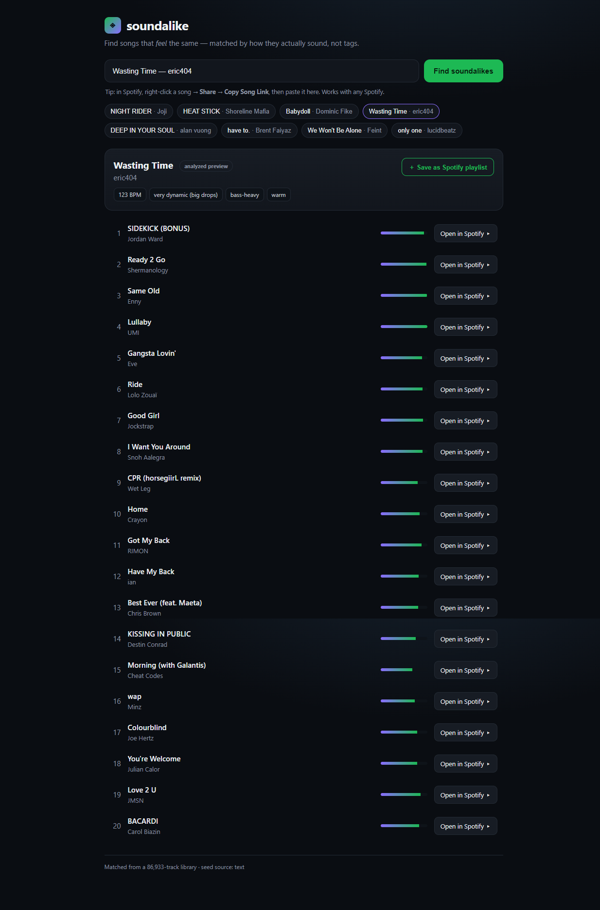

# soundalike

**Find songs similar to the ones you like — an open-source music recommender.**

`soundalike` started life as a first-year university project (`spotify_program.py`): a
terminal script that read a static CSV of top songs and printed min/max/mean stats. This
repo evolves it into a real, working recommendation engine that finds songs matching your
taste — built to work *around* Spotify's 2024 API lockdown rather than depending on it.

It combines several engines — offline audio-feature similarity, an acoustic DSP engine that
measures features straight from the waveform, a **vibe engine** that matches a song's bass
profile and dynamics (the drops), a **deep-vibe engine** that fuses the neural embedding with
that vibe signal, live Spotify (OAuth PKCE), and a **self-supervised neural network trained on
106,000 songs** whose genre-probe accuracy climbs from 0.25 → 0.641 as the training set scales
from 475 to 106k tracks.

> **📖 Want the engineering story?** The [**Case Study**](docs/CASE_STUDY.md) walks through the
> design decisions, the machine-learning scaling experiment, and the GPU/systems challenges I
> solved (data-loading bottlenecks, VRAM-aware training, 11x download speedups, cuDNN kernel
> inspection). It's written as a portfolio-style deep dive.

---

## Try it in 10 seconds — the web app 🎧

```bash
pip install -e ".[ml]"
soundalike serve            # opens http://127.0.0.1:8787
```

Type a song (`Title — Artist`), pick one of your own Spotify top tracks, or — the
frictionless way — **right-click a song in Spotify → Share → Copy Song Link** and paste it.
You instantly get songs that *sound* like it, with the seed's detected vibe (tempo, dynamics,
bass, tone) and an **Open in Spotify** button on every result. It works with **any** Spotify,
including the Microsoft-Store build.



Want the recommendations *inside* the Spotify app — a right-click **“Find soundalikes”** menu
item? That's the [**Spicetify extension**](integrations/spicetify/README.md) (needs the
standalone Spotify client). Everything runs locally; nothing leaves your machine.

**Prefer a hosted, no-install demo?** The ~273k-song library runs as a **numpy-only Vercel app**
(no PyTorch needed for library songs) — deploy it to a subdomain and let anyone try it in the
browser, with an optional client-side "Log in with Spotify" (OAuth PKCE — users authorize on
Spotify's own site, never hand over a password) to save results as a playlist. See
[`webapp/DEPLOY.md`](webapp/DEPLOY.md).

---

## Why this exists (and why it's built the way it is)

On **2024-11-27, Spotify removed** several Web API endpoints for all *new* apps
([announcement](https://developer.spotify.com/blog/2024-11-27-changes-to-the-web-api)),
including the two you'd normally reach for here:

- **Recommendations** — the endpoint behind "Song Radio" / similar-song discovery.
- **Audio Features** — danceability, energy, valence, etc. (the entire basis of the old project).

So a modern tool **cannot** just ask Spotify for similar songs or audio features. `soundalike`
solves discovery with its own engines instead:

| Engine | Signal | Needs credentials? | Coverage |
|--------|--------|--------------------|----------|
| **Deep-vibe** ⭐⭐⭐ | **Fusion** of the learned neural embedding + bass/dynamics, vs a ~1,600-song library | No | Real, listenable songs |
| **Vibe** ⭐⭐ | Frequency-band balance (sub→air) + **dynamics** (the drops), vs a ~1,500-song library | No | Real, listenable songs |
| **Acoustic DSP** ⭐ | Features measured from the **actual audio waveform** (tempo, energy, timbre…) | No | Any track with a preview |
| **Content-based** | Audio-feature similarity on a bundled dataset | No | Songs in the dataset (~855) |
| **Learned model** | A CNN trained on your GPU to embed audio (research track) | No | What you train it on |
| **Live Spotify taste** | Your liked / top / recent tracks as seeds | Free Spotify app (OAuth) | Your library |
| Last.fm *(optional)* | Crowd-sourced "similar tracks" | Free API key | Any track |

The **acoustic engines are the heart of the project**: instead of trusting anyone's precomputed
numbers, they download a 30-second preview and *measure* the sound itself with digital signal
processing, then rank by those measurements. Similarity by the physics of the audio — not by
"people who listened to X also listened to Y" (which is all Spotify radio and Last.fm do). The
**vibe engine** goes furthest, explicitly modelling a track's bass profile and its dynamics (the
drops) so recommendations match the *feel*, not just the timbre.

What Spotify *still* allows (and we use): your library/top/recent tracks, artist genres,
search, and **playlist creation** — so results can be saved straight back to your account.

We never ask for your password. Live access uses OAuth 2.0 with PKCE.

---

## Install

```bash
git clone https://github.com/yassinsolim/soundalike.git
cd soundalike
python -m venv .venv
# Windows:
.\.venv\Scripts\Activate.ps1
# macOS/Linux:
# source .venv/bin/activate
pip install -e ".[dev]"
```

This installs the `soundalike` command.

---

## Quickstart — offline, no credentials

Find songs similar to a single track:

```bash
soundalike similar --title "Blinding Lights" -n 10
```

Care more about some features than others (weights are repeatable):

```bash
soundalike similar --title "Believer" --weight energy=2 --weight danceability=1.5
```

Build a **taste profile** from several songs and get recommendations for the blend:

```bash
soundalike profile --seeds "Blinding Lights; One Dance; STAY" -n 15
```

Explore the dataset (a nod to the original project, done properly):

```bash
soundalike stats
```

---

## Live mode — your real Spotify taste

One-time setup (~2 minutes) is documented in **[SETUP.md](SETUP.md)**: create a free
Spotify app, copy `.env.example` to `.env`, and add your Client ID (plus a free Last.fm key
for full-catalog coverage).

```bash
soundalike login                      # authorize in your browser (OAuth PKCE)
soundalike whoami                     # confirm you're connected

# Recommend from your top tracks using the bundled audio-feature engine:
soundalike recommend --source top -n 25

# Full-catalog recommendations via Last.fm, saved as a new playlist:
soundalike recommend --source liked --engine lastfm --playlist "soundalike picks"

# Export your library to a CSV you can reuse offline:
soundalike pull --source liked --limit 200 --out liked.csv
soundalike profile --file liked.csv -n 30
```

> The `content` engine only matches songs present in the bundled ~855-song dataset, so
> coverage of your personal library is partial. Use `--engine lastfm` for any track.

---

## Acoustic engine — similarity by science ⭐

The flagship engine measures the sound itself and compares those measurements. It needs no
credentials (uses free Deezer previews) and works for any track with a preview.

```bash
# Measure one song's acoustic features straight from its audio (DSP):
soundalike audio-features --title "Babydoll" --artist "Dominic Fike"

# Recommend by measured acoustic similarity:
soundalike audio-similar --title "Babydoll" --artist "Dominic Fike" -n 12

# Seed from your live Spotify taste instead:
soundalike audio-similar --source top --seed-limit 5 -n 20
```

**How it works.** For each track it decodes a 30s preview and computes, with `librosa`:
tempo (BPM), RMS energy, spectral centroid/rolloff/bandwidth, zero-crossing rate, spectral
contrast, and 13 MFCCs (a timbre fingerprint). Features are standardized (so BPM and the
spectral features are comparable), optionally weighted, and ranked by distance to your seed.
A catalog (Deezer) is used *only* to enumerate candidate songs and fetch audio — the ranking
is 100% your measured acoustics, never a crowd "also-liked" signal.

Example: seed *Babydoll — Dominic Fike* → Omar Apollo, Malcolm Todd, more Dominic Fike. A
tight bedroom-pop/indie cluster chosen purely from waveform features.

---

## Vibe engine — match the *feel* of a track ⭐⭐

The acoustic engine above averages each feature over the whole clip, which works for
consistent songs but washes out **dynamics**: a track with quiet verses and a heavy drop ends
up looking "medium" everywhere. The **vibe engine** fixes that by measuring the two things that
actually define a song's feel:

- **Frequency-band balance** — how energy splits across **sub / bass / low-mid / mid / high-mid
  / presence / air**. This is the literal "how much sub-bass, how much highs" of a track.
- **Dynamics** — how much the loudness *moves* (standard deviation, dynamic range, and crest =
  peak / average). This is what separates a steady mellow song from one with a big drop.

It ranks against a **bundled library of ~1,500 real songs** across hip-hop, EDM, electro, pop
and hyperpop (built from Deezer previews), with the low-end and dynamics **weighted highest** so
bass-heavy drop tracks match other bass-heavy drop tracks.

```bash
# Find songs with a similar vibe (works out of the box — library ships with the package):
soundalike vibe-similar --title "Wasting Time" --artist "eric404"

# Emphasize a specific quality, e.g. sub-bass, even more:
soundalike vibe-similar --title "HUMBLE." --artist "Kendrick Lamar" --weight band_sub=4

# Build/refresh your own library (saved to ~/.soundalike):
soundalike vibe-build --per-genre 150
```

It also prints a plain-English read of the seed's vibe, e.g.:

```
Seed: Wasting Time — eric404
  vibe: 123 BPM, very dynamic (big drops), bass-heavy, warm
```

**Why this matters (a worked example).** *Wasting Time* by eric404 is 73% sub-bass with a big
dubstep drop (crest 2.2). The plain acoustic engine, averaging that away, returned soft
bedroom-pop. The vibe engine reads the drops and the sub-bass correctly and returns
hyperpop/electronic tracks that actually match — **aldn**, **Flume**, **Slow Magic** — the right
scene, chosen by the shape of the sound.

---

## Deep-vibe engine — the best matcher ⭐⭐⭐

The deep-vibe engine embeds a song with an **artist-aware neural encoder** and blends that with the
song's **vibe vector** (bass profile + dynamics), then ranks a **bundled library of ~87,000 real
songs spanning every genre** by a tunable mix of the two. Everything ships with the package — the
encoder *and* the library — so it works with **zero setup and no local training**.

```bash
# Fused recommendation (works out of the box):
soundalike deep-vibe-similar --title "Lovers Rock" --artist "TV Girl"

# Dial the blend: 1.0 = pure learned texture, 0.0 = pure bass/dynamics:
soundalike deep-vibe-similar --title "Bangarang" --artist "Skrillex" --alpha 0.6

# Blend several songs into one "taste" (find what sits in the middle of them):
soundalike deep-vibe-similar --title "Lovers Rock" --artist "TV Girl" \
    --seed "Bags :: Clairo" --seed "Show Me How :: Men I Trust"

# Add variety so you don't get five near-identical songs (MMR re-ranking),
# and cap how many songs any one artist can contribute:
soundalike deep-vibe-similar --title "HUMBLE." --artist "Kendrick Lamar" \
    --diversity 0.3 --max-per-artist 1
```

Each result shows its breakdown so you can see *why* it matched:

```
Seed: Lovers Rock — TV Girl
  vibe: 103 BPM, steady/flat, bass-heavy, bright
  blend: 80% learned-texture + 20% bass/dynamics

   1. Relax — Vacations           [blend +4.59 | texture 0.34 | vibe 0.17]
   2. Recto Verso — Paradis        [blend +4.35 | texture 0.34 | vibe 0.12]
   3. A Knife in the Ocean — Foals  [blend +4.29 | texture 0.30 | vibe 0.20]
   4. Love Forever — Chapterhouse   [blend +3.92 | texture 0.26 | vibe 0.22]  (shoegaze)
```

Four things make this work at scale, and each was driven by a concrete failure (see the
[case study](docs/CASE_STUDY.md)):

- **Coverage** — the library was grown to ~87,000 real songs across every scene via a 2-hop
  related-artist crawl seeded from ~400 curated artists spanning world/regional (K-pop, city-pop,
  Afrobeats, French/Latin, reggae), electronic subgenres (techno, house, DnB, phonk, synthwave,
  ambient), rock/metal/punk (post-rock, shoegaze, black/death metal, emo), jazz, classical, blues
  and gospel — deduplicated to one row per song — so a niche seed actually has close neighbours.
- **An artist-aware encoder** — the FMA-trained encoder confused scenes on real vocal music, so it
  was fine-tuned on the harvested songs with a *supervised-contrastive* objective (same artist =
  similar), which taught it "sounds like the same kind of thing" on the real domain. (A later
  ArcFace+GeM variant scored higher on same-artist mAP but *regressed* real cross-artist
  recommendation in external validation, so it was reverted — see `docs/CASE_STUDY.md`.)
- **A higher-dimensional embedding** — as the library grew past ~50k, songs crowded together and
  precision softened; widening the embedding from 256 to 384 dimensions gives the space more room to
  separate ~87k songs, which recovered precision without hurting coverage.
- **Whitening** — the embeddings piled into a tight cone (every pair ~0.9 cosine); ZCA-whitening
  the space makes similarity key on what's *distinctive* about a track, which sharply improves
  ranking on a big, diverse library.

Matching the *feel* of a track is genuinely hard — some corners are still an honest frontier — but
across jazz, post-rock, metal, hip-hop, R&B, electronic, indie and bedroom-pop it now returns
genuinely scene-coherent picks. For example, *So What* by Miles Davis returns Brad Mehldau, Lee
Morgan and Ahmad Jamal; *Your Hand in Mine* by Explosions in the Sky returns If These Trees Could
Talk, This Will Destroy You and Mono; *Ditto* by NewJeans returns CHUU and LOONA.

### Real-world retrieval benchmark and the failed final audio test

Version 5 freezes **107 Category-A musical-similarity pairs** across 85 named scenes. It includes
popular, deep-cut, and niche music, short source excerpts, URLs, access dates, source classes, and
category rationales. The 67-pair development split and 40-pair FINAL split are separated by
connected artist components; all previous held-out rows are development-only. The FINAL manifest
and four target-agnostic baseline rankings were SHA-256 frozen before any iteration-4 training.
The protocol locked one method and allowed exactly one final opening. Its finalized state binds the
winner-ranking hash and is sealed by a detached Ed25519 signature whose private key was destroyed.

The predeclared primary metric emphasizes useful ranks:
`mean(NDCG@10, MRR, Recall@10)`. Iteration 4 trained and indexed the complete 272,853-song
catalogue with three new audio models (cross-artist FMA supervised contrastive, FMA BYOL, and
EfficientNet/CLAP audio distillation), a 3-window MaxSim index, and an audio-only reranker trained
on 3,967 independent listening-similarity pairs after excluding every benchmark artist.

DEV favored a learned audio head plus a rank-stratified multi-representation tail:

| Development Category-A metric | Frozen production | Locked audio method |
|---|---:|---:|
| Recall@10 | 0.02985 | **0.04478** |
| Recall@50 | 0.02985 | **0.07463** |
| MRR | 0.00485 | **0.01254** |
| Primary | 0.01506 | **0.02558** |

That DEV gain was +69.9% with no worsened pair and a paired-bootstrap primary-delta interval of
**0.000116..0.028508**. Candidate diagnostics also showed why simpler models failed: SupCon and
BYOL almost never put the counterpart inside the first 1,000 candidates; distillation reached
candidate Recall@1000 0.145 but no top-50 hit.

The untouched FINAL set was then opened once. It **failed** the predeclared acceptance criteria:

| Once-opened FINAL (40 pairs) | R@10 | R@20 | R@50 | MRR | Primary |
|---|---:|---:|---:|---:|---:|
| Pre-goal production | 0 | 0 | 0 | 0 | 0 |
| Iteration-3 deployed | 0 | 0 | 0.025 | 0.000833 | 0.000278 |
| Raw encoder | 0 | 0 | 0 | 0 | 0 |
| All-priors-zero audio ablation | **0.025** | **0.025** | **0.025** | **0.003125** | **0.012004** |
| Locked iteration-4 method | 0 | 0.025 | 0.025 | 0.001786 | 0.000595 |

The locked method improved only one pair, at rank 14. Its paired primary-delta 95% interval was
**0..0.001786**, so it includes zero; the required meaningful-count and confidence checks fail.
The scene guardrail passed only because every frozen production scene contribution was zero.
The zero production denominator also makes a relative-gain headline meaningless. The direct
all-priors-zero audio ablation was stronger at useful ranks, but it too moved only one pair and is
not sufficient evidence to ship. The locked research package would total 508,847,827 bytes; cold
load was 10.86 s and process RSS reached 2.85 GB (2.21 GB delta), too close to the hosted 3 GB limit
to justify a speculative release. Local ranking averaged 79.2 ms (p95 92.1 ms).

Accordingly, **no iteration-4 retrieval method was deployed and no completion claim is made**.
Production remains the previously reviewed `dual_sonic64_guardrail` because its guarded top five
retained 17/20 direct UX passes; that is a secondary manual-UX result, not proof of retrieval gain.
Independent ListenBrainz/Deezer validation from iteration 3 remains statistically equivalent.
The live site still reports `2026.07.11-dual-sonic64`; previews and search were not changed.

The frozen protocol, exact DEV/FINAL reports, source records, negative findings, and hashes are in
`.goals/human-quality-recommendations/` and the case study.

### Query-conditioned collaborative candidate test (iteration 5)

Iteration 5 tested the next evidence-driven hypothesis: audio reranking cannot recover a target that
never enters its candidate pool, so add a real **people-who-like-this-also-like-that** generator. The
training source was the CC-BY-4.0 [Music4All-Onion](https://doi.org/10.5281/zenodo.6609677)
user-track count set: 50,016,042 interactions from 119,140 users. Exact title/artist matching mapped
28,538 source tracks to 27,367 catalogue rows. A 64-dimensional skip-gram item2vec model trained for
eight epochs over 22.85 million mapped listening tokens from 115,468 users; the distilled runtime
index contains 13,680 catalogue rows and 2,640 artist centroids.

Before that training, a new v6 protocol froze 107 already-opened v5 pairs as DEV diagnostics and
**88 fresh FINAL pairs** from the independently operated ListenBrainz similar-recordings service.
The fresh set spans 18 scenes and popular/deep-cut/niche tiers. Its manifest, production rankings,
and unopened state were hashed and Ed25519-signed. The exact method and target-agnostic rankings
then passed the explicit `FROZEN → METHOD_LOCKED → RANKINGS_LOCKED → FINALIZED` transition; FINAL
was opened once.

The source audit found 39/88 FINAL pairs whose two recordings mapped into Music4All. Those pairs
represented 74 source item edges and 2,236 shared-user co-occurrences. The deciding item2vec corpus
removed every one before training (2,236→0). An unmasked model was locked only as an anti-
memorization diagnostic. No benchmark artist boost, Wikipedia/notability score, or global popularity
feature is present; the notability feature and weight are identically zero.

Candidate generation genuinely changed on opened DEV:

| DEV candidate recall | @100 | @500 | @1000 |
|---|---:|---:|---:|
| Audio only | 0.0196 | 0.0490 | 0.0686 |
| Collaborative, FINAL edges masked | 0.0784 | 0.1275 | 0.1275 |
| Hybrid union + current production | **0.1078** | **0.2059** | **0.2353** |

A DEV-selected linear reranker used collaborative cosine/rank, a small audio-vibe weight, the real-
index quality filter, and artist caps. DEV primary rose 0.00631→0.01903 (+201%), with R@10
0.0098→0.0294 and MRR 0.00491→0.01237, but its paired interval
**[-0.00991, 0.03751] included zero**. That uncertainty was retained rather than hidden.

The once-opened fresh FINAL then **failed decisively**:

| FINAL (88 fresh pairs) | R@10 | R@50 | MRR | Primary |
|---|---:|---:|---:|---:|
| Current deployed method | 0.01136 | **0.03409** | **0.01196** | **0.01156** |
| Audio-only control | 0 | 0 | 0 | 0 |
| Collaborative-only, edge-masked | 0 | 0.02273 | 0.00066 | 0.00022 |
| Locked hybrid, edge-masked | 0 | 0.02273 | 0.00070 | 0.00023 |
| Unmasked diagnostic (not eligible) | **0.02273** | **0.05682** | 0.00859 | 0.01392 |

The locked winner regressed 97.99% against current production, improved only 2/88 pairs, worsened 3,
and had paired delta CI **[-0.03432, 0.00037]**. Candidate recall for the masked hybrid union was
only 0.0227/0.0682/0.0909 at @100/@500/@1000. The unmasked diagnostic nominally gained 20.4%, but
its CI **[-0.02860, 0.03009]** included zero, it improved only five pairs, MRR regressed, and its
advantage disappeared when exact deciding edges were removed. Graph topology alone did not
generalize.

Direct inspection also failed the separate UX gate: **13/20** difficult seeds passed (required
16), including four missing catalogue queries. Deezer related-artist overlap on 11 independent seeds
improved 0.158→0.267 with delta CI [0.0364, 0.1879], but that is an artist-level *taste-affinity*
metric, not evidence of sonic similarity and cannot override FINAL. Every resolved direct top-five
had a Deezer preview URL; availability was checked, not claimed as audible playback.

The compact runtime addition is only 2,026,706 bytes. It loaded in 0.012 s, added 48.4 MB RSS, and
ranked warm queries in 0.252 s mean / 0.288 s p95. It fits serverless constraints, but quality—not
resources—blocked release. **Nothing from iteration 5 was deployed or retuned after FINAL.** The live
site intentionally remains `2026.07.11-dual-sonic64` on 272,853 tracks.

Rebuild the research assets (the finalized protocol will correctly reject a second FINAL open):

```powershell
New-Item -ItemType Directory -Force ml_data\iteration5\raw | Out-Null
curl.exe -L -o ml_data\iteration5\raw\music4all-id-information.csv `
  https://huggingface.co/datasets/Leon299/music4all/raw/main/id_information.csv
curl.exe -L -o ml_data\iteration5\raw\userid_trackid_count.tsv.bz2 `
  https://zenodo.org/api/records/6609677/files/userid_trackid_count.tsv.bz2/content

.\.venv\Scripts\python.exe -m soundalike.ml.collaborative `
  --metadata ml_data\iteration5\raw\music4all-id-information.csv `
  --counts ml_data\iteration5\raw\userid_trackid_count.tsv.bz2 `
  --index ml_data\deepvibe_index_v5.npz `
  --benchmark benchmarks\soundalike_pairs.v6.json `
  --output-dir ml_data\iteration5\collaborative

.\.venv\Scripts\python.exe -m soundalike.ml.collaborative_rerank dev `
  --index ml_data\deepvibe_index_v5.npz `
  --benchmark benchmarks\soundalike_pairs.v6.json `
  --masked-asset ml_data\iteration5\collaborative\item2vec-final-edges-masked.npz `
  --full-asset ml_data\iteration5\collaborative\item2vec-full.npz `
  --scorer ml_data\iteration5\collaborative\hybrid-scorer.json `
  --report .goals\human-quality-recommendations\artifacts\collaborative-dev-v6.json
```

### Catalogue-wide graph and multi-positive evaluation (iteration 6)

Iteration 6 addressed the measured 5% Music4All track-coverage ceiling before doing more ranking
work. A 569,202,935-byte Last.fm-360K archive (MD5
`635e6ed3fc873aa4ba33aba0ebce02b1`) supplied 17,559,530 public
user/artist/play tuples. The dataset is distributed with Last.fm's permission for **non-commercial
use** ([Zenodo 10.5281/zenodo.6090214](https://doi.org/10.5281/zenodo.6090214)); that restriction is
recorded rather than described as a permissive software license. Exact normalized mapping learned
collaborative vectors for 6,126/18,258 catalogue artists, directly covering 142,767/272,853 tracks
(52.3%). An audio-centroid-to-collaborative-anchor projection then gave every catalogue artist a
static graph neighborhood: **100% effective track and query-artist coverage**. Direct source coverage
and projected coverage are reported separately.

Before graph training or DEV selection, protocol v7 froze and Ed25519-signed a new benchmark:
**60 untouched FINAL seeds, 14 scenes, and 6-12 graded positives per seed**. Opened v6 queries became
40 multi-positive DEV seeds. Relevance is explicitly artist-level *taste affinity*, sourced from
Deezer related artists with independent ListenBrainz session evidence where available; it is not
called acoustic similarity. The separate 20-seed preview/list review remains the sonic/scene axis.
Production baseline lists, source URLs/excerpts/access dates, index hash, metric policy, and labels
were frozen before tuning. The winner and rankings were hash-locked before FINAL opened once.
The signed benchmark's top-level source summary incompletely names only ListenBrainz; its per-record
fields show the actual primary source is Deezer for 100/100 records, with additional ListenBrainz
evidence on 38. The signed file was not rewritten post-FINAL; the source audit records this erratum
and the builder now emits both source families.

Candidate generation cleared its pre-ranking DEV gate:

| DEV candidate recall | @100 | @500 | @1000 |
|---|---:|---:|---:|
| Audio only | 0.196 | 0.441 | 0.576 |
| Music4All sparse graph | 0.328 | 0.440 | 0.464 |
| Catalogue-wide artist graph | 0.460 | 0.460 | 0.460 |
| Hybrid union | **0.532** | **0.704** | **0.766** |

The DEV-selected hybrid used graph strength/rank, sparse Music4All rank, audio/vibe scene
consistency, quality filtering, one-result-per-artist output, and a generic positions-1-3 scene
guard. Static popularity/notability remained exactly zero. On DEV, graded nDCG@10 rose
0.0713→0.2444 (+242.8%, absolute +0.1731, paired 95% CI [0.1066, 0.2434]).

The fresh once-opened FINAL **did not confirm the gain**:

| FINAL (60 seeds) | nDCG@10 | MRR@10 | Recall@10 |
|---|---:|---:|---:|
| Frozen production baseline | **0.05250** | **0.15661** | **0.04457** |
| Current deployed iteration-3 method | 0.07735 | 0.20935 | 0.05846 |
| Locked two-hop-masked hybrid | 0.04286 | 0.14034 | 0.03333 |
| Music4All sparse diagnostic | 0.08348 | 0.18544 | 0.07582 |
| Full graph diagnostic (unmasked) | 0.16560 | 0.39532 | 0.12919 |

The locked winner regressed **18.3%** versus the frozen baseline (absolute -0.00963,
CI [-0.04409, 0.02610]), improved 8/60 seeds, worsened 15, and failed nDCG, MRR, recall,
improved-count, confidence, and scene gates. The independent-source full graph looked strong, but
220 deciding edges were present in the source graph. Direct masking removed all exact edges and
strict transitive masking broke 17,132 two-hop paths to zero; graph nDCG then collapsed from 0.16560
to 0.00238. That anti-memorization result prevents a post-hoc switch to the attractive unmasked
diagnostic.

Cold-start query resolution improved from 16/20 to **20/20**, and all 100 locked top-five results
had Deezer previews, but direct coherence still failed at **12/20** (required 16). Hyperpop,
digicore, city-pop, Pixies, Starboy, and JVKE exposed scene errors. MusicBrainz community-tag
validation on 11 benchmark-disjoint seeds improved 0.0871→0.1165, but its paired CI
[-0.0148, 0.0692] is statistically equivalent and cannot override the two deciding failures.

The compact static additions total 25,222,632 bytes. Measured process RSS was 2.12 GB
(+921 MB after loading the current production index and research ranker), total cold load was
10.75 s, and warm recommendation latency was 0.100 s mean / 0.120 s p95. These fit the measured
3 GB hosted envelope, but quality—not resources—blocked release. **Iteration 6 was not deployed or
retuned after FINAL.** Live verification on ten seeds confirms 272,853 tracks,
`2026.07.11-dual-sonic64`, working search/recommend requests, and 50/50 available previews.

### Graph-first generalization preflight (iteration 7)

Iteration 7 did **not** consume another FINAL. It first corrected the signed-v7 provenance summary
in a new detached-Ed25519-signed development protocol: Deezer related artists supplied the primary
labels for 100/100 v7 records, while ListenBrainz supplied secondary evidence for 38. Last.fm-360K
and Music4All share neither dataset, operator, API, nor numeric IDs with Deezer. A read-only audit
found legitimate cross-source agreement on 430/1,170 resolved Last.fm→Deezer artist edges (36.8%)
and 285/346 Music4All learned top-96 neighborhoods (82.4%). Unmasked Last.fm direct edges were
therefore predeclared as the intended query-conditioned collaborative signal; masks remain
mechanism diagnostics, not deciding constraints.

The 11-feature scorer was replaced by a three-parameter policy fixed before any new FINAL:

`G = 0.7·normalized_edge_weight + 0.3/log2(edge_rank+1)`

`score = G + audio_weight·A + style_weight·S`

Here `A` is a fixed Sonic64/CLAP/vibe blend and `S` is broad style overlap from MusicBrainz
community tags. The catalogue-wide style asset directly labels 208 artists and deterministically
propagates audio-nearest multi-label vectors to all 18,258 artists; it is 575,524 bytes and does not
use Last.fm, Music4All, benchmark labels, or popularity. The selected DEV policy was
`audio_weight=0.30`, `style_weight=0.35`, `style_guard_min=0.0`. At the selected zero guard it
excluded 0/47 resolved genre-blending positives; diagnostic thresholds 0.15 and 0.25 would falsely
exclude 3/47 and 4/47.

All legitimate opened evidence was considered: v6 is the de-duplicated Category-A superset of
v1-v5, and all 100 now-opened v7 records were included. Five of 295 records were catalogue
unresolvable, leaving 290 records and 254 unique queries. Against the **currently deployed**
`dual_sonic64_guardrail`, nested five-fold relative composite gains were **+14.7%, +18.6%, +6.0%,
+18.1%, and +8.5%**—every fold missed the required +20%. Overall candidate recall@1000 improved
0.1996→0.2654, nDCG@10 0.03477→0.04882, MRR 0.08707→0.10353, and Recall@10
0.02844→0.04520, but the predeclared 80% relevance/20% independent-style composite improved only
0.19461→0.22035 (**+13.2%**). Only 4/17 broad scene-held-out folds passed every gate; African
(-13.6%), classical (-25.3%), reggae/dub/ska (-36.1%), and `other` (-10.7%) breached the -10% floor.

A separately locked, previously unreviewed 20-seed direct review resolved all queries and exposed
previews for all 100 challenger and 100 production results. Actual names, artists, G/A/S
rationales, propagated styles, and junk flags were recorded position by position. The challenger
passed **13/20**, below 16: SOPHIE, underscores, Daft Punk, Mariya Takeuchi, NewJeans, Bad Bunny,
and Gorillaz failed; no junk or seed-title variant appeared.

The serving candidate now stores only the full graph (`int16` neighbors / `float16` weights), cutting
the graph 23.2→11.4 MB (50.8%). An isolated process measured 5.91 s load, **1.493 GB peak RSS**,
1.219 GB resident (the core index alone was 1.191 GB, so the 1.1 GB resident target is not feasible
without reformatting it), 110 ms first recommendation, and 113 ms warm mean / 133 ms p95, with zero
fallbacks. The earlier 655 MB headroom figure was only a conservative **Hobby-tier assumption**;
iteration 8 below checks the linked project and refuses to treat that estimate as verified capacity.

Because cross-validation and direct review both failed, the protocol remained
`DEVELOPMENT_LOCKED` with `final_open_count=0`: **no fresh FINAL was built or opened, no release
asset was uploaded, and production remains unchanged.**

### Confidence-gated production fallback (iteration 8)

The global graph policy hurt sparse scenes, so iteration 8 implemented the smaller policy suggested
by that failure. Current production is now the explicit development challenger’s default:

`fire graph head iff agreement(Music4All, Last.fm) >= tau and consistency(A, S) >= sigma`

When either check fails, the challenger returns the **exact production ordering**. `G` is a frozen
equal blend of the two sources’ fixed `0.7·weight + 0.3/log2(rank+1)` components; graph mode ranks
with `G + audio_weight·A`. Thus the only numeric tunables are `tau`, `sigma`, and
`audio_weight`. There are no scene branches, manual/artist boosts, Wikipedia scores, or popularity
features in the graph head.

Selection used only 65 already-opened, source-audited Category-A sonic/editorial pairs from v6.
Four catalogue-unresolvable labels left 61 scored records. The 40 ListenBrainz-only sonic records,
88 human-songs-like records, and all 100 Deezer multi-positive records were excluded from deciding
selection. Deezer remains supporting evidence only: Music4All↔Deezer learned-neighborhood overlap is
82.4%, Last.fm↔Deezer overlap is 36.8%, and the ID-isolation audit still passes.

| Nested sonic DEV | nDCG@10 | MRR@10 | Recall@10 | Primary |
|---|---:|---:|---:|---:|
| Exact production | **0.007060** | **0.004098** | 0.016393 | **0.009184** |
| Gated challenger | 0.004935 | 0.001821 | 0.016393 | 0.007717 |

Primary is `mean(nDCG@10, MRR@10, Recall@10)`. Outer-fold primary results were
`0→0`, `0→0`, `0→0`, `0.046685→0.039226`, and `0→0`; aggregate change was
**-15.98%** (absolute -0.001467, paired 10,000-bootstrap CI
**[-0.004402, 0]**), with 0 improved / 1 worsened / 60 unchanged. Candidate Recall@1000 stayed
0.245902→0.245902. The gate fired 25/61 (41.0%) and abstained 36/61; reasons were 31 missing-source,
4 insufficient-agreement-neighborhood, 1 consistency rejection, and 25 passes. Scene-held-out CV
matched the aggregate and failed the floor only in metal (-15.98%); all other scene deltas were zero.

A separately locked difficult review compared both methods on the same fresh 20 seeds, including
two city-pop, two Latin, three hyperpop/digicore, Daft Punk, Gorillaz, and the Pixies→trip-hop
failure. All 200 positions include preview status, audio/style values, tags, and junk evidence.
The challenger reached **16/20** versus production **15/20**; its gate fired 5/20 and fixed the
my-bloody-valentine list, but brakence, Gorillaz, Frank Ocean, and FKA twigs still failed.

The dual-source runtime graph is 12,160,029 bytes and stores no raw Music4All vectors. Isolated
measurement found 7.96 s load, 1,494,294,528-byte peak RSS, 1,327,017,984-byte resident RSS,
200.6 ms warm mean / 265.5 ms p95, deterministic output, and zero silent fallbacks. The linked
Vercel project config was found, but CLI authentication was unavailable and both project/team API
probes returned 403. Therefore the **actual tier and headroom remain unverified**; the resource gate
fails closed instead of assuming Hobby or Pro.

The nested, scene, and verified-tier preconditions failed. Consequently
`final_open_count=0`: **no fresh FINAL identity was created or opened, no canonical/hosted code or
manifest changed, and nothing was deployed.** Production and live stats remain
`2026.07.11-dual-sonic64` / 272,853 songs.

Reproduce the non-FINAL development run:

```powershell
.\.venv\Scripts\python.exe -c "from soundalike.ml.catalog_graph import compact_dual_source_graph; compact_dual_source_graph('ml_data/iteration7/catalog-artist-graph-full-v8.npz','ml_data/iteration5/collaborative/item2vec-full.npz','ml_data/iteration8/catalog-artist-graph-dual-v8.npz')"

.\.venv\Scripts\python.exe -m soundalike.ml.catalog_v8 dev-cv `
  benchmarks\soundalike_pairs.v6.json benchmarks\soundalike_multipositive.v7.json `
  .goals\human-quality-recommendations\protocol-v7\state.json `
  ml_data\deepvibe_index_v5.npz ml_data\iteration8\catalog-artist-graph-dual-v8.npz `
  ml_data\iteration7\catalog-style-v8.npz `
  .goals\human-quality-recommendations\artifacts\catalog-gated-sonic-dev-cv-v8.json

.\.venv\Scripts\python.exe -m pytest tests\ -q
```

### Powered served-list sonic DEV (iteration 9)

Iteration 9 replaces the one-counterpart proxy with a list-level DEV benchmark of the **actual
served top 10**. The frozen gold contains 60 catalogue-resolved seeds across 13 scenes and 815
eligible positives (minimum 5 per seed, grades 1–3). Every seed has a normalized, hash-bound
Music-Map snapshot; 40 also retain an independent category-A critic/editorial track comparison,
and 6 counterpart artists are confirmed by both source classes. Last.fm, Music4All, Deezer,
ListenBrainz, and MusicBrainz never supply deciding relevance labels.

The two predeclared co-primaries remain separate:

1. exponential-gain graded nDCG@10 over source-supported track or artist relevance; and
2. a method-blind top-5 coherence pass requiring independently supported positions 1–3, at least
   4/5 supported, and no junk or same-artist variant.

The challenger drops Music4All as a mandatory conjunct. It has exactly three parameters:
Last.fm confidence `tau`, per-track `min(audio, style)` threshold `sigma`, and one audio tie-break
weight. Music4All has only a fixed optional corroboration weight/bonus and never gates coverage.
Nested five-fold DEV selected `(tau=.35, sigma=.35, audio_weight=0)`.

| Powered out-of-fold DEV | Production | Challenger |
|---|---:|---:|
| graded nDCG@10 | 0.08112 | **0.20069** |
| MRR@10 | 0.31546 | **0.59278** |
| candidate recall@1000 | 0.43258 | **0.57893** |
| strict top-5 coherence | 2/60 (3.3%) | **16/60 (26.7%)** |

nDCG improves **+147.4%** (absolute +0.11957, paired-bootstrap CI
`[+0.08094,+0.16154]`, 34 seeds improved). No scene regresses; scene-held-out nDCG improves
+145.9%. The policy fires 36/60, abstains for 23 seeds without Last.fm coverage and one below
`tau`, and no longer has Music4All coverage abstentions. Candidate recall, MRR, the improved-seed
count, CI, absolute gain, and every scene all pass.

The deciding coherence co-primary still fails decisively. A second independent model-assisted
blind read, grounded per result in the frozen Music-Map/category-A evidence or a disclosed
MusicBrainz-direct supporting tag, finds production 1/60 and challenger 5/60. Its conservative
review also flags 13 and 9 version/cover candidates respectively. This corroborates the failed
coherence gate rather than rescuing it. Exact category-A track retrieval is
unchanged at 1/36 and remains diagnostic only. Public Deezer preview checks found 449/773 unique
listed tracks available; preview data was never used for selection.

The linked Vercel project and public Vercel-bot production deployment are real, but no credential
environment variable or CLI login is available and the project API returns 403. Official limits
are plan-dependent (Hobby 2 GB; Pro/Enterprise up to 4 GB), while local metadata and GitHub
deployments expose no plan. The actual tier therefore remains unknown and the platform gate fails
closed.

Because coherence is below 80% and the tier is unverified, `final_open_count` remains **0**:
no fresh FINAL was created, no winner was wired, and production remains untouched.

Reproduce the complete non-FINAL run:

```powershell
$Replay = ".cache\iteration9-replay"
New-Item -ItemType Directory -Force $Replay | Out-Null
.\.venv\Scripts\python.exe -m soundalike.ml.catalog_list_gold_v9 `
  --output "$Replay\gold.json"
.\.venv\Scripts\python.exe -m soundalike.ml.catalog_v9 freeze `
  --protocol "$Replay\protocol" --gold "$Replay\gold.json"
.\.venv\Scripts\python.exe -m soundalike.ml.catalog_v9 evaluate `
  --protocol "$Replay\protocol" --gold "$Replay\gold.json" `
  --report "$Replay\dev.json" --blind-lists "$Replay\blind-lists.json" `
  --judgments "$Replay\judgments.json" --blind-key "$Replay\blind-key.json"
.\.venv\Scripts\python.exe -m soundalike.ml.catalog_compact_v9 "$Replay\dev.json"
.\.venv\Scripts\python.exe -m soundalike.ml.catalog_tier_v9 `
  --output "$Replay\tier.json"
.\.venv\Scripts\python.exe -m pytest tests\ -q
```

### Growing the library past the bundle limit

The ~87k-song index ships bundled (75 MB, under GitHub's 100 MB per-file cap), so the tool works
offline out of the box. But a bigger or higher-dimensional library won't fit in the repo — so the
pack (encoder + index) can also live on a **GitHub Release**, which allows up to 2 GB per file and
doesn't bloat the repo or every clone. A tiny `data/index_manifest.json` names the canonical pack,
and the package resolves it in order: an explicit `--index`/`--model-dir`, then a matching copy in
your cache, then the bundled copy, then a download from the Release (verified by SHA-256, with a
graceful offline fallback to the bundle). Nothing downloads unless the bundle is missing or the
manifest points to a newer pack, so the default experience stays zero-friction.

```bash
# Pre-fetch / refresh the hosted pack (otherwise it's fetched lazily on first use):
soundalike fetch-index
```

To publish a larger library: build the index, upload it plus the encoder to a Release, and update
the manifest's `release_tag` + SHA-256s. This is what lets the library scale to hundreds of
thousands of songs without ever hitting the repo file-size limit.

---

## Learned-model research track (GPU)

An experimental track trains our own audio-embedding CNN (PyTorch) to place similar-sounding
songs near each other, with a self-supervised contrastive objective (SimCLR/NT-Xent) that
needs no similarity labels. It runs on an NVIDIA GPU (built and tested on an RTX 5080 /
Blackwell, CUDA 13, using channels-last + mixed precision for Tensor-Core speed).

### The result: deep learning wins once it has data

Trained with a self-supervised contrastive objective (no genre labels), a ResNet encoder
learns an embedding space where acoustically similar songs cluster. Evaluated with a kNN
genre probe (chance ≈ 0.28 for 16 genres):

| Model | Training data | kNN genre acc | vs baseline |
|-------|---------------|---------------|-------------|
| Chance (majority class) | — | 0.284 | — |
| Our neural embedding | Deezer 475 | 0.25 | **loses** to baseline |
| Pooled-mel baseline (no ML) | FMA 25k | 0.521 | — |
| Our neural embedding | **FMA-medium 25k** | **0.601** | **+8 pts** |
| Pooled-mel baseline (no ML) | FMA 106k | 0.507 | — |
| Our neural embedding | **FMA-large 106k** | **0.641** | **+13 pts** |

The story is the scaling curve. On **475 tracks the neural net *lost*** to a trivial pooled-mel
baseline (0.25). At **25k tracks it beats the baseline by +8** (0.601). At **106k tracks it wins
by +13** (0.641) — the more data, the wider the margin, exactly as contrastive deep learning
predicts. On FMA-large, **57%** of tracks have a same-genre nearest neighbor in the learned
space (from a model that never saw a label), and it trains on the ~57k *unlabeled* FMA tracks
too (self-supervised needs no labels) while being evaluated only on the ~49.6k labeled ones.


*FMA-large (106k tracks): loss falls while the genre-probe accuracy rises; the UMAP shows
Electronic (top), Rock/Pop (bottom) and a tight Old-Time/Historic cluster; per-genre retrieval
reaches Old-Time 93%, Rock 74%, Classical 67%, Hip-Hop 64%.*

Engineering notes for the 106k run: the 14 GB packed dataset exceeds the 5080's 16 GB VRAM, so
training auto-switches to a **CPU-resident** mode (dataset pinned in RAM, batches streamed to
the GPU) that still keeps it at 99% utilization. The download used aria2 with 16 connections
(~138 MB/s vs ~13 MB/s single-stream). Spectrogram precompute runs across all CPU cores.

### Teaching the model *vibe* (the encoder behind deep-vibe)

The contrastive encoder above learns *timbre* well, but "vibe" is really about a song's
**frequency-band balance and its dynamics** (how hard the drop hits). So I trained a dedicated
**vibe-aware encoder** with a multi-task objective: the usual contrastive loss **plus** a
regression head that must predict a 10-dim *vibe target* (7 frequency-band fractions + loudness
dynamics + spectral centroid) computed straight from each song's mel-spectrogram. That auxiliary
task forces the embedding to encode *how a song sounds and moves*, not just its genre.

The vibe target is computed from the packed FMA spectrograms with **no re-downloading**, so the
whole vibe-aware model trains on all 106k songs in ~131 min on the 5080.

**Does it actually encode more vibe?** Yes — measurably. On 1,738 held-out real songs, a *linear*
probe decoding the vibe target from each encoder's embeddings improves from **R² 0.82 → 0.94**,
and the biggest gains are exactly on the vibe-defining dimensions: bass (0.73 → 0.96), loudness
dynamics (0.70 → 0.89) and drop size (0.70 → 0.85). In other words, nearest neighbours in the
vibe-aware space are far more likely to share the seed's bass profile and energy.


*Left: multi-task training — val genre-probe accuracy rises as the vibe-target loss falls.
Right: per-dimension linear-probe R² of decoding vibe from the embedding; the vibe-aware encoder
(blue) beats the plain contrastive one (grey) on every band and every dynamics measure.*

This vibe-aware encoder is the one bundled with the package and used by `deep-vibe-similar`.

```bash
# Train it yourself (needs the packed FMA data from the steps below):
python -m soundalike.ml.train_vibe --packed packed.npz --out-dir ml_data/model_vibe

# Harvest a real-song library once, then re-embed it with any encoder (fast, offline):
python -m soundalike.ml.spec_cache harvest --cache ml_data/spec_cache.npz
python -m soundalike.ml.spec_cache build --cache ml_data/spec_cache.npz --model-dir ml_data/model_vibe --out ml_data/deepvibe_vibeaware.npz
```

### Domain-matching: the artist-aware encoder

Growing the recommendation library (ultimately to ~87,000 songs) exposed the encoder as the real
ceiling: trained on FMA (mostly instrumental, Creative-Commons music), it confused *scenes* on
real vocal music — a dream-pop seed pulled in random pop, a hyperpop track pulled in smooth R&B.
More data made it *worse*, because the bigger pool contained more texture-similar-but-vibe-wrong
songs.

The fix uses the strongest free style signal on the harvested library — **the artist**. Two songs
by the same artist share a sonic identity, so the encoder is fine-tuned with a **supervised
contrastive** objective (PK-sampled batches; same-artist songs are positives) plus the
vibe-target auxiliary, all on the cached real-song mel-spectrograms (no re-downloading, ~40 min on
the 5080). That teaches "sounds like the same kind of thing" directly on the domain users query,
and — because the library was crawled through the related-artist graph — it generalizes to
*neighbouring* artists, not just the same one.

Two more fixes mattered as the library grew. **A higher-dimensional embedding** (256 → 384) gives
the space more room to separate ~87k songs, which recovered the precision that had softened at 55k.
And a cheap inference-time trick — **ZCA-whitening** the embedding at load time (the raw embeddings
pile into a tight ~0.9-cosine cone) — makes similarity key on what's *distinctive*. Together,
retrieval goes from incoherent to scene-coherent:

| Seed | Before (FMA encoder, raw cosine) | After (artist-aware 384-d + whitening) |
|------|-----------------------------------|-----------------------------------------|
| *So What* — Miles Davis | (mixed) | Brad Mehldau, Lee Morgan, Ahmad Jamal |
| *Your Hand in Mine* — Explosions in the Sky | (mixed) | If These Trees Could Talk, This Will Destroy You, Mono |
| *Ditto* — NewJeans | (mixed) | CHUU, LOONA (K-pop) |
| *HUMBLE.* — Kendrick | (mixed) | Kodak Black, JID, $uicideboy$ |

**Trying to upgrade the objective — and why validation matters.** Supervised-contrastive
was a big step, and the *objective* (not network size) is clearly the lever — a 512-d encoder
and encoder ensembles both failed to beat 384-d. So I tried replacing the contrastive loss
with **ArcFace** (additive angular margin) plus **GeM pooling**, and on same-artist **mean
average precision** it looked like a clear win: **mAP 0.0486 vs 0.0396, +23%** over
supervised-contrastive, averaged over 5 seeds.

But that's an *internal* metric, so I validated it against **independent human behavior** —
ListenBrainz co-listening ("people who listen to X also listen to Y") and Deezer
related-artists — over a diverse set of mainstream *and* niche seeds. The result reversed the
verdict: the ArcFace encoder agreed **less** with real listeners (ListenBrainz agreement 0.117
vs 0.161; Deezer 0.058 vs 0.100), and qualitatively it botched niche genres the old encoder
nailed — city pop (Mariya Takeuchi → Hiroshi Sato/T-Square/Anri became Dream Theater/Clapton),
hyperpop (100 gecs → SOPHIE/Dorian Electra became EDM DJs). **Same-artist mAP had rewarded
packing each artist into a tight ball (separability), which is *not* the inter-artist geometry
recommendation actually needs.** So I **reverted to the supervised-contrastive encoder** and
added a `cross_artist_agreement` metric (nearest *other*-artist overlap vs a human related-artist
map) so model selection now optimizes the right thing. The ArcFace/GeM code stays in the repo as
a measured negative result; the full story lives in `CASE_STUDY.md`.

```bash
# Grow the library broadly (2-hop related-artist crawl), pre-train the vibe base at 384-d,
# fine-tune the artist encoder (supervised-contrastive), and bundle:
python -m soundalike.ml.grow_broad --cache ml_data/spec_cache.npz --workers 10 --target 90000
python -m soundalike.ml.train_vibe --packed packed.npz --out-dir ml_data/model_vibe384 --width 64 --embedding-dim 384
python -m soundalike.ml.train_artist --cache ml_data/spec_cache_dedup.npz --init-model ml_data/model_vibe384 \
    --embedding-dim 384 --out-dir ml_data/model_artist384
python -m soundalike.ml.spec_cache build --cache ml_data/spec_cache_dedup.npz --model-dir ml_data/model_artist384 --out src/soundalike/data/deepvibe_index.npz --half
```

### How big should the library be? (measured, not guessed)

"Just add more songs" sounds like a free win, but it isn't — and rather than guess, I measured it.
`soundalike.ml.benchmark` scores the library with two label-free metrics as its size grows:

* **fixed-pair recall@10** (precision) — hold a song and one same-artist sibling fixed, then only
  add *distractors*; how often does the sibling stay in the top-10? This falls as the pool grows.
* **held-out nearest-neighbour cosine** (coverage) — for songs held out of the library, how close
  is their nearest match? This rises as the pool grows.


The curves cross around 20k and both flatten past ~40k: a bigger library **buries a specific song's
sibling under distractors (precision ↓) but makes it more likely *something* close exists
(coverage ↑)**. An equal-weight F1 of the two peaks near ~20k; pure coverage saturates near the top.

So why ship ~87k? Because the failures users actually notice are **coverage** failures — a jazz or
K-pop seed returning nothing in-scene — and those are exactly what a big, broad library fixes. The
precision cost (a specific sibling slipping out of the top-10) is real but subtler, and it's better
addressed by **smarter ranking than by discarding whole scenes**: the `--diversity` (MMR) and
`--max-per-artist` flags keep the top-10 varied and useful without shrinking coverage. The bundle is
also capped near ~100 MB by GitHub, so ~87k is close to the practical ceiling anyway. It's a
deliberate, measured choice — coverage-first, with ranking to recover precision.

```bash
# Reproduce the sweep on the bundled library (or your own --index):
python -m soundalike.ml.benchmark --k 10 --sizes 5000,10000,20000,40000,60000,86000
```

### Reproduce it

```bash
# 1. Get FMA (audio + metadata) — see https://github.com/mdeff/fma
#    fma_medium.zip (~22GB) or fma_large.zip (~93GB), plus fma_metadata.zip.
#    Unzip with 7-Zip (the archives use the deflate64 format).
# 2. Build a manifest, pack spectrograms, train, evaluate, visualize:
python -m soundalike.ml.fma --audio-dir FMA/fma_large --metadata FMA/fma_metadata/tracks.csv --subset large --out manifest.csv --include-unlabeled
python -m soundalike.ml.precompute --manifest manifest.csv --spec-dir specs --workers 22
python -m soundalike.ml.pack --manifest manifest.csv --spec-dir specs --out packed.npz
python -m soundalike.ml.train_fast --packed packed.npz --out-dir ml_data/model_fma --epochs 45
python -m soundalike.ml.evaluate --embeddings ml_data/model_fma/embeddings.npz
python -m soundalike.ml.visualize --model-dir ml_data/model_fma

# Recommend with the trained model:
soundalike learned-similar --title "Blinding Lights" --artist "The Weeknd" --model-dir ml_data/model_fma
```

`train_fast` auto-detects whether the dataset fits in VRAM: it stays GPU-resident when it fits
(FMA-medium) and streams from pinned CPU RAM when it doesn't (FMA-large). Smaller quick-start
commands (`soundalike.ml.collect` / `train` / `map`) run the same pipeline on a few hundred
Deezer previews with no external download — handy for a fast sanity check.

The low-level GPU tooling is its own learning artifact:

```bash
python -m soundalike.ml.gpu          # inspect which cuDNN conv algorithm gets selected
```

---

## Python API

```python
from soundalike import ContentBasedRecommender, FeatureConfig, load_bundled_dataset

rec = ContentBasedRecommender(
    FeatureConfig(weights={"energy": 2.0}, metric="euclidean")
).fit(load_bundled_dataset())

for r in rec.similar_to("Blinding Lights", n=5):
    print(r.title, "—", r.artist, round(r.score, 3))
```

---

## How the content engine works

1. Each song becomes a vector of audio features: `bpm, danceability, valence, energy,
   acousticness, instrumentalness, liveness, speechiness`.
2. Features are **standardized** (z-score) so `bpm` (~40–220) and the 0–100 percentages are
   comparable — the step the original project skipped.
3. Optional per-feature **weights** emphasize what you care about.
4. Similarity is computed with Euclidean distance (default) or cosine. A taste profile is the
   centroid of your seed songs; recommendations are the nearest songs, excluding what you fed in.

---

## Dataset

The bundled `spotify_data.csv` (also at `src/soundalike/data/`) has one row per song:

`title, artist(s), release, num_of_streams, bpm, key, mode, danceability, valence, energy,
acousticness, instrumentalness, liveness, speechiness`

Any CSV with the audio-feature columns works via `--dataset path.csv` or `Dataset.from_csv`.

---

## Project structure

```
src/soundalike/
  dataset.py        # load/normalize songs, match by title/artist
  features.py       # feature list, aliases, weighting config
  recommender.py    # ContentBasedRecommender
  profile.py        # parse seed lists (text/CSV/inline)
  cli.py            # the `soundalike` command
  config.py         # .env-based config (never commits secrets)
  spotify/          # OAuth PKCE + Web API client (no deprecated endpoints)
  lastfm/           # similar-tracks client + cross-catalog recommender (optional)
  audio/            # ⭐ acoustic DSP engine: previews (Deezer), librosa features,
                    #    feature cache, acoustic-similarity recommender;
                    #    vibe engine (bands + dynamics) + a bundled ~1,500-song library
  ml/               # GPU research track: gpu (cuDNN inspector), collect, spectrogram,
                    #    model (CNN/ResNet + NT-Xent), data, train, supervised, evaluate,
                    #    fma (dataset loader), precompute, pack, train_fast (GPU-resident),
                    #    vibe_target + train_vibe (vibe-aware multi-task encoder),
                    #    grow_broad (2-hop related-artist crawl), spec_cache (harvest-once),
                    #    train_artist (artist-aware fine-tune), deepvibe (fusion + whitening + MMR),
                    #    benchmark (recommendation-quality + library-size sweep),
                    #    index_store (fetch the pack from a GitHub Release past the bundle limit)
  data/             # bundled artifacts: artist-aware 384-d encoder + ~87k-song deep-vibe library
tests/              # pytest suite (offline + network-free live/audio/ml logic)
spotify_program.py  # the original first-year project, kept for posterity
```

Run the tests:

```bash
pytest -q
```

---

## Roadmap

- [x] Content-based recommender (offline, tested)
- [x] Spotify OAuth (PKCE) + library/top/recent fetch + playlist export
- [x] Last.fm cross-catalog similarity (optional)
- [x] **Acoustic DSP engine** — measure features from real audio, rank by science
- [x] **GPU training pipeline** — dataset harvest, CNN/ResNet encoder, contrastive + supervised, cuDNN inspector
- [x] **Scaled to FMA-medium (25k)** — kNN 0.601; beats the no-ML baseline by +8 pts
- [x] **Scaled to FMA-large (106k)** — kNN 0.641; beats the baseline by +13 pts (CPU-resident training)
- [x] **Vibe-aware encoder** — multi-task (contrastive + vibe-target); linear-probe vibe R² 0.82 → 0.94
- [x] **Grown the library to ~273k songs** — 2-hop related-artist crawl + full-discography deep pass from ~480 multi-genre seeds, deduplicated (hosted; the git-bundled fallback index is ~87k)
- [x] **Higher-dim embedding (384-d)** — recovers precision at scale so coverage and precision both improve
- [x] **Artist-aware encoder + whitening** — domain-matched fine-tune (same-artist supervised contrastive) fixes scene precision at scale
- [x] **ArcFace + GeM objective (tried, reverted)** — won +23% same-artist mAP but external validation (ListenBrainz + Deezer) showed it *regressed* real cross-artist recommendation, so it was reverted; drove a new `cross_artist_agreement` metric
- [x] **External behavioral validation** — cross-checked recs against ListenBrainz co-listening + Deezer related-artists over mainstream *and* niche seeds (both ~26–135× above random)
- [x] **Hybrid ranking** — deep-vibe fuses learned texture with measured bass/dynamics (ships out of the box)
- [x] **Recommendation benchmark** — label-free precision/coverage metrics + measured library-size trade-off
- [x] **Diversity + multi-seed** — MMR re-ranking, per-artist caps, and blend several songs into one taste
- [x] **Web app + right-click integration** — `soundalike serve` (paste a song / Spotify "Copy Song Link" → instant soundalikes) and a Spicetify extension for an in-app right-click menu
- [x] **Once-opened retrieval protocol** — 107 Category-A pairs, 85 scenes, a 40-pair artist-component-disjoint FINAL split, frozen baseline rankings, SHA-256 state, and a machine-enforced single opening
- [x] **Substantial audio experiments** — FMA SupCon, FMA BYOL, audio-teacher distillation, independent-pair metric learning, and multi-window late interaction all indexed and tested on 272,853 songs; negative results are retained
- [x] **Honest audio-final rejection** — iteration-4 DEV improved, but FINAL moved one pair with a confidence interval touching zero; no iteration-4 method was shipped
- [x] **Collaborative candidate experiment** — Music4All-Onion item2vec over 115,468 mapped users, audio/collaborative/production candidate union, learned DEV reranker, exact-edge-masked topology ablation, and an 88-pair fresh once-opened FINAL
- [x] **Honest collaborative-final rejection** — candidate recall improved on DEV but collapsed on fresh FINAL; the locked method regressed current production, direct judgment passed 13/20, and no iteration-5 asset was deployed
- [x] **Catalogue-wide retrieval experiment** — Last.fm-360K artist graph, audio-to-collaborative projection, 100% effective catalogue coverage, four-generator candidate gate, and exact/transitive leakage ablations
- [x] **Multi-positive once-opened FINAL** — 60 fresh seeds, 14 scenes, 6-12 graded positives, signed freeze, locked rankings, honest -18.3% result, 12/20 direct coherence, and no deployment
- [x] **Desktop/hosted Dual-Sonic64 parity** — retained as the prior manual-UX behavior, not described as a statistically established retrieval improvement
- [ ] Inline audio previews in the web UI

Contributions welcome — this is meant to be community-built.

## License

MIT — see [LICENSE](LICENSE).
