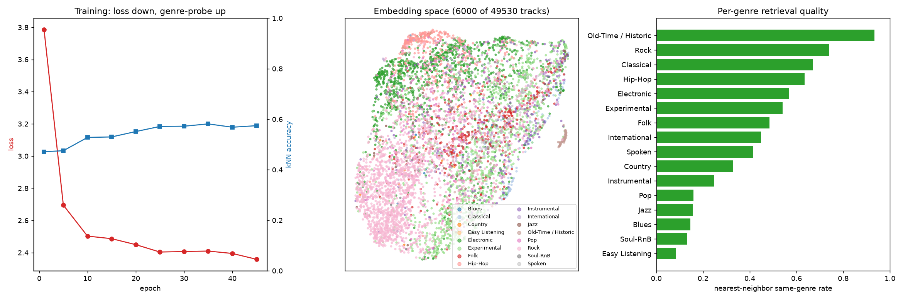
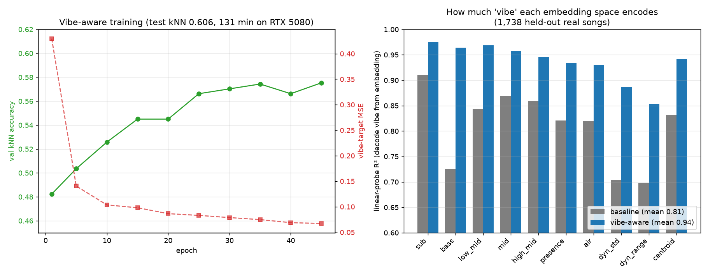
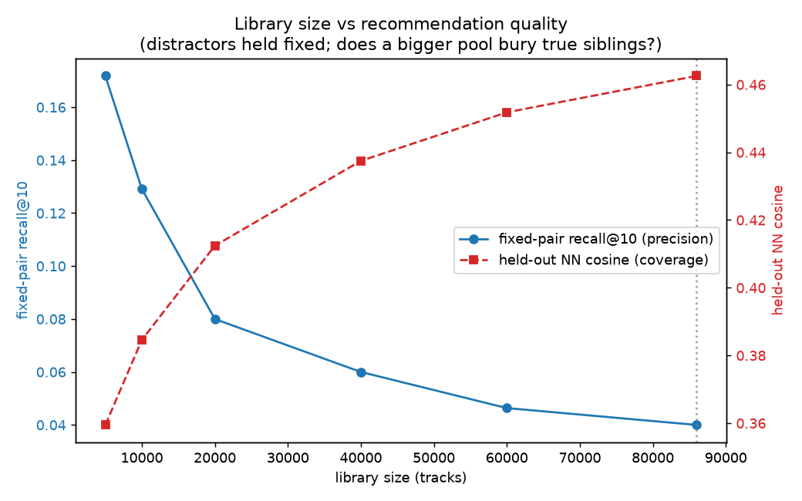

# soundalike — Engineering Case Study

> How a first-year university script became a multi-engine music recommender with a
> self-supervised deep-learning model trained on 106,000 songs.

This document is the story behind the code: the problem, the constraints, the design
decisions, the walls I hit, and how I got through them. The polished "what it is and how to
run it" lives in the [README](../README.md); this is the "how it was built and why."

---

## TL;DR

- **Started with:** a ~180-line first-year terminal script that read a static CSV of songs and
  printed min/max/mean statistics.
- **Ended with:** an installable Python package with **six recommendation engines**, a live
  Spotify integration (OAuth PKCE, no passwords), and **GPU-trained audio-embedding neural
  networks** — a contrastive FMA encoder, a **vibe-aware** encoder that learns a song's bass profile
  and dynamics, and an **artist-aware** encoder fine-tuned on ~87,000 real songs — feeding a
  bundled, out-of-the-box recommender.
- **Headline result:** the learned model's genre-probe accuracy scales with data —
  **0.25 → 0.601 → 0.641** as the training set grows **475 → 25,000 → 106,000** tracks — going
  from *losing* to a no-ML baseline to beating it by **+13 points**.
- **Vibe result:** a multi-task "vibe-aware" encoder raises how much vibe its embedding space
  encodes from **linear-probe R² 0.82 → 0.94** on 1,738 held-out real songs, with the biggest
  gains on bass and dynamics — the qualities that define whether two songs *feel* the same.
- **Scale result:** growing the library to ~87k songs across every genre exposed the *encoder* as
  the bottleneck; a domain-matched **artist-aware** fine-tune, a **higher-dimensional embedding**
  (256→384) and embedding **whitening** turned incoherent cross-genre matches into scene-coherent
  ones (Miles Davis → Brad Mehldau/Lee Morgan; Explosions in the Sky → This Will Destroy You/Mono;
  NewJeans → CHUU/LOONA, not random pop).
- **Objective + validation result:** a controlled 5-seed sweep found an **ArcFace + GeM** encoder
  that beat supervised-contrastive by **+23% on same-artist mAP** — but validating it against
  *independent human behavior* (ListenBrainz co-listening + Deezer related-artists) revealed it
  **regressed real cross-artist recommendation** (and botched niche genres like city pop/hyperpop).
  An internal metric had rewarded the wrong thing, so I **reverted** and built a `cross_artist_agreement`
  metric that measures inter-artist geometry — the honest "measure, ship, re-measure, revert" loop.
- **Human-quality audio retrieval result:** a 107-pair, component-disjoint protocol exposed another
  failed generalization. The locked audio-only method improved DEV primary 0.01506→0.02558, but
  the once-opened 40-pair FINAL test moved one counterpart to rank 14, with primary 0→0.000595
  and a paired 95% interval touching zero. It was rejected and not deployed.
- **Collaborative candidate result:** Music4All-Onion item2vec over 115,468 mapped users raised DEV
  hybrid candidate R@1000 from 0.0686 audio-only to 0.2353. On a fresh, once-opened 88-pair FINAL,
  however, the exact-edge-masked hybrid regressed current-production primary 0.01156→0.00023 and
  direct inspection passed only 13/20 difficult seeds. It was rejected and not deployed.
- **Graph-first preflight result:** a signed, low-capacity three-parameter policy improved opened-DEV
  candidate recall 0.1996→0.2654 and nDCG@10 0.03477→0.04882, but nested folds gained only
  6.0%-18.6%, scene-held-out validation passed 4/17 scenes, and a new direct review passed 13/20.
  Preconditions failed, so no protocol-v8 FINAL was created or opened.
- **Human calibration result:** MagnaTagATune's real odd-one-out votes put the current artist-SupCon
  encoder at 16/29 (55.2%) and a DEV-selected, FMA-regularized 32-D projection at 19/29 (65.5%).
  The +10.3-point paired CI still spans zero, so the catalog was not re-embedded. A signed,
  60-seed blinded-list evaluator is ready, but no real listener exports existed in this run.
- **All-triad cross-validation result:** a leakage-purged nested cross-fit uses all 307 accepted
  MagnaTagATune triads. The inner-selected learned model reaches 186/307 versus 176/307 for the
  production encoder, but +3.26 points with CI crossing zero fails the release gate. No catalog,
  commercial evaluator, FINAL, or deployment changed.
- **Built and validated on:** an NVIDIA RTX 5080, the full automated suite, and a clean packaged
  wheel.

---

## 1. The problem

The original project (`spotify_program.py`) was a good learning exercise but fundamentally
limited: it read one static 855-row CSV and computed aggregate statistics. The goal was to turn
it into something real — **a tool that finds songs that genuinely sound like the ones you
like**, better than the mediocre "song radio" features that already exist.

### The constraint that shaped everything

The obvious approach — ask Spotify's API for similar songs and audio features — is **no longer
possible**. On **2024-11-27, Spotify removed** the Recommendations and Audio Features endpoints
for all new apps ([official announcement](https://developer.spotify.com/blog/2024-11-27-changes-to-the-web-api)).
Those are exactly the endpoints this idea would normally depend on.

That constraint became the project's defining design driver: **if you can't get similarity or
audio features from Spotify, you have to compute them yourself.** That's not a limitation — it's
the whole point of what makes this interesting.

---

## 2. Architecture: five engines, one idea

Every engine answers the same question — "what sounds like this?" — but from a different signal
and with different tradeoffs.

| Engine | Signal | Credentials | Coverage |
|--------|--------|-------------|----------|
| **Deep-vibe** ⭐ | Vibe-aware neural embedding **fused** with measured bass/dynamics | None | Bundled ~1,700-song library |
| **Vibe** | Frequency-band balance + dynamics, vs a ~1,500-song library | None | Real, listenable songs |
| **Acoustic DSP** | Features measured from the raw waveform (librosa) | None | Any track with a preview |
| **Content-based** | Audio-feature vectors, standardized + weighted | None | Bundled dataset |
| **Learned model** | A CNN trained to embed audio (contrastive) | None | Whatever it's trained on |
| **Live Spotify / Last.fm** | Your real listening + optional crowd data | Free API keys | Your library / any track |

A deliberate design principle runs through the acoustic engines: **ranking is done purely by
the sound.** A music catalog (Deezer) is used *only* to enumerate candidate songs and fetch their
audio — never to decide what's "similar." That keeps the recommendations grounded in acoustics
rather than "people who listened to X also listened to Y," which is what every existing tool
already does. Iteration 5 deliberately tested a collaborative counter-hypothesis as a research
candidate generator; its fresh FINAL failed, so this production design was not changed.

---

## 3. The machine-learning story (the interesting part)

The most ambitious engine trains a neural network to place similar-sounding songs near each
other in an embedding space. It's **self-supervised** using a contrastive objective (NT-Xent,
the SimCLR loss): two augmented snippets of the *same* track are pulled together while snippets
of *different* tracks are pushed apart. This needs **no similarity labels** — which is essential,
because nobody hands you ground-truth "these two songs are similar" data.

### Act 1 — an honest failure

The first attempt trained on ~475 songs harvested from free previews. The result was humbling
and instructive: **the neural network lost to a trivial baseline.** A no-learning approach
(mean+std pooling of the spectrogram) recovered genre at **0.375** accuracy; the neural net
managed only **0.25** — barely above the **0.24** chance rate.

This is textbook behaviour: **contrastive deep learning is data-hungry.** With only a few
hundred examples the model can tell individual clips apart without ever learning what makes a
*genre* cohere. Rather than hide this, I measured it explicitly and treated it as the signal to
scale up. (I also confirmed genres *were* separable from audio — the baseline's 0.375 ≫ 0.24
chance proved the signal existed; the model just needed more data to capture it.)

### Act 2 — scaling to real data

The [Free Music Archive](https://github.com/mdeff/fma) provides labeled audio at scale. I trained
on FMA-medium (25k tracks) and then FMA-large (106k tracks), evaluating with a **kNN genre
probe** — freeze the embeddings, then see how well a simple classifier recovers genre from them.
A model that has learned real musical structure will score well above chance.

| Training data | Neural kNN | No-ML baseline | Chance | Verdict |
|---------------|-----------|----------------|--------|---------|
| 475 tracks | 0.25 | 0.375 | 0.24 | **loses** to baseline |
| FMA-medium 25,000 | 0.601 | 0.521 | 0.28 | **+8 points** |
| FMA-large 106,000 | **0.641** | 0.507 | 0.29 | **+13 points** |

**The scaling curve is the whole story.** The more data, the wider the neural network's margin
over the baseline — precisely what the theory predicts. At 106k tracks, **57% of songs have a
same-genre nearest neighbor** in the learned space, from a model that never saw a single label
during training.



*Training on 106k tracks: loss falls as the genre-probe accuracy rises (left); the embedding
space forms visible clusters — Electronic at top, Rock/Pop at bottom, a tight Old-Time/Historic
island (middle); per-genre nearest-neighbor retrieval reaches Old-Time 93%, Rock 74%, Classical
67%, Hip-Hop 64% (right).*

### Does it actually recommend well?

The numbers are backed up by qualitative results. Querying the 106k model with mainstream songs
it has never seen (it maps them into the learned space and finds neighbors in the FMA catalog):

- **"Lose Yourself" — Eminem** → 5 of 6 neighbors are labeled **Hip-Hop**.
- **"Clair de Lune" — Debussy** → a Beethoven piano sonata (**Classical**) and other solo-piano
  instrumental tracks.
- **"Bohemian Rhapsody" — Queen** → folk/acoustic ballad tracks, matching its ballad sections.

The model learned to discriminate by acoustic character — rap finds rap, classical finds
classical — purely from the physics of the audio.

---

## 4. Engineering challenges (and how I solved them)

The interesting problems weren't the ML — they were the systems engineering around it.

### Challenge: the GPU was starving

The first FMA-medium training run pinned the GPU at **9% utilization**. Sampling `nvidia-smi`
over time showed a sawtooth: brief bursts to 98% then long stalls — a classic data-loading
bottleneck. The root cause was random reads of 25,000 tiny spectrogram files from a slow
network-mounted drive (measured at ~20 files/second).

**Fix:** I built a consolidation step (`pack.py`) that packs every spectrogram into a single
compact `float16` array, and a training path (`train_fast.py`) that loads the **entire dataset
into VRAM once** and does augmentation *on the GPU*. Result: **99% utilization, 37s/epoch** — the
bottleneck vanished.

### Challenge: the dataset didn't fit in VRAM

Scaling to 106k tracks made the packed dataset **14 GB** — too big to sit in the 5080's 16 GB
VRAM alongside the model. Rather than fail or shrink the data, I made the trainer **auto-detect
its data residency**: it keeps the dataset GPU-resident when it fits (FMA-medium) and switches to
**pinned CPU RAM with per-batch PCIe streaming** when it doesn't (FMA-large). A batch is only
~17 MB, so the transfer overlaps compute and the GPU still runs at **99% utilization**.

### Challenge: downloading 93 GB

FMA-large is a 93 GB archive. A single-stream download ran at ~13 MB/s (~2 hours). I switched to
**aria2 with 16 parallel connections**, hitting **~138 MB/s — an ~11x speedup** (~11 minutes).
Along the way I also had to diagnose and recover from a corrupted download (two writers hitting
the same file) and abandon a problematic drive that blocked executable launches.

### Challenge: understanding the hardware

Out of genuine curiosity about how NVIDIA's libraries pick low-level algorithms, I built a
**cuDNN solver-selection inspector** (`ml/gpu.py`). It surfaces which CUDA kernel cuDNN chooses
for a given convolution — revealing it selected a **TF32 Tensor-Core `cutlass` kernel in NHWC
layout**, plus the layout-transpose kernels that overhead implies. I then demonstrated the
optimization ladder empirically: **NCHW → channels-last (1.34x) → fp16 + channels-last (4.2x)**,
and folded channels-last + mixed precision into training so the 5080 runs near its Tensor-Core
peak.

---

## 5. Iterating from real feedback: the "vibe" engine

The best case study material comes from a feature that *didn't* work at first.

A test query — "find songs like *Wasting Time* by eric404," a hyperpop track with quiet vocals
and a heavy dubstep drop — returned soft acoustic bedroom-pop. Wrong vibe entirely. Rather than
hand-tune, I **measured why**. I analysed the seed and the bad recommendations directly:

| Song | sub-bass % | dynamic range | crest (peak/avg) |
|------|-----------|---------------|------------------|
| *Wasting Time* (the seed) | **73%** | **0.39** | **2.21** |
| a "soft" recommendation | 45% | 0.25 | 1.61 |

The data made the bug obvious. The seed is overwhelmingly **sub-bass** and has **~2× the dynamic
range and crest** (the peak-vs-average spikiness that *is* the drop). But the original engine
**averaged every feature over the whole 30-second clip** — so the quiet intro and the loud drop
blurred into a bland "medium," and the sub-bass dominance wasn't modelled at all. It was blind to
exactly the qualities that define the vibe.

**The fix** was a new feature set that measures what the averages hide:

- **Frequency-band balance** — energy split across seven bands (sub → air), i.e. the literal
  "how much bass, how much highs."
- **Dynamics** — standard deviation, dynamic range, and crest factor of the loudness envelope,
  which capture "does this track have drops?"

These are weighted so the low-end and the dynamics dominate the match, and ranked against a
bundled library of ~1,500 real, diverse songs. The result: the same query now correctly reads
*"123 BPM, very dynamic (big drops), bass-heavy"* and returns hyperpop/electronic tracks in the
right scene (aldn, Flume, Slow Magic). This is the engineering habit that matters most —
**diagnose with data before you change code**, and let the measurement design the fix.

### From hand-crafted vibe to *learned* vibe

The hand-crafted vibe vector works, but it raised a sharper question: could the **neural encoder
itself** learn to represent vibe, instead of relying on hand-weighted features bolted on
afterwards? The plain contrastive encoder is good at timbre but, as the R² numbers below show,
only partly captures bass and dynamics.

So I trained a **vibe-aware encoder** with a multi-task objective: the self-supervised contrastive
loss **plus** an auxiliary head that must predict a 10-dim *vibe target* — seven frequency-band
fractions, loudness dynamics (std + range), and spectral centroid — computed directly from each
song's mel-spectrogram. Predicting that target from a short crop forces the embedding to encode
*how the whole song sounds and moves*. Crucially, the target is derived from the **already-packed
FMA spectrograms**, so the vibe-aware model trains on all 106k songs with **zero re-downloading**
(~131 min on the 5080).

To measure whether it worked, I used a **linear probe**: fit a ridge regression from each
encoder's frozen embeddings to the vibe target on 1,738 held-out real songs, and report
cross-validated R². A linear probe is the standard, honest test of "is this information linearly
present in the representation?"

| Vibe dimension | Baseline encoder | Vibe-aware encoder |
|----------------|------------------|--------------------|
| **Overall (10-dim)** | **0.82** | **0.94** |
| Bass | 0.73 | **0.96** |
| Loudness dynamics | 0.70 | **0.89** |
| Drop size (dynamic range) | 0.70 | **0.85** |

The vibe-aware encoder wins on *every* dimension, and the largest gains are exactly on **bass and
dynamics** — the qualities the original engine was blind to and the ones that decide whether two
songs feel the same. That encoder is what ships in the package and powers the deep-vibe engine.



A second engineering payoff came out of building this: I split "download a preview" from "embed
it" with a **spec cache**. The library's mel-spectrograms are harvested from Deezer *once* (rate
-limited, resumable, checkpointed) and stored; re-embedding the whole 1,738-song library with a
newly trained encoder is then a local, offline, seconds-long operation. Swapping in a better model
no longer costs an hour of rate-limited downloading — which is what made the baseline-vs-vibe-aware
comparison above a fair, apples-to-apples test on an identical song set.

---

## 6. Scaling the library exposed the real bottleneck (and how I fixed it)

Testing on a niche seed (*Lovers Rock* by TV Girl) returned generic pop — because the bundled
library, curated for the earlier hyperpop test, simply had no dream-pop neighbours. So I **grew the
library in waves — ~1,700 → ~25,000 → ~55,000 → ~87,000 songs** across every scene, crawling the
Deezer **related-artist graph** two hops out from a ~400-artist multi-genre seed list (deliberately
over-sampling niches the charts miss: K-pop and city-pop, Afrobeats, French and Latin rap, techno/
house/DnB, phonk and synthwave, post-rock, shoegaze, black/death metal, jazz, classical, blues,
gospel, reggae). (Deezer's genre endpoints turned out to be useless — they ignore the id and return
the same global list — so the related-artist graph, which *is* genre-coherent, did the work.) Four
engineering details made the harvest practical: a **candidate sidecar** so a restart never re-does
the slow gather; **thread-pool downloads** (the box was 93% idle at 0.8/s single-threaded → ~6/s
across 10 workers); the discovery that Deezer **preview URLs are signed and expire**, so the worker
fetches a fresh URL by track id right before downloading (this alone took the success rate from 0%
back to 100%); and a **dedup pass** that collapses remaster/sped-up/remix/karaoke variants of the
same song to one row, so a seed can't match five copies of one track.

But growing the library made recommendations **worse**, which was the most instructive result of
the whole project. A bigger, more diverse pool contained more songs that were *texture-similar but
vibe-wrong*, and the FMA-trained encoder — trained on mostly instrumental Creative-Commons music —
happily surfaced them (a dream-pop seed matched Creed and Metallica). **The library was never the
ceiling; the encoder was.** Three fixes, two at train time and one at inference:

1. **An artist-aware encoder.** I fine-tuned the encoder on the harvested songs with a
   **supervised-contrastive** objective using the *artist* as the label (PK-sampled batches; songs
   by the same artist are positives), plus the vibe-target auxiliary. "Same artist ⇒ similar" is a
   free, strong style signal, and because the library was crawled through related artists it
   generalizes to *neighbouring* artists. It trains on the cached spectrograms in ~40 min on the
   5080.

2. **A higher-dimensional embedding.** When the library passed ~50k songs, precision on
   already-strong seeds *softened* — a bigger pool means more competing look-alikes crowding a
   fixed-size space. Widening the embedding from 256 to 384 dimensions (which barely changes compute
   — it's just the final projection — and keeps the bundled index under GitHub's 100 MB limit) gave
   the space room to separate ~87k songs, and precision recovered while coverage kept improving. The
   384-d base also scored higher on the held-out genre probe (kNN 0.617 vs 0.606). I also tried
   **512-d** to see if bigger was better still — it wasn't: on the recommendation benchmark it matched
   384-d on precision and was *slightly worse* on coverage (0.445 vs 0.463), at +33% size and memory,
   and its genre-probe kNN actually dropped to 0.609. So 384-d is the measured sweet spot, and the
   encoder's *capacity* is no longer the bottleneck — a useful negative result that says "don't just
   make it bigger."

3. **Whitening.** The embeddings piled into a tight cone (every pair ~0.9 cosine), so raw cosine
   couldn't rank finely. ZCA-whitening the space at load time removes the dominant shared direction
   so similarity keys on what's *distinctive*.

The combined effect, on identical seeds:

| Seed | FMA encoder, raw cosine | Artist-aware 384-d + whitening |
|------|--------------------------|--------------------------------|
| *So What* — Miles Davis | mixed | Brad Mehldau, Lee Morgan, Ahmad Jamal |
| *Your Hand in Mine* — Explosions in the Sky | mixed | If These Trees Could Talk, This Will Destroy You, Mono |
| *Ditto* — NewJeans | mixed | CHUU, LOONA (K-pop) |
| *HUMBLE.* — Kendrick | mixed | Kodak Black, JID, $uicideboy$ |

It's now genuinely scene-coherent across jazz, post-rock, metal, hip-hop, R&B, electronic, indie,
bedroom-pop, K-pop and ambient — including whole scenes (jazz, post-rock, phonk, city-pop) that
simply weren't in the library before. The instructive arc is the coverage-vs-precision tension:
scaling the library helped coverage but *hurt* precision until the encoder was given more capacity
to match — a reminder that "more data" and "better model" are different levers. The throughline is
the same engineering habit as the vibe engine:
**let the failure tell you where the real bottleneck is**, and don't mistake "more data" for
"better model."

### Putting a number on "how big should the library be?"

Rather than keep guessing, I built a label-free benchmark (`soundalike.ml.benchmark`) that measures
the trade-off directly. Holding a song and one same-artist sibling fixed and adding only
*distractors*, **fixed-pair recall@10 falls from 0.17 at 5k to 0.04 at 86k** — a bigger pool does
bury a specific sibling. Meanwhile **held-out nearest-neighbour cosine (coverage) rises from 0.36 to
0.46** — a bigger pool means something close almost always exists. The curves cross near 20k and both
flatten past ~40k.



So the "perfect balance" isn't a single number — it depends on which failure you care about. I chose
**coverage-first (~87k)** deliberately: the failures users actually notice are coverage failures (a
niche seed returning nothing in-scene), and the precision cost is better recovered with **smarter
ranking than with a smaller library**. That's what the new `--diversity` (MMR re-ranking),
`--max-per-artist`, and multi-seed *taste-blend* features do — keep the top-K varied and on-point
without throwing away whole scenes. The bundle is also GitHub-capped near ~100 MB, so ~87k is close
to the practical ceiling regardless. The point isn't the exact size; it's that the decision is now
*measured and defensible* instead of a hunch.

### The objective is the lever — a controlled encoder sweep

If the encoder is the ceiling, the obvious question is *how do you raise it?* Rather than guess, I
built a trustworthy head-to-head metric — same-artist **mean average precision** (`score_embeddings`
whitens exactly as production does, then reports mAP + recall@10 + coverage in one call) — fixed a
5-seed baseline, and ran each idea as a controlled experiment where the objective is the only
variable. The result overturned my intuition: **capacity is not the bottleneck; the objective is.**

| Variation | mean mAP (5 seeds) | vs baseline | verdict |
|-----------|:---:|:---:|---|
| Supervised-contrastive, 384-d *(previous ship)* | 0.0396 | — | baseline |
| 512-d encoder | — | worse | ❌ capacity isn't the lever (see §8 note) |
| 3-encoder ensemble (concat) | 0.038–0.040 | −2 to −7% | ❌ combining encoders hurt precision |
| **ArcFace** (additive angular margin) | 0.0477 | **+20%** | ✅ objective *is* the lever |
| **ArcFace + GeM pooling** | **0.0486** | **+23%** | ⚠️ shipped, then **reverted** (see below) |
| ArcFace + GeM, margin 0.3 | 0.0488 | +23% | ➖ tie on mAP, *worse* on the NN probe → rejected |

Two findings drove the (initial) ship. **ArcFace** replaces the plain contrastive push/pull with an
additive angular margin, forcing each song tighter around its artist prototype and further from every
other — a +20% mAP jump on its own. **GeM pooling** swaps the encoder's flat spatial average for a
learnable generalized mean, so the network chooses how peaky its per-clip summary is; interestingly it
learned an exponent *below* 1 (softer than average), and added another ~2%. Pushing the margin higher
(0.3) was a statistical tie on mAP but *regressed* the independent same-artist NN probe — a clean
signal that 0.2 is the sweet spot for noisy related-artist labels, not a number to keep cranking.

On same-artist mAP and on a first qualitative glance it looked great — so I shipped it. Then I did
what you should always do with an *internal* metric: I checked it against the outside world.

### Ship, re-measure, revert: external validation caught a regression

Same-artist mAP asks "are a song's own siblings near it?" That rewards packing each artist into a tight
ball — but a recommender never returns the seed's own artist; it returns *other* artists. So I validated
the shipped encoder against two **independent human-behavior** ground truths, over 24 mainstream *and*
niche seeds: **ListenBrainz** co-listening (people who listen to X also listen to Y) and **Deezer**
related-artists. For each seed I measured the fraction of our recommended artists that real listeners
corroborate, against a random-library baseline.

| Ground truth (independent of our audio) | ArcFace+GeM (shipped) | Supervised-contrastive (old) | Random |
|---|:---:|:---:|:---:|
| ListenBrainz co-listening (24 seeds) | 0.117 | **0.161** | 0.004 |
| Deezer related-artists (24 seeds) | 0.058 | **0.100** | 0.001 |
| Deezer centroid geometry (116 artists) | 0.233 | **0.252** | — |

Both encoders are 26–135× better than random, so both are genuinely sensible — but the **old
supervised-contrastive encoder agreed with real listeners more, on every measure.** Qualitatively the
gap was worst exactly where it hurts: **city pop** (*Plastic Love* — Mariya Takeuchi: old → Hiroshi
Sato, T-Square, Anri, Momoko Kikuchi; ArcFace → Dream Theater, Eric Clapton) and **hyperpop** (*100
gecs*: old → SOPHIE, Dorian Electra; ArcFace → Rezz, Diplo). ArcFace's aggressive artist-separation had
sharpened same-artist retrieval while *distorting the inter-artist geometry that recommendation depends
on* — a metric optimizing the wrong thing.

So I **reverted to the supervised-contrastive encoder** and added `cross_artist_agreement` to the
benchmark: it builds each artist's centroid, ranks the nearest *other*-artist centroids, and scores
overlap against a human related-artist map — the North Star same-artist mAP had missed. The ArcFace/GeM
trainer and pooling stay in the tree as a documented negative result. The lesson is the most valuable
artifact here: **an internal metric is a hypothesis, not a verdict — validate against the real world
before you trust it, and be willing to unship.**

It shows up qualitatively for the *kept* (supervised-contrastive) encoder, exactly where the FMA
encoder was weakest. *Plastic Love* — Mariya Takeuchi returns genuine city pop (Hiroshi Sato,
T-Square, Anri); *OMG* — NewJeans surfaces K-pop neighbours; jazz and black-metal seeds return
scene-royalty. The remaining weak spot (both encoders): ultra-niche breakcore seeds (*Sewerslvt*) leak
into trance — a candidate for the next objective iteration, now measurable via `cross_artist_agreement`.

---

## 7. Ranking quality: the once-opened audio test

Iteration 3 fixed category leakage and deployed a manually coherent guardrail, but its advertised
+88.3% retrieval result was one additional counterpart at rank 37. Recall@10 fell 0.05→0, MRR
fell 0.00625→0.00590, and the paired interval [-0.00256, 0.07703] crossed zero. The held-out set
had also been reused for challenger selection, and removing Wikipedia/notability priors reduced the
reported method to zero hits. It was not evidence that the +20% goal had been met.

### A new benchmark before new training

Version 5 was built before fitting iteration-4 models. It contains 107 deciding Category-A pairs
across 85 named scenes and stores URLs, short excerpts, source classes, access dates, and category
rationales. A post-freeze audit checked 190 unique URLs: 186 returned 200, two were
publisher-access-controlled, and two stale slugs have verified canonical/archive replacements in the
audit artifact. Samples, interpolations, covers, remixes, legal allegations, and weak listicles do not
enter the metric. Named criticism/participant accounts provide the editorial rows; the independent
ListenBrainz similar-recordings dataset supplies human-listening musical-similarity rows, with its
session-based limitation stated explicitly. MusicBrainz recording IDs verify identity.

The 67 development and 40 FINAL pairs share no artist or transitive artist component. Tracks and
artists are unique, and popular, deep-cut, and niche strata are present. Every prior v4 held-out row
is development-only. Before training, the protocol froze and hashed:

- `benchmarks/soundalike_pairs.v5.json`;
- the 40-pair FINAL manifest;
- ranked outputs for pre-goal production, iteration-3 deployed, raw encoder, and all-priors-zero
  audio baselines; and
- a signed state document with `final_open_count = 0`.

The primary was predeclared as `mean(NDCG@10, MRR, Recall@10)`. Success required ≥20% relative
and positive absolute gain, non-regressing Recall@10 and MRR, paired-bootstrap CI above zero, at
least five improved FINAL pairs, and no scene regression beyond 10%. The selected configuration,
checkpoint hashes, and DEV report were locked before the state machine permitted one opening. Review
then hardened the transition further: future runs must enter `RANKINGS_LOCKED`, binding the exact
target-agnostic ranking file hash before `open-final`. The historical failed run generated that file
14 seconds before opening but predated the explicit transition; this limitation is recorded in state.

### Materially different audio experiments

All models excluded every benchmark artist where catalogue rows were used for training. Titles,
artists, Wikipedia/pageviews, popularity, manual pairs, benchmark identities, and FINAL outcomes
were never model inputs.

| Approach | Substantial training/index run | DEV result |
|---|---|---|
| Cross-artist FMA SupCon ResNet | 153,600 examples, 1,200 updates; 272,853-row 128-d index | R@10 0; R@50 0.0149 |
| FMA BYOL ResNet | 102,400 examples, 800 updates; full 128-d index | no top-50 hit |
| EfficientNet/CLAP audio distillation | 256,000 examples, 1,000 updates; 15,570 benchmark rows excluded; full 128-d index | candidate R@1000 0.145, no top-50 hit |
| Independent-pair audio metric/reranker | 3,967 cross-artist positives with zero benchmark-artist overlap | useful only as a two-stage head |
| Three-window MaxSim | 3×128 vectors for all 272,853 tracks over a five-signal candidate union | union R@1000 0.217, but reranker had no top-50 hit |

Candidate recall was the main failure: the learned FMA models usually never admitted the known
counterpart to the first 1,000 candidates. Distillation admitted more counterparts but could not
order them usefully. The locked method therefore used a learned audio-only candidate head and a
rank-stratified tail across EfficientNet, distilled audio, SupCon, and CLAP. The tail is a candidate-
recall mechanism, not a metadata prior.

### DEV selection

| Development Category-A metric | Pre-goal production | Locked audio method |
|---|---:|---:|
| Recall@10 | 0.02985 | **0.04478** |
| Recall@50 | 0.02985 | **0.07463** |
| MRR | 0.00485 | **0.01254** |
| NDCG@10 | 0.01048 | **0.01944** |
| Primary | 0.01506 | **0.02558** |

Relative DEV gain was **+69.9%**. Four pairs improved, none worsened, and the paired primary-delta
95% interval was **[0.000116, 0.028508]**. This was sufficient to lock the configuration; no FINAL
rank or metric had been read.

### FINAL opened once — failure

The state machine opened FINAL at `2026-07-12T08:46:37Z` and immediately finalized it. A second
open is rejected programmatically. The finalized state and bound ranking hash are sealed by a
detached Ed25519 signature (`protocol-v5/state.sig`); the private key was not retained, and the
committed public key verifies the artifact independently.

| Once-opened FINAL (40 pairs) | R@1 | R@5 | R@10 | R@20 | R@50 | MRR | NDCG@10 | Primary |
|---|---:|---:|---:|---:|---:|---:|---:|---:|
| Pre-goal production | 0 | 0 | 0 | 0 | 0 | 0 | 0 | 0 |
| Iteration-3 deployed | 0 | 0 | 0 | 0 | 0.025 | 0.000833 | 0 | 0.000278 |
| Raw encoder | 0 | 0 | 0 | 0 | 0 | 0 | 0 | 0 |
| All-priors-zero audio ablation | 0 | 0 | **0.025** | **0.025** | **0.025** | **0.003125** | **0.007887** | **0.012004** |
| Locked method | 0 | 0 | 0 | 0.025 | 0.025 | 0.001786 | 0 | 0.000595 |

The locked method moved one pair to rank 14. Its absolute primary delta was 0.000595; the paired
95% interval **[0, 0.001786]** includes zero and P(delta>0)=0.6364. The per-scene no-regression
check passed (all production scene contributions were zero), but one improved pair is below the
predeclared five-pair minimum. The production baseline's zero primary makes a relative percentage
undefined in practical terms. The all-priors-zero audio baseline found one pair at rank 8 and was
stronger than the locked method at useful ranks, but it also failed confidence and count criteria.

**Verdict: FINAL failed.** It was not reopened, no hyperparameter was changed afterward, and no
iteration-4 model was deployed. A future attempt requires a new protocol and new component-disjoint
FINAL set.

### Product and resource decision

Production remains the prior `dual_sonic64_guardrail`, whose guarded top five retained 17/20 direct
manual UX passes versus 11/20 for the original baseline. That result is secondary and subjective;
it is not blended with retrieval and is not described as clearing the goal. The current site and
release are unchanged, so search and preview behavior were not put at risk by a failed experiment.

Training used an RTX 5080: SupCon 617.84 s, BYOL 390.55 s, distillation 319.65 s. Full-catalog
embedding passes took 38.66–43.05 s; the 3-window index took 109.73 s. The three selected float16
matrices total 209,551,488 bytes plus a 7,813-byte scorer. With the 299,288,526-byte base index,
the research package would be 508,847,827 bytes. Measured cold load was 10.86 s; process RSS rose
2.21 GB to 2.85 GB, uncomfortably close to the hosted 3 GB limit. Twenty local rankings averaged
79.2 ms (p95 92.1 ms). These are research assets only because FINAL failed; the deployed index is
unchanged.

Reproduction and immutable evidence:

```powershell
$env:PYTHONPATH = "src;."
.\.venv\Scripts\python.exe -m soundalike.ml.final_protocol freeze `
  --benchmark benchmarks\soundalike_pairs.v5.json `
  --index ml_data\deepvibe_index_v5.npz `
  --protocol-dir .goals\human-quality-recommendations\protocol-v5

# Training/evaluation APIs are in soundalike.ml.audio_experiments.
# `lock` and `open-final` now refuse because this protocol is FINALIZED.
.\.venv\Scripts\python.exe -m pytest tests\ -q
```

Exact records are in `artifacts/audio-dev-results-v5.json`, `artifacts/final-once-v5.json`, and
`protocol-v5/state.json`.

---

## 8. Collaborative candidates: independent data, fresh FINAL, failed result

The iteration-4 failure was diagnostic, not just disappointing. Every FINAL query and target was
present in the 272,853-row catalogue, but audio candidate recall was too low for any reranker to
help. Iteration 5 therefore changed candidate generation rather than training another audio encoder.

### Independent collaborative source and compact model

The training source is [Music4All-Onion](https://doi.org/10.5281/zenodo.6609677), published under
CC-BY-4.0 by Moscati et al. (CIKM 2022). Its public count subset contains 50,016,042 user-track
interactions from 119,140 Last.fm users over 56,512 tracks; the full dataset provenance records
252,984,396 timestamped listens. The downloaded 550,649,499-byte count archive matched published
MD5 `314b51196a9c8f333c7fefc0711760a1`.

Exact normalized title/artist matching mapped 28,538 source IDs to 27,367 catalogue rows. Streaming
the archive produced 22,854,372 mapped tokens from 115,468 users with at least two mapped tracks.
A 64-dimensional skip-gram item2vec model used window 30, 15 negative samples, eight epochs, and 24
CPU workers. After the frequency floor, the compact index covers 13,680 catalogue rows and 2,640
artists. An unmapped seed uses a mapped artist centroid when available, otherwise an audio-neighbour
bridge; this preserves query-conditioned retrieval without a global popularity fallback.

The runtime asset is float16 and only 1,978,816 bytes. User histories, raw counts, and the 389 MB
training corpora are research inputs and do not ship.

### Fresh protocol before training

Version 6 was frozen before item2vec training. The 107 opened v5 pairs became DEV diagnostics only.
FINAL contains 88 fresh, in-catalog, cross-artist human “songs-like” pairs from the independently
operated ListenBrainz session-similarity service across 18 scenes and popular/deep-cut/niche tiers.
DEV and FINAL are artist-disjoint; the complete 195-pair benchmark has 414 unique credited artists.
Source URLs, algorithm, score, excerpts, and access dates are stored for every FINAL pair.

`protocol-v6` froze the benchmark, 88-pair manifest, release index, and target-agnostic rankings for
pre-goal/current-production/audio controls. A detached Ed25519 signature seals the pre-training
frozen snapshot. After DEV selection, the method manifest and three assets were hash-bound. The
winner and all controls were generated without target comparisons, then the state entered
`RANKINGS_LOCKED` at `2026-07-12T11:58:58Z`. FINAL opened once at `11:59:29Z`; the finalized state
is separately Ed25519-signed. Both private keys were destroyed.

Training and benchmark source families are distinct, but both describe aggregate listening
behavior, so source identity alone is not treated as proof. The stronger test was exact edge masking:
39/88 FINAL pairs had both items mapped into Music4All, representing 74 internal item edges and
2,236 shared-user co-occurrences. Before deciding-model training, one endpoint was deterministically
removed from every such user context. The masked corpus audit is exactly 2,236→0. A full, unmasked
model was locked only as an anti-memorization ablation; it was never eligible to replace the winner.

### Candidate union and DEV selection

Three genuinely different generators were compared: audio-only, item2vec collaborative-only, and a
round-robin union of both plus current-production candidates. The union keeps at most three tracks
per artist before ranking. The final list applies the existing real-index derivative filter, seed-
title rejection, exact recording deduplication, and one-result-per-artist cap. A compact linear
reranker uses collaborative cosine, collaborative reciprocal rank, and a small audio-vibe score.
The global Wikipedia/notability feature and weight are both exactly zero.

| Opened DEV (102 resolved pairs) | Audio only | Collaborative masked | Hybrid union masked |
|---|---:|---:|---:|
| Candidate Recall@100 | 0.0196 | 0.0784 | **0.1078** |
| Candidate Recall@500 | 0.0490 | 0.1275 | **0.2059** |
| Candidate Recall@1000 | 0.0686 | 0.1275 | **0.2353** |

| DEV ranked-list metric | Current candidate control | Collaborative only | Locked hybrid |
|---|---:|---:|---:|
| Recall@10 | 0.00980 | **0.02941** | **0.02941** |
| Recall@50 | 0.05882 | 0.06863 | **0.07843** |
| MRR | 0.00491 | 0.01222 | **0.01237** |
| Primary | 0.00631 | 0.01898 | **0.01903** |

The hybrid's all-DEV relative gain was +201.4%, but the paired delta interval
**[-0.00991, 0.03751] crossed zero**. The 24-pair internal selection subset had no top-10 hit for
any tested linear blend; its tie-break chose the smallest predeclared positive audio weight (0.01),
not a convincing learned separation. This weakness was disclosed before FINAL and no FINAL metric
was used to change it.

### FINAL opened once — candidate generation still failed

| Once-opened FINAL (88 pairs) | R@10 | R@50 | MRR | NDCG@10 | Primary |
|---|---:|---:|---:|---:|---:|
| Current deployed `dual_sonic64_guardrail` | 0.01136 | 0.03409 | **0.01196** | **0.01136** | **0.01156** |
| Audio only | 0 | 0 | 0 | 0 | 0 |
| Collaborative only, edge-masked | 0 | 0.02273 | 0.00066 | 0 | 0.00022 |
| **Locked hybrid, edge-masked** | 0 | 0.02273 | 0.00070 | 0 | 0.00023 |
| Unmasked diagnostic, not eligible | **0.02273** | **0.05682** | 0.00859 | 0.01045 | 0.01392 |

Against current production, the locked winner's absolute primary delta was **-0.01133**
(-97.99%), CI **[-0.03432, 0.00037]**. It improved two pairs, worsened three, lost the existing
punk/hardcore top-five hit, regressed Recall@10 and MRR, and failed every predeclared gate. Its
candidate recall was only 0.0227/0.0682/0.0909 at @100/@500/@1000.

The unmasked diagnostic nominally reached +20.4% primary against current production, but its CI
**[-0.02860, 0.03009]** included zero, it improved 5/88 rather than the required 10, and MRR
regressed. More importantly, the lift largely disappeared after the required direct edges were
removed. That is evidence of edge memorization, not graph-topology generalization, so it cannot be
selected after the fact.

Direct inspection independently failed: **13/20** difficult seeds passed the locked top-five rule
(required 16), with four missing queries and three incoherent resolved lists. All 80 resolved result
rows exposed a Deezer preview URL; availability was checked, but no audible-playback claim is made.
On 11 benchmark-disjoint seeds, Deezer related-artist overlap improved 0.158→0.267 with paired delta
CI [0.0364, 0.1879]. This is encouraging *artist-level taste affinity*, not sonic similarity, and
cannot override a failed deciding FINAL or direct test. Neither Last.fm nor ListenBrainz is claimed
as an external validation source for this Last.fm-derived training run.

### Resource and product decision

The masked index plus scorer adds 2,026,706 bytes. It loaded in 0.0124 s and added 48.4 MB process
RSS. With the 299,288,526-byte production index, measured RSS was 1.253 GB; first ranking took
1.98 s and 16 warm rankings averaged 0.252 s (p95 0.288 s). The method fits the hosted resource
budget, so resource pressure is not the reason for rejection.

**Verdict: FINAL failed.** No iteration-5 code or asset was wired into production, no release or
manifest was changed, and no post-FINAL retuning occurred. The live site still reports
`2026.07.11-dual-sonic64` and 272,853 tracks. Historical iteration-3/4 artifacts remain unchanged;
the v6 state, reports, direct judgments, source audit, resource measurements, and negative ablations
are retained under `.goals/human-quality-recommendations/`.

Reproduction (the finalized state correctly rejects a second open):

```powershell
New-Item -ItemType Directory -Force ml_data\iteration5\raw | Out-Null
curl.exe -L -o ml_data\iteration5\raw\music4all-id-information.csv `
  https://huggingface.co/datasets/Leon299/music4all/raw/main/id_information.csv
curl.exe -L -o ml_data\iteration5\raw\userid_trackid_count.tsv.bz2 `
  https://zenodo.org/api/records/6609677/files/userid_trackid_count.tsv.bz2/content

.\.venv\Scripts\python.exe -m soundalike.ml.collaborative `
  --metadata ml_data\iteration5\raw\music4all-id-information.csv `
  --counts ml_data\iteration5\raw\userid_trackid_count.tsv.bz2 `
  --index ml_data\deepvibe_index_v5.npz `
  --benchmark benchmarks\soundalike_pairs.v6.json `
  --output-dir ml_data\iteration5\collaborative

.\.venv\Scripts\python.exe -m soundalike.ml.collaborative_rerank dev `
  --index ml_data\deepvibe_index_v5.npz `
  --benchmark benchmarks\soundalike_pairs.v6.json `
  --masked-asset ml_data\iteration5\collaborative\item2vec-final-edges-masked.npz `
  --full-asset ml_data\iteration5\collaborative\item2vec-full.npz `
  --scorer ml_data\iteration5\collaborative\hybrid-scorer.json `
  --report .goals\human-quality-recommendations\artifacts\collaborative-dev-v6.json

.\.venv\Scripts\python.exe -m pytest tests\ -q
```

---

## 9. Catalogue-wide graph: coverage fixed, fresh FINAL still failed

Iteration 5 proved that a 13,680-row collaborative index could not retrieve most of a 272,853-track
catalogue. Iteration 6 therefore gated candidate recall before reranking and built a static
catalogue-wide artist graph.

### Source, mapping, and cold-start bridge

[Last.fm-360K](https://doi.org/10.5281/zenodo.6090214) contains 17,559,530
`user, artist, plays` rows from 359,347 users. The 569,202,935-byte archive matched published MD5
`635e6ed3fc873aa4ba33aba0ebce02b1`. Its license is accurately recorded as Last.fm permission for
**non-commercial use** (`other-nc` on Zenodo), not CC-BY or a permissive software license.
Music4All-Onion remained a second, CC-BY-4.0, track-level source.

A six-epoch 64-dimensional skip-gram model used only catalogue-mapped artists. It directly mapped
6,126/18,258 artists and 142,767/272,853 tracks (33.6% artist, 52.3% track coverage). The direct
numbers miss the requested coverage target, so they are not hidden. A precomputed audio-centroid
bridge mapped every remaining catalogue artist to eight directly collaborative artist anchors and
distilled their vectors. Exact k-NN over the combined direct/projected vectors gives the runtime
graph **100% effective artist and track coverage**. Query modes distinguish
`catalog_artist_graph` from `audio_projected_artist_bridge`; no global popularity fallback is used.

The runtime NPZ is 23,242,398 bytes. It stores artist/audio centroids, track-to-artist CSR data, and
three graph variants; it contains no users, play histories, API keys, or visitor credentials.

### Stronger measurement frozen before tuning

Protocol v7 replaced the one-positive noise floor with a graded multi-positive design. It froze:

- 40 opened v6 queries expanded into multi-positive DEV records;
- 60 fresh FINAL queries, 14 scenes, popular/deep-cut/niche tiers;
- 6-12 independently sourced relevant artists per seed, grades 1-3;
- production/current-audio baseline lists and the complete 272,853-row index hash;
- source URLs, excerpts, algorithm/relationship, access dates, metric policy, and component audit.

The automated primary is graded nDCG@10; MRR@10 and Recall@10 are non-regression gates. Automated
labels measure **taste affinity** from independent Deezer related artists plus ListenBrainz session
similarity where available. They are never described as acoustic similarity. A separate locked
20-seed list/preview inspection measures sonic/scene coherence. Shipping requires both axes.

One frozen metadata summary is incomplete: `source_policy.automated_evaluation` names ListenBrainz
only, while the authoritative per-record fields show Deezer as the primary source for 100/100
records and additional ListenBrainz evidence on 38. Rewriting a signed, once-opened benchmark would
be worse than preserving the error. The source audit records the erratum, and the builder now emits
both source families. Both remain independent of Last.fm-360K and Music4All training.

The frozen state was SHA-256-bound and detached-Ed25519-signed before training. The ephemeral private
key was destroyed. After DEV-only selection, three assets and the method manifest were hash-locked;
all target-blind rankings entered `RANKINGS_LOCKED`; FINAL opened once; the finalized state was
separately signed.

### Candidate gate and DEV selection

| DEV candidate recall (40 seeds) | @100 | @500 | @1000 |
|---|---:|---:|---:|
| Audio only | 0.1956 | 0.4413 | 0.5758 |
| Music4All sparse | 0.3282 | 0.4403 | 0.4636 |
| Catalogue-wide graph | 0.4604 | 0.4604 | 0.4604 |
| Hybrid union | **0.5322** | **0.7038** | **0.7656** |

The hybrid's +0.1897 absolute lift over audio at @1000 cleared the predeclared +0.10 gate. Only then
was a linear reranker selected on DEV. It uses catalogue-graph strength/rank, Music4All strength/rank,
audio/vibe scene consistency, source agreement, real-index quality filtering, artist caps, and a
generic scene-consistency floor for positions 1-3. Static popularity/notability is exactly zero.

| DEV ranked list | nDCG@10 | MRR@10 | Recall@10 |
|---|---:|---:|---:|
| Frozen production | 0.07131 | 0.19913 | 0.06014 |
| Audio only | 0.03227 | 0.08486 | 0.02986 |
| Music4All sparse | **0.24825** | **0.51857** | 0.19903 |
| Catalogue graph | 0.19624 | 0.37913 | 0.17986 |
| Locked hybrid | 0.24444 | 0.49027 | **0.22028** |

The locked hybrid gained +242.8% nDCG relative, absolute +0.17313, paired
CI [0.10662, 0.24343]. FINAL labels and artists were not read during selection.

### Exact and transitive masking

The benchmark and graph sources are independently operated, so cross-source agreement is legitimate
evaluation evidence. A stronger anti-memorization check was nevertheless predeclared. Across 706
FINAL query-positive artist relationships, the full Last.fm graph contained 220 exact directed
relationships. Direct masking removed every one (220→0). A read-only pre-mutation audit found
17,132 two-hop
`query→intermediate→positive` paths and deterministically removed 10,141 edge slots until the path
count was also zero. The deciding method used this strict variant. Full and direct-only graphs were
locked diagnostics, never post-FINAL alternatives.

### Once-opened FINAL

| FINAL (60 seeds) | nDCG@10 | MRR@10 | Recall@10 |
|---|---:|---:|---:|
| Frozen production baseline | **0.05250** | **0.15661** | **0.04457** |
| Deployed iteration-3 control | 0.07735 | 0.20935 | 0.05846 |
| Audio only | 0.02597 | 0.08048 | 0.02824 |
| Music4All sparse diagnostic | 0.08348 | 0.18544 | 0.07582 |
| Full catalogue graph diagnostic | **0.16560** | **0.39532** | **0.12919** |
| Direct-edge-masked graph | 0.00175 | 0.01042 | 0.00278 |
| Two-hop-masked graph | 0.00238 | 0.01667 | 0.00139 |
| **Locked two-hop-masked hybrid** | **0.04286** | **0.14034** | **0.03333** |

The winner regressed -18.3% against frozen production (absolute -0.00963,
CI [-0.04409, 0.02610], P(positive)=0.291). It improved 8/60 seeds, worsened 15, left 37
unchanged, and failed every predeclared gain, confidence, improved-count, MRR, recall, and scene
gate. African and classical fell 100%; electronic, hip-hop, indie-alternative, and pop also exceeded
the maximum -10% scene regression.

The unmasked graph's apparent +215% lift is informative but not releasable: removing independent
direct agreement collapsed nDCG to 0.00175, and breaking all two-hop paths left 0.00238. The fresh
result therefore does not show topology generalization beyond deciding-edge agreement. No method was
reselected after opening.

### Direct and external checks

Replacing four absent iteration-5 queries with in-catalog equivalents fixed direct measurability:
20/20 queries resolved and all 100 top-five tracks exposed a Deezer preview. The locked method still
passed only **12/20** scene-coherence judgments (required 16). It fixed Post Malone's crossover list,
but failed Frank Ocean twice, both hyperpop/digicore replacements, city-pop, Pixies (trip-hop still
rank 1), Starboy, and JVKE. Preview availability and actual ranked metadata were inspected; no human
audible-playback claim is made.

Independent MusicBrainz community tags measured style consistency on 11 benchmark-disjoint seeds.
Mean tag Jaccard improved 0.08708→0.11646; paired delta +0.02937,
CI [-0.01485, 0.06916]. This is statistically equivalent and supportive only.

### Resources and release decision

The sparse graph, catalogue graph, and scorer total 25,222,632 bytes. Production-index load was
3.92 s; research hybrid assets loaded in 5.24 s; total cold load was 10.75 s. Process RSS reached
2.12 GB, a +921 MB measured delta after production-index load. Sixteen warm queries averaged
99.9 ms (p50 105.8 ms, p95 119.8 ms). The package fits the measured 3 GB Vercel envelope, but the
quality gates fail.

**Verdict: no deployment.** The canonical and hosted serving paths, release assets, and manifest
remain unchanged. Live verification on ten diverse seeds confirms 272,853 tracks,
`2026.07.11-dual-sonic64`, successful search/recommend requests, and 50/50 preview URLs.

Reproduce the pre-FINAL stages (the finalized protocol rejects a second open):

```powershell
curl.exe -L -o ml_data\iteration6\source\lastfm-dataset-360K.tar.gz `
  https://zenodo.org/api/records/6090214/files/lastfm-dataset-360K.tar.gz/content

.\.venv\Scripts\python.exe -m soundalike.ml.catalog_benchmark `
  --index ml_data\deepvibe_index_v5.npz `
  --v6 benchmarks\soundalike_pairs.v6.json `
  --cache ml_data\iteration6\listenbrainz-v7-cache.json `
  --output benchmarks\soundalike_multipositive.v7.json `
  --dev-count 40 --final-count 60

.\.venv\Scripts\python.exe -m soundalike.ml.catalog_graph `
  --archive ml_data\iteration6\source\lastfm-dataset-360K.tar.gz `
  --index ml_data\deepvibe_index_v5.npz `
  --benchmark benchmarks\soundalike_multipositive.v7.json `
  --output-dir ml_data\iteration6\catalog_graph

.\.venv\Scripts\python.exe -m soundalike.ml.catalog_rerank dev `
  --index ml_data\deepvibe_index_v5.npz `
  --benchmark benchmarks\soundalike_multipositive.v7.json `
  --sparse ml_data\iteration5\collaborative\item2vec-final-edges-masked.npz `
  --catalog ml_data\iteration6\catalog_graph\catalog-artist-graph.npz `
  --scorer ml_data\iteration6\catalog_graph\hybrid-scorer-v7.json `
  --report .goals\human-quality-recommendations\artifacts\catalog-hybrid-dev-v7.json
```

---

## 10. Low-capacity graph-first policy: preflight failed before FINAL

Iteration 6 established that independent Last.fm↔Deezer direct-edge agreement was the useful graph
signal, while the over-conservative mask and 11-feature DEV scorer destroyed it. Iteration 7 treated
that opened result only as a development hypothesis and added hard preconditions before another
FINAL could exist.

### Corrected provenance and independent style data

A new detached-Ed25519-signed development protocol preserves v7 byte-for-byte while correcting its
summary: all 100 record-level primary sources are Deezer related artists; 38 also carry
ListenBrainz evidence. Last.fm-360K and Music4All-Onion use different datasets, operators, APIs, and
ID namespaces from Deezer. Their normalized-name overlap is evidence, not a shared key:

| Read-only source-agreement audit | Resolved edges | Overlap | Fraction |
|---|---:|---:|---:|
| Last.fm-360K full top-neighbor graph vs Deezer | 1,170 | 430 | 36.8% |
| Music4All learned top-96 artist neighborhood vs Deezer | 346 | 285 | 82.4% |

The development lock explicitly permits unmasked Last.fm direct edges as the intended
query-conditioned collaborative signal. Direct/two-hop masks are retained only as mechanism
diagnostics.

Scene/style consistency comes from a separate source: MusicBrainz community artist tags. General,
artist-agnostic tag rules produce 22 broad multi-label styles. Of 18,258 catalogue artists, 208 have
usable direct tags; exact audio-nearest propagation covers the remaining 18,050 while preserving
the direct anchors. The 575,524-byte float16 asset contains no Last.fm/Music4All data, popularity,
or benchmark-specific artist boosts. On all opened v6 genre-blending/slash-scene pairs, the selected
zero guard falsely excludes 0/47 resolved pairs; diagnostic 0.15/0.25 guards exclude 3/47 and 4/47.

### Exact policy and opened-DEV cross-validation

The scorer has exactly three numeric parameters:

```
G = 0.7 * normalized_graph_edge_weight + 0.3 / log2(graph_edge_rank + 1)
A = mean(Sonic64 cosine01, CLAP cosine01, 1 / (1 + vibe_distance))
S = MusicBrainz broad-style cosine overlap
score = G + audio_weight * A + style_weight * S
```

Graph-only and graph+audio+scene policies were fixed in the signed grid. Nested selection chose
`(audio_weight=0.30, style_weight=0.35, style_guard_min=0.0)`. v6 supplies the de-duplicated
Category-A v1-v5 superset and all 100 opened v7 records were considered. Five catalogue-unresolvable
records were reported and excluded; 290 records / 254 unique queries remained. No unopened data was
accepted.

| Opened DEV | nDCG@10 | MRR@10 | Recall@10 | Style@3 | Composite |
|---|---:|---:|---:|---:|---:|
| Deployed `dual_sonic` | 0.03477 | 0.08707 | 0.02844 | 0.83396 | 0.19461 |
| Graph-first policy | **0.04882** | **0.10353** | **0.04520** | **0.90645** | **0.22035** |

The composite is predeclared as `0.80*nDCG@10 + 0.20*MusicBrainz-style@3`; sonic/editorial and
taste-affinity axes remain separately reported. Candidate recall@1000 improved 0.1996→0.2654 and
221/290 seeds improved, but the composite gain was only **+13.2%**, below +20%.

Nested held-out-fold gains were +14.7%, +18.6%, +6.0%, +18.1%, and +8.5%. Broad scene-held-out CV
was stricter: only folk/country, pop, rock, and shoegaze/dream-pop passed all gates (4/17). African
(-13.6%), classical (-25.3%), reggae/dub/ska (-36.1%), and `other` (-10.7%) breached the -10% floor;
several additional scenes missed +20%, candidate-recall, MRR, or Recall gates.

### Locked direct review and resources

A separate 20-seed set was locked before ranking. It included mainstream, niche, and blending
queries across hip-hop/R&B, shoegaze, hyperpop/digicore, electronic, metal, jazz, city/J/K-pop,
Latin/African, and art-rock. All queries resolved; every challenger and production top-five item had
a Deezer preview; 0/200 inspected rows were junk. Position-by-position names, artists, G/A/S,
propagated style labels, preview status, and reviewer rationale are retained. **13/20 passed**, not
16. Failures were SOPHIE, underscores, Daft Punk, Mariya Takeuchi, NewJeans, Bad Bunny, and
Gorillaz—mostly the same boundary problem the policy was meant to solve.

The runtime graph drops both diagnostic masks and quantizes full-neighbor IDs/weights, shrinking
23,242,398→11,423,703 bytes (50.8%); missing masks fail closed rather than aliasing. Isolated
subprocess measurement found:

- load 5.91 s; first recommendation 108.6 ms;
- warm mean 112.7 ms, p50 116.1 ms, p95 131.0 ms (20 queries);
- peak RSS 1,492,938,752 bytes; resident 1,218,555,904 bytes;
- core index alone 1,191,428,096 bytes, making the 1.1 GB resident target infeasible without a core
  index format change;
- conservative Vercel Hobby limit 2 GiB (official docs dated 2026-07-01), 654,544,896 bytes peak
  headroom, zero errors/fallbacks, deterministic repeated output.

**Stop decision:** both deciding preconditions failed. The development state remains locked with
`final_open_count=0`; no fresh benchmark was created, no labels were opened, no assets were
released, and desktop/hosted production remains `2026.07.11-dual-sonic64`.

Reproduce the allowed (opened-DEV only) work:

```powershell
.\.venv\Scripts\python.exe -m soundalike.ml.catalog_v8 audit `
  benchmarks\soundalike_multipositive.v7.json `
  ml_data\iteration6\catalog_graph\catalog-artist-graph.npz `
  ml_data\iteration5\collaborative\item2vec-full.npz

.\.venv\Scripts\python.exe -m soundalike.ml.catalog_v8 dev-cv `
  benchmarks\soundalike_pairs.v6.json benchmarks\soundalike_multipositive.v7.json `
  .goals\human-quality-recommendations\protocol-v7\state.json `
  ml_data\deepvibe_index_v5.npz ml_data\iteration7\catalog-artist-graph-full-v8.npz `
  ml_data\iteration7\catalog-style-v8.npz `
  .goals\human-quality-recommendations\artifacts\catalog-dev-cv-v8.json
```

There is deliberately no FINAL command in `soundalike.ml.catalog_v8`.

---

## 11. Confidence-gated graph fallback: direct quality passed, CV did not

Iteration 7 showed why one global graph ranking cannot protect heterogeneous scenes. Iteration 8
therefore made deployed production the default and allowed a graph head only when two independent
confidence checks pass:

```text
Last.fm component = 0.7 * normalized_weight + 0.3 / log2(rank + 1)
Music4All component = 0.7 * normalized_weight + 0.3 / log2(rank + 1)
G = 0.5 * Last.fm component + 0.5 * Music4All component
A = mean(Sonic64 cosine01, CLAP cosine01, 1 / (1 + vibe_distance))
score = G + audio_weight * A

fire iff source_agreement >= tau
        and min(mean(A@5), mean(style@5), min(style@3)) >= sigma
otherwise return exact production
```

The graph candidate set is the union of exact top-96 Music4All artist-vector neighbors and
Last.fm-360K neighbors for directly mapped queries/candidates. Audio-projected Last.fm artists do
not count as independent evidence. At least five neighbor artists must occur in both sources before
`tau` can pass. The fixed grid has only `tau`, `sigma`, and the one audio tie-break weight; there is
no per-scene lookup, style ranking weight, manual artist boost, Wikipedia feature, or popularity
feature.

### Sonic-only development protocol

The pre-registration is detached-Ed25519-signed. Selection considered all 65 eligible v6 records:
51 editorial/participant comparisons and 16 named-critic comparisons, minus one unresolved and one
disputed claim. Four otherwise eligible records were catalogue-unresolvable, leaving 61 scored.
The following were explicitly excluded from the deciding axis:

- 40 ListenBrainz session/co-listening-only pairs;
- 88 `category_a_human_songs_like` pairs;
- 100 Deezer related-artist multi-positive records.

No eligible opened multi-positive **sonic/editorial** source existed; relabelling Deezer affinity as
sonic gold would have been the same axis error that invalidated earlier experiments. The Deezer set
therefore remains supporting-only. Music4All↔Deezer top-neighborhood overlap is disclosed as 82.37%
(285/346), Last.fm↔Deezer as 36.75% (430/1,170), while numeric-ID isolation passes.

Nested five-fold selection chose `(tau=0.35, sigma=0.30, audio_weight=0.05)` in every outer fold:

| Outer fold | Records | Production primary | Gated primary | Relative | Fired |
|---:|---:|---:|---:|---:|---:|
| 0 | 13 | 0 | 0 | 0% | 3 |
| 1 | 12 | 0 | 0 | 0% | 8 |
| 2 | 12 | 0 | 0 | 0% | 4 |
| 3 | 12 | 0.046685 | 0.039226 | -15.98% | 4 |
| 4 | 12 | 0 | 0 | 0% | 6 |
| **Aggregate** | **61** | **0.009184** | **0.007717** | **-15.98%** | **25** |

The aggregate absolute delta is -0.001467; the paired 10,000-bootstrap CI is
[-0.004402, 0], with probability-positive 0.0 and 0 improved / 1 worsened / 60 unchanged.
nDCG@10 changed 0.007060→0.004935, MRR@10 0.004098→0.001821, Recall@10 stayed
0.016393, and candidate Recall@1000 stayed 0.245902. Thus every positive-evidence gate except
Recall non-regression failed.

Scene-held-out selection produced the same aggregate. Exact scene outcomes:

| Held scene | N | Relative primary | Fired / abstained |
|---|---:|---:|---:|
| Asian pop | 4 | 0% | 2 / 2 |
| Electronic | 6 | 0% | 4 / 2 |
| Folk/country | 2 | 0% | 0 / 2 |
| Hip-hop | 4 | 0% | 1 / 3 |
| Indie/alternative | 13 | 0% | 6 / 7 |
| Jazz | 2 | 0% | 0 / 2 |
| Metal | 3 | **-15.98%** | 2 / 1 |
| Other | 1 | 0% | 0 / 1 |
| Pop | 5 | 0% | 2 / 3 |
| R&B/soul | 11 | 0% | 4 / 7 |
| Reggae/dub/ska | 1 | 0% | 0 / 1 |
| Rock | 7 | 0% | 4 / 3 |
| Shoegaze/dream-pop | 2 | 0% | 0 / 2 |

Across outer predictions, the gate fired 25/61 (40.98%) and abstained 36/61. Abstention reasons
were missing one independent source (31), fewer than five shared neighbors (4), and failed
audio/style consistency (1). This is the intended safety mechanism, but it did not create a sonic
retrieval gain.

### Direct lists and resource stop

A fresh target-blind 20-seed manifest was hash-locked to the selected policy before list generation.
It covers city-pop ×2, Latin ×2, hyperpop/digicore ×3, Daft Punk, Gorillaz, Pixies, trip-hop,
shoegaze, metal, jazz, rap, R&B, Afrobeats, K-pop, and art-pop. Both methods’ 200 positions record
title/artist, preview availability, A/S values, style tags, and junk evidence. The challenger passed
**16/20**, production 15/20. Graph mode fired 5/20 (shoegaze, two metal, rap, jazz) and corrected the
my-bloody-valentine head; it abstained on all city-pop, Latin, hyperpop/digicore, Daft Punk,
Gorillaz, and Pixies cases. Challenger failures remained brakence, Gorillaz, Frank Ocean, and FKA
twigs. No duplicate, karaoke, slowed, seed-title variant, or other generated junk flag appeared.

The compact dual-source NPZ is 12,160,029 bytes: 18,258 Last.fm graph artists × 96 plus a sparse
2,640-query Music4All top-96 block. It contains no user histories or raw Music4All vectors.
Subprocess measurement over the direct seeds found:

- load 7.959 s; first recommendation 180.0 ms;
- warm mean 200.6 ms, p50 182.4 ms, p95 265.5 ms;
- peak RSS 1,494,294,528 bytes; resident 1,327,017,984 bytes;
- deterministic repeated output, zero errors, zero silent fallbacks.

The linked `soundalike` project ID/org ID were verified from `.vercel/project.json`, but the Vercel
CLI had no credentials and both exact project/team API calls returned 403. `vercel.json` declares
durations, not the plan. Therefore the actual memory tier and headroom are **unknown**. Unlike
iteration 7’s conservative estimate, this gate does not assume Hobby: platform headroom is null and
the resource precondition fails.

**Stop decision:** nested CV, scene-held-out CV, candidate-recall, confidence, improved-count, and
verified-tier requirements failed. Direct review alone cannot authorize a FINAL. No fresh FINAL was
created or opened (`final_open_count=0`), no rankings entered `RANKINGS_LOCKED`, and no desktop,
hosted, release, manifest, or live-production path changed.

---

## 12. Powered sonic list gold: retrieval passed, coherence stopped release

Iteration 8's 61 single-counterpart records left 60 scores pinned to zero. Iteration 9 therefore
froze a harder, higher-dynamic-range unit: each observation is the two methods' **actual served
top-10 list**, not an embedding distance or one exact target.

### Independent gold and scorer lock

The DEV set has 60 real, catalogue-resolved seeds across 13 required scenes: rap, R&B, indie,
shoegaze, hyperpop, electronic, metal, jazz, city/J/K-pop, Latin/Afrobeats, pop, rock, and
difficult blends. The 815 positives have at least five per seed and at least two grades. Evidence
is independent of the candidate graph and Deezer validation:

- 60 HTTP-200 Gnod Music-Map pages, normalized with source rank, affinity, retrieved claim,
  access date, raw-response SHA-256, and normalized-snapshot SHA-256;
- 40 existing category-A track comparisons carrying publisher, source class, URL, access date,
  and retrieved critic/editorial evidence;
- 6 target artists where both independent source classes explicitly agree.

Artist-level relevance is disclosed: a served track inherits grade 1 or 2 only when its artist is
explicitly present on the seed's similar-artist map. Category-A exact recordings receive grade 3.
Samples, legal claims, covers/remixes, weak listicles, junk variants, same-artist results, and
seed-title mashups are ineligible. No model invented a relevance label.

Before evaluating any real policy, `protocol-v9-powered-development-r2` locked and Ed25519-signed the
gold, snapshots, scorer source, policy source, complete 48-policy grid, production index, graph,
and style asset. The co-primary was fixed as:

```text
co-primary 1 = exponential-gain graded nDCG@10 on actual served lists
co-primary 2 = top-5 evidence-grounded coherence pass
               (positions 1-3 all coherent, >=4/5 coherent, zero junk)

advance only if:
  nDCG relative >=20%, absolute >=.02, bootstrap CI low >0, >=10 seeds improve
  every scene >=-10%, candidate recall improves, MRR non-regresses
  coherence >=80% and >=10 percentage points above production
```

The exact category-A recording target is retained only as an underpowered diagnostic.

### Last.fm-first policy

Music4All's 5% track coverage caused iteration 8 to abstain before judging quality. The v9 policy
uses exactly three tunables and no artist/scene/popularity branch:

```text
tau          = Last.fm top-neighborhood confidence threshold
sigma        = per-track min(audio similarity, style consistency) threshold
audio_weight = the single graph-ranking audio tie-break

G = Last.fm component + 0.15 * optional Music4All component
score = G + audio_weight * A
```

A shared Music4All neighbor adds a fixed 0.05 confidence bonus, but Music4All is never required.
Missing Last.fm, confidence below `tau`, or fewer than five song-consistent candidates returns the
exact production ordering.

### Powered DEV result

Nested five-fold selection chose `(tau=.35, sigma=.35, audio_weight=0)`.

| Out-of-fold metric | Production | Challenger | Change |
|---|---:|---:|---:|
| graded nDCG@10 | 0.081117 | **0.200690** | **+147.4%** |
| MRR@10 | 0.315463 | **0.592778** | +87.9% |
| Recall@10 | 0.058693 | **0.143664** | +144.8% |
| candidate recall@1000 | 0.432576 | **0.578932** | +33.8% |
| strict coherence passes | 2/60 | **16/60** | +14 seeds |

Absolute nDCG gain is +0.119573; the 10,000-sample paired-bootstrap CI is
`[+0.080937,+0.161538]`, probability-positive 1.0, with 34 improved / 0 worsened /
26 unchanged. Every scene is non-regressing; scene-held-out aggregate gain is +145.9% with the
same zero-regression floor. Thus every retrieval, power, candidate, MRR, junk, and scene gate
passes.

The gate fires 36/60 and abstains 24/60: 23 missing Last.fm, one below `tau`, and **zero**
Music4All-missing abstentions. Evaluation covered 48 policies × 60 records in 88.0 seconds.
The selected lists contain both complete 10-result orders, source grade/rationale/uncertainty,
gate components, track IDs, and preview availability. Public preview verification found 449
available and 324 unavailable among 773 unique tracks.

### Why DEV still failed

The independent coherence axis is not close to release quality. The locked strict scorer passes
16/60 (26.7%), not 80%. A separate method-blind model-assisted review then judged all 600 top-5
positions without reading the unblinding key. It required a frozen Music-Map/category-A citation
or disclosed MusicBrainz-direct supporting tags for every positive assertion; unsupported cases
were high-uncertainty failures. After unblinding, production passes 1/60 and the challenger 5/60
(58/300 vs 123/300 coherent positions). The conservative review also flags 13 production and 9
challenger version/cover candidates. It confirms the lists are nowhere near the 80% bar and adds a
second independent reason not to release.

Exact category-A top-10 hits remain 1/36 for both methods. This diagnostic does not override the
powered nDCG gain or the failed list-coherence gate.

The compact runtime assets are unchanged from iteration 8 (12.16 MB graph, measured 1.494 GB peak
RSS, 7.96 s load, 265.5 ms warm p95). The linked Vercel project and public Vercel-bot deployment
are verified, but the actual plan is not: there are no local credential variables, CLI inspection
requires login, the project API returns 403, and GitHub deployment metadata exposes no tier.
Official memory limits vary by plan, so the tier gate remains fail-closed.

**Stop decision:** powered retrieval passed strongly, but the independently grounded coherence
co-primary and hosted-tier precondition failed. No fresh FINAL directory or identity exists,
`final_open_count=0`, and no canonical, hosted, release, manifest, or live-production path changed.

---

## 13. Human audio calibration and an actual-list listening protocol

Iteration 9's large retrieval gain was real on its labels but not evidence of sound: 768/815
positives came from a taste-affinity map, and two coherence judges passed only 16/60 and 5/60.
Relabelling current outputs would have manufactured the missing ground truth. Instead, the next
iteration separated two questions:

1. does an audio representation agree with any downloadable human similarity judgments; and
2. do people judge the **actual served commercial-track lists** better?

### What public human evidence actually exists

No public, downloadable commercial-track human sonic gold was found. MIREX's Audio Music
Similarity protocol is public and directly motivates this study: artist-filtered query-by-example,
five results per method, randomized human presentation, `not / somewhat / very similar`, and an
optional 0–10 score. The secured Evalutron judgments are not treated as an available dataset.
Protocol source:
[MIREX AMS](https://web.archive.org/web/20220521123954id_/https://music-ir.org/mirex/wiki/2019:Audio_Music_Similarity_and_Retrieval);
system citation: Gruzd et al.,
[“Evalutron 6000”](https://doi.org/10.1145/1255175.1255307), JCDL 2007.

The usable public anchor is MagnaTagATune's triadic human comparison file. The City-hosted page
credits Law et al. (ISMIR 2009), publicly links the data, and asks for citation, but states no
dataset-wide redistribution license for the Magnatune audio. Therefore:

- the two CSVs, three verified archive parts, extracted clips, mels, and checkpoints remain under
  gitignored `ml_data`;
- no copyrighted audio is committed or re-hosted;
- only source URLs, exact schemas/counts/hashes, aggregate scores, and code are committed in
  `benchmarks/evidence/v10/magnatagatune-provenance.json`.

The released CSVs have 533 rows, 7,650 votes, 1,019 compared clips, and 31,382 clip metadata rows.
A `clipN_numvotes` value is an odd-one-out vote for clip N; the other two are the similar pair.
Tied maxima are excluded. Requiring at least three votes yields 307 unambiguous rows.

### Artist-isolated training and the once-opened audio test

All compared artists form one connected graph, so a naive component split is impossible. A
deterministic weighted-Louvain partition (resolution 1.0, seed 20260712) assigns whole artist
communities to splits and discards crossing rows. It retains 86 train / 28 DEV / 29 TEST
constraints and 97 / 35 / 35 artists, with no artist or clip crossing a split.

The representation set and +5-point material-win/positive-CI rule were hash-locked before TEST.
The compact projection was trained only on MTAT train. Independent FMA mels regularized it by
preserving frozen artist-SupCon pair geometry; neither commercial benchmark labels nor v9 outputs
entered training. Twenty-four projection configurations were selected on MTAT DEV, where the
chosen 32-D model reached 23/28. TEST then opened exactly once:

| Human odd-one-out TEST | Correct | Accuracy | Wilson 95% CI |
|---|---:|---:|---:|
| artist-SupCon incumbent | 16/29 | 55.2% | [37.5%, 71.6%] |
| FMA cross-artist SupCon | 16/29 | 55.2% | [37.5%, 71.6%] |
| 29-D vibe/DSP | 13/29 | 44.8% | [28.4%, 62.5%] |
| pretrained LAION-CLAP | 17/29 | 58.6% | [40.7%, 74.5%] |
| MTAT triplet projection + FMA regularization | **19/29** | **65.5%** | **[47.3%, 80.1%]** |

The projection's +10.3-point paired delta has CI `[-13.8,+34.5]` points and
`P(delta>0)=0.758`. It clears the point estimate but **fails the predeclared CI evidence**. This
is a negative release decision: no 272,853-row spec-cache re-embedding, song tie-break change,
commercial FINAL, or production deployment occurred.

GPU work ran on the RTX 5080: fixed-encoder extraction took 0.23 s and 0.08 s, CLAP 8.65 s,
512-sample FMA regularizer extraction 0.26 s, and the 24-model projection sweep 12.32 s after
40.77 s of CPU audio/DSP preparation. Input/checkpoint hashes and exact prediction vectors are
in `magnatagatune-human-calibration-v10.json`.

### Version quality on the real index

The title filter now classifies versions rather than relying on isolated phrases. A canonical
query excludes explicit remix/mix, edit, instrumental, cover, karaoke/tribute, slowed/reverb,
nightcore/sped-up, medley/mashup, and seed-title variants. A derivative seed can admit only the
same derivative classes. Within one artist/canonical title, an available original wins over its
derivatives. There are no artist-specific rules.

On all 272,853 real rows, 16,931 are filtered; an independent recognizer identifies 11,470 explicit
derivatives with zero false negatives, and six risky legitimate controls have zero false positives.
There are 4,353 same-artist canonical groups where an original replaces a derivative. Unlabelled
cross-artist covers cannot be inferred honestly from title and artist strings; those remain an
explicit human junk/version flag until trustworthy work/original-release attribution exists.

### Frozen blinded commercial-list evaluator

The standalone `benchmarks/human_eval_v10.html` rates the already-generated production/challenger
lists for 60 seeds across 13 scenes. It keeps method identity out of the HTML and public pack,
uses a private random salt for opaque list IDs, randomizes seed/list order per local session,
filters same-artist results, plays available public previews, autosaves to localStorage, resumes
signed partial exports, and never uploads ratings. Shared tracks across methods are rated once and
credited to both positions. Each result gets the MIREX 3-class judgment, optional 0–10, and a
junk/version flag; each list gets top-3 unrelated count and whole-list coherence.

The public served-list content hash is
`458abcb809378dbc16506c9d0055477bc26d74585416b38f53863b07341c9815`.
The state entered `RANKINGS_LOCKED` with zero ratings and is detached-Ed25519-signed by public key
fingerprint `SHA256:c9Vzptc7X6TbwM/tHyOvOt25dGF8BPjeEvC60/iw+Do`. The 600 method positions
collapse to 480 unique per-seed results, so 120 duplicates are not rated twice; 119 result and
22 seed preview URLs resolved at freeze. The role key stays gitignored.

The browser HMAC proves portable integrity, not humanity. Before aggregation, the local study
operator checks the export and signs its exact bytes with a separate gitignored collector key
(public fingerprint `SHA256:pzZfnWuEifekquayAp1aDGlxjBLivMgY9FYHtO0IxV4`). The aggregation CLI
requires that detached approval; rejects any export containing Last.fm, Deezer, Music4All, Gnod,
editorial, model, or proxy evidence; requires interactive timestamps/durations and a valid local
HMAC; merges repeated anonymous rater/seed submissions deterministically; and reports pairwise
agreement/kappa, per-seed nDCG/coherence/junk/top-3 counts, plus bootstrap CIs from complete
same-rater A/B deltas averaged within seed.

**Stop decision:** no actual listener export was supplied in this run. The aggregator therefore
fails closed and cannot create a `sonic_human` report. Human AC#3 is not claimed, the locked v9
challenger is not promoted, and production remains `2026.07.11-dual-sonic64`.

### Audio-access readiness erratum (iteration 11)

The signed v10 study was structurally ready but only froze URLs for 119/480 unique results and
22/60 seeds. Because those Deezer CDN URLs are signed and expire, simply re-freezing a larger URL
set would still fail during a long multi-rater collection. Iteration 11 therefore leaves every
recommendation and the prior signed protocol untouched, and creates a separately signed
**audio-access-only erratum**.

The 272,853-row index SHA-256
`f3ed57af1b8073f2872eed1e9192dee04d1089c7266fb98a157d1ea194526fb9` supplied stable Deezer IDs
for **480/480 unique results and 60/60 seeds**. The revised public pack contains those IDs and
access policy, not signed CDN URLs. Its hash is
`e22979e8f2debf3d1880f070dcd185d538ee30a2f6f819982a6238c9fe36757d`.
The old and new list-order manifests both hash to
`39428533a7e335438968e5b413514b886561e6e79ef57315fce590f7adc677e2`; list IDs, result IDs,
positions, method-key hash, and blinding are unchanged. The original v10 protocol/list/state/
signature byte hashes are regression-tested, and the new Ed25519 erratum binds the old/new pack,
order, evaluator, private-key, and catalog-index hashes.
The aggregator pins the new signer fingerprint, re-verifies the original signed v10 state against
hard-coded predecessor file hashes, and compares every old/new title, artist, track ID, opaque ID,
and ranked position. It therefore does not trust a replaceable allowed-signers file beside the
erratum.

The listener now asks the existing `/api/preview` behavior for a fresh URL on demand. The browser
sends only one numeric Deezer ID in the query: no body, credentials, referrer, rating, anonymous
rater ID, session ID, or localStorage value. The URL is checked for an HTTPS `dzcdn.net` origin,
kept only in an in-memory session `Map`, and replaced once if playback fails. CSP permits only the
loopback/same-origin API or `soundalike.yassin.app` plus Deezer media; there are no analytics.
No-preview and network failures are visible, with neutral no-referrer Deezer/Spotify links.

The production endpoint was exhaustively queried for all 480 results and 60 seeds:

| category | available | no preview | errors |
|---|---:|---:|---:|
| unique result rows | **457/480** | 23 | 0 |
| seeds | **59/60** | 1 | 0 |
| ranked positions | **558/600 (93.0%)** | 42 | 0 |

This is above the 90% position target. The 23 result Deezer IDs and one seed ID defining the exact
current legal ceiling are recorded in `human-eval-preview-audit-v11.json`; no resolved CDN URL is.
Production CORS returned `Access-Control-Allow-Origin: *`. Chrome 150 independently verified a
fresh API 200, CDN media 206, 29.989-second playback through completion, an explicit 404
no-preview state, empty referrer, zero rating requests, and no preview URL in localStorage.

The preferred launch is one loopback command:

```powershell
.\.venv\Scripts\python.exe -m soundalike.ml.human_eval_v11 serve
```

One listener still represents 480 unique result grades plus 120 list judgments (90–150 minutes).
The study instructions now require at least three independent raters, ideally five. Export/import
HMACs, collector signatures, reloadable localStorage autosave, and the existing private role key
remain compatible through verified erratum binding. No human ratings were created here, no FINAL was opened, no recommendation order
or deployed model changed, and AC#3 remains intentionally unclaimed pending actual raters.

### All-triad nested cross-validation (iteration 12)

No human commercial-list exports were available after iteration 11. The only honest route was to
extract more evidence from the existing public human-audio judgments without pretending that MTAT
answers the commercial ranked-list question.

The 307 accepted rows involve 611 clips and 193 artists. Their raw artist co-occurrence graph has
one connected component, which makes a conventional whole-component k-fold split impossible:
either all rows occupy one fold or crossing rows are discarded. V12 therefore uses a
**multi-membership purged grouped cross-fit**. Weighted Louvain communities of the shared-artist/
shared-clip triad graph are packed into five test folds while balancing row count, vote-confidence
mass, and fixed confidence strata (`<0.25`, `0.25–0.50`, `>=0.50`). For each outer fold, every
non-test row sharing any artist or clip with test is purged. Three inner folds repeat exactly the
same isolation. Every accepted source row is test exactly once; no test artist or clip occurs in
its eligible training rows.

| fold | OOF test | eligible train | purged | artist-SupCon | inner-selected learned | delta |
|---:|---:|---:|---:|---:|---:|---:|
| 0 | 75 | 87 | 145 | 46/75 | 50/75 | +5.33 pt |
| 1 | 66 | 96 | 145 | 33/66 | 41/66 | +12.12 pt |
| 2 | 55 | 105 | 147 | 34/55 | 30/55 | -7.27 pt |
| 3 | 69 | 77 | 161 | 44/69 | 39/69 | -7.25 pt |
| 4 | 42 | 155 | 110 | 19/42 | 26/42 | +16.67 pt |

Five deliberately small families were tried: linear symmetric triplet hinge, row-orthogonality
regularized linear triplet, a 32/64-D two-layer MLP with 0.4 dropout and strong weight decay,
smooth pairwise ranking, and linear triplet plus independent FMA geometry distillation. Fixed
grids contain only 32/64-D models, fixed 140/160-epoch budgets, two margins or temperatures, and
deterministic seeds. Training rows are weighted by vote confidence. Each family and then the
promotion candidate are selected from inner OOF confidence-weighted accuracy, unweighted
accuracy, parameter count, and fixed config ID—in that order. Outer labels never select a family,
configuration, or epoch.

| all 307 OOF triads | correct | accuracy | confidence-weighted |
|---|---:|---:|---:|
| artist-SupCon production audio | 176 | 57.3% | 62.8% |
| FMA cross-artist SupCon | 185 | 60.3% | 66.1% |
| vibe/DSP | 180 | 58.6% | 64.8% |
| LAION-CLAP | 204 | 66.4% | 74.3% |
| linear triplet | 187 | 60.9% | 69.4% |
| orthogonal linear triplet | 190 | 61.9% | 69.5% |
| small MLP triplet | 199 | 64.8% | 70.8% |
| smooth linear ranking | 176 | 57.3% | 64.0% |
| FMA-distilled linear triplet | 197 | 64.2% | 70.7% |
| **predeclared inner-selected learned** | **186** | **60.6%** | **67.5%** |

The promotion comparison is paired by source row against production audio. Its `+3.26`-point
delta has triad-bootstrap CI `[-1.30,+7.82]` and multi-membership artist-cluster CI
`[0.00,+6.62]` (50,000 draws each). A 100,000-draw paired sign-flip test gives `p=0.213`;
exact McNemar gives `p=0.212` from 31 challenger-only and 21 baseline-only correct rows.
Accuracy deltas by predeclared vote strength are +1.09 low, +3.31 medium, and +5.32 high points.
Three of five folds improve, but the overall delta is below five points and neither CI lower
bound is above zero. The gate therefore fails.

CLAP, the MLP family, and FMA-distilled family are useful hypotheses, not post-hoc winners.
Selecting one because its outer score looks strongest would reuse the outer folds; CLAP also
cannot be applied to the existing catalog embedding/spec cache without 272,853 source audio
files. No outer result was reused to choose a final model.

Feature preparation took 34.67 s; artist-SupCon, FMA-SupCon, CLAP, and the 512-item FMA cache took
0.23 s, 0.08 s, 16.31 s, and 0.31 s on the RTX 5080. Nested training took 136.63 s, peaked at
71.3 MB allocated / 92.3 MB reserved GPU memory, and preserved 25 selected fold checkpoints
(1.86 MB total). The fixed and FMA caches are 2.39 MB and 0.73 MB. The complete 307-row OOF
report, fold/inner manifests, configurations, seeds, losses, prediction vectors, tests, and
checkpoint hashes are in `magnatagatune-human-nested-cv-v12.json`; compact checkpoints are under
`benchmarks/evidence/v12/mtat-fold-checkpoints/`.

**Release decision:** negative. No final all-data projection was trained; all 272,853 catalog
rows, query transform, three-parameter Last.fm gate, v10/v11 signed protocols, ranked lists,
evaluator, commercial FINAL state, and production deployment remain unchanged.
The unchanged v11 IDs were re-audited fresh: previews resolved for 480/480 unique results,
59/60 seeds, and 600/600 ranked positions with zero errors. The one unavailable seed remains
visible through the evaluator fallback. This new access snapshot is
`human-eval-preview-reaudit-v12.json`; it is not a new pack or a human rating.

---

## 14. Security & correctness

- **No passwords, ever.** Live Spotify access uses OAuth 2.0 **Authorization Code + PKCE** with a
  local loopback callback, CSRF `state` validation, and cached auto-refreshing tokens.
- **No secrets in git.** Credentials live only in a git-ignored `.env`; the repo ships a
  `.env.example` template.
- **No data leakage in training.** The v5 audio benchmark remains component-disjoint. The v6
  collaborative protocol makes every opened v5 pair DEV-only and freezes 88 fresh, artist-disjoint
  FINAL pairs before training. Exact deciding item edges were removed from every Music4All user
  context (2,236 co-occurrences to zero), target-agnostic rankings entered `RANKINGS_LOCKED`, and
  FINAL opened once. Tests reject artist/track duplicates, split overlap, and protocol tampering.
- **Real-index derivative audit.** On 272,853 rows the generic v10 filter removes 16,931 explicit
  versions. An independent pattern set found 11,470 recognizable derivatives with zero false
  negatives; six curated legitimate risky titles had zero false positives.
- **Release integrity.** Desktop and hosted downloads pin SHA-256; hosted download is atomic and
  fails before loading on a mismatch, and numpy object pickles are disabled.
- **Automated tests** cover the recommenders, OAuth/PKCE, DSP, vibe and vibe-aware engines,
  the spec cache, recommendation benchmarks, diversity/MMR, GeM pooling, ML split logic, the
  categorized production benchmarks, one-open protocol, audio and collaborative experiments,
  graph-edge masking, candidate unions, no-notability ablation, real-index derivative checks,
  checksum handling, detached protocol signatures, and exact desktop/hosted parity.


---

## 15. What I'd build next

- **Persist a personal acoustic-feature store** so the engines cover a user's entire Spotify
  library, not just what's in a preview catalog.
- **Run the frozen multi-reviewer panel** — the local signed evaluator now exists; recruit anonymous
  listeners, merge only actual exports, publish agreement/CIs, and still ship nothing unless the
  predeclared human-list gates pass.
- **A 512-d or a downloadable (non-bundled) index** — the downloadable index now exists (fetched from
  a GitHub Release past the 100 MB bundle cap), so library coverage can grow further; a wider encoder,
  though, was measured *not* to help (512-d matched 384-d). The next encoder gain should come from a
  better **objective** *selected on the right metric* — `cross_artist_agreement`, not same-artist mAP
  (§6 explains why the ArcFace mAP win didn't survive external validation).
- **Fix the niche weak spot** — external validation showed ultra-niche breakcore seeds (*Sewerslvt*)
  leak into trance. Now that `cross_artist_agreement` can score it against ListenBrainz/Deezer, it's a
  measurable target for the next fine-tune (e.g. harder negatives from a development-only graph).
- **Rotate a new unopened held-out split** after any training on the current development pairs, and
  improve catalogue coverage before claiming known-pair Recall@20 is solved.
- **Contrastive-on-vibe** — mine positive pairs by vibe similarity, not just augmented crops or
  same-artist labels, so the objective pulls same-*vibe* songs together directly (the natural next
  step after ArcFace, since the artist signal is a proxy for vibe, not vibe itself).

---

## 16. Skills demonstrated

For anyone evaluating this as a portfolio piece, the work spans:

- **Machine learning:** self-supervised contrastive learning (SimCLR/NT-Xent), **multi-task
  learning** (contrastive + auxiliary regression), CNN and ResNet encoders, mixed-precision
  training, embedding evaluation (kNN probe, silhouette, retrieval, **linear probing**), UMAP
  visualization — with an honest, measured account of when deep learning does and doesn't help.
- **Digital signal processing:** mel-spectrograms, MFCC/timbre features, frequency-band energy
  analysis, loudness dynamics, tempo and spectral analysis from raw audio.
- **GPU / systems performance:** diagnosing data-loading bottlenecks, VRAM-aware data residency,
  CUDA memory-layout and precision tuning, reading cuDNN kernel selection.
- **API integration & security:** OAuth 2.0 PKCE, token lifecycle management, rate-limit handling,
  secret hygiene.
- **Software engineering:** clean package design, a 511-test suite, packaging, a documented CLI,
  decoupling I/O from compute (the harvest-once spec cache), and reviewed, merged pull requests.
  Includes a reproducible human-aligned evaluation suite, three ranking improvements (quality
  filter, genre reranker, collaborative graph), and desktop/hosted parity tests.
- **Data engineering:** multi-connection downloading, parallel preprocessing across CPU cores,
  compact on-disk formats (float16 caches + models), robust handling of corrupt inputs.

Every result in this document was measured on real hardware and is reproducible from the commands
in the [README](../README.md).
