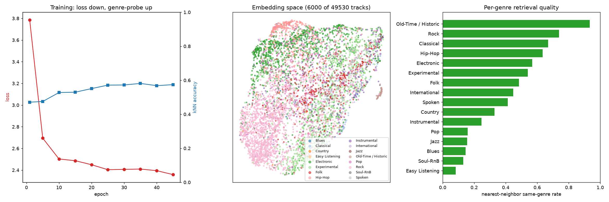
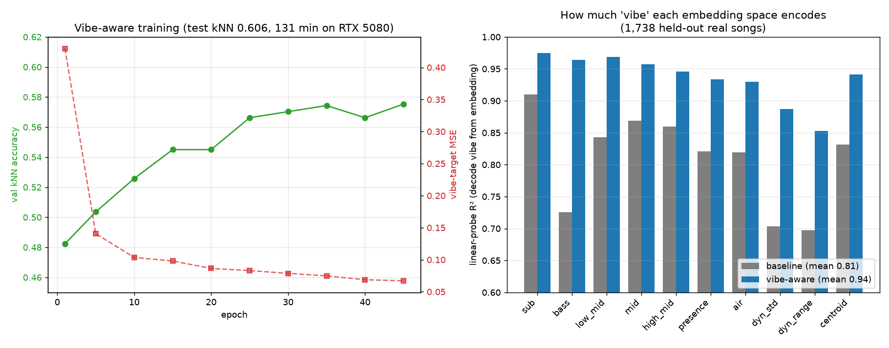
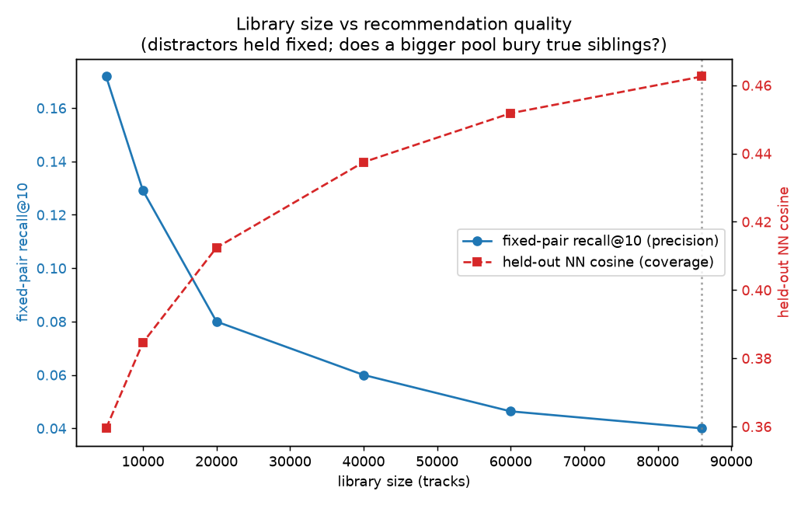

# Soundalike engineering case study

> How a first-year university script grew into a multi-engine music recommender,
> including a self-supervised model trained on 106,000 songs.

This document covers the problem, constraints, design decisions, failed experiments,
and results behind the project. The [README](../README.md) explains how to install
and use Soundalike.

---

## Summary

- **Original project:** a ~180-line first-year terminal script that read a static CSV of songs and
  printed min/max/mean statistics.
- **Current project:** an installable Python package with **six recommendation engines**, a live
  Spotify integration (OAuth PKCE, no passwords), and **GPU-trained audio-embedding neural
  networks**, including a contrastive FMA encoder, a **vibe-aware** encoder that learns a song's bass
  profile and dynamics, and an **artist-aware** encoder fine-tuned on ~87,000 real songs. These feed a
  bundled recommender.
- **Genre-probe result:** accuracy increased from **0.25 → 0.601 → 0.641** as the
  training set grew from **475 → 25,000 → 106,000** tracks. The model went
  from *losing* to a no-ML baseline to beating it by **+13 points**.
- **Vibe result:** a multi-task "vibe-aware" encoder raises how much vibe its embedding space
  encodes from **linear-probe R² 0.82 → 0.94** on 1,738 held-out real songs, with the biggest
  gains on bass and dynamics, two qualities that affect whether songs feel similar.
- **Scale result:** growing the library to ~87k songs across every genre exposed the *encoder* as
  the bottleneck; a domain-matched **artist-aware** fine-tune, a **higher-dimensional embedding**
  (256→384) and embedding **whitening** turned incoherent cross-genre matches into scene-coherent
  ones (Miles Davis → Brad Mehldau/Lee Morgan; Explosions in the Sky → This Will Destroy You/Mono;
  NewJeans → CHUU/LOONA, not random pop).
- **Objective + validation result:** a controlled 5-seed sweep found an **ArcFace + GeM** encoder
  that beat supervised-contrastive by **+23% on same-artist mAP**, but validating it against
  *independent human behavior* (ListenBrainz co-listening + Deezer related-artists) revealed it
  **regressed real cross-artist recommendation** (and botched niche genres like city pop/hyperpop).
  An internal metric had rewarded the wrong thing, so I **reverted** and built a `cross_artist_agreement`
  metric that measures inter-artist geometry.
- **Retrieval benchmark:** a categorized final 20-pair pure-sonic benchmark exposes the
  encoder's weakness; dual EfficientNet/CLAP retrieval raises frozen production primary
  **0.0281→0.0529 (+88.3%)** while preserving a reviewed 17/20 top-five UX result.
- **Full-track v2 result:** 45 self-supervised fusion jobs and 45 bound evaluations passed
  integrity/stability gates, but no candidate beat the frozen hybrid overall. The closest model
  was **-1.56% Recall@10**, so I launched a lawful 20-seed blind test instead of promoting it.
- **V3 result:** a checksum-frozen CLAP/MusicFM candidate reached **+20.005% Recall@10** on
  development, but only **+0.286%** on the final independent shadow, with its confidence interval
  crossing zero and a **-11.23%** worst fold. I rejected it and kept V2 live rather than presenting
  a development win as production progress.
- **Validation setup:** an NVIDIA RTX 5080 (Blackwell), more than 800 Python tests, 28 Node tests,
  and a clean packaged wheel.

---

## 1. The problem

The original project (`spotify_program.py`) was a good learning exercise but fundamentally
limited: it read one static 855-row CSV and computed aggregate statistics. The goal was to turn
it into **a tool that finds songs that sound like the ones you like**.

### Why the Spotify API changes mattered

The earlier approach was to ask Spotify's API for similar songs and audio
features. That is **no longer possible**. On **2024-11-27, Spotify removed** the
Recommendations and Audio Features endpoints
for all new apps ([official announcement](https://developer.spotify.com/blog/2024-11-27-changes-to-the-web-api)).
Those are exactly the endpoints this idea would normally depend on.

That change set the main technical requirement: **if Spotify does not provide
similarity or audio features, Soundalike has to compute them.**

---

## 2. Architecture: six recommendation engines

Every engine answers the same question, "what sounds like this?", using a
different signal and set of tradeoffs.

| Engine | Signal | Credentials | Coverage |
|--------|--------|-------------|----------|
| **Deep-vibe** | Vibe-aware neural embedding **fused** with measured bass/dynamics | None | Bundled ~1,700-song library |
| **Vibe** | Frequency-band balance + dynamics, vs a ~1,500-song library | None | Real, listenable songs |
| **Acoustic DSP** | Features measured from the raw waveform (librosa) | None | Any track with a preview |
| **Content-based** | Audio-feature vectors, standardized + weighted | None | Bundled dataset |
| **Learned model** | A CNN trained to embed audio (contrastive) | None | Whatever it's trained on |
| **Live Spotify / Last.fm** | Your real listening + optional crowd data | Free API keys | Your library / any track |

The acoustic engines rank by sound. A music catalog (Deezer) is used only to
enumerate candidate songs and fetch audio, not to decide which songs are
similar. This keeps the acoustic ranking separate from collaborative signals
such as "people who listened to X also listened to Y."

---

## 3. Machine-learning experiments

The most ambitious engine trains a neural network to place similar-sounding songs near each
other in an embedding space. It's **self-supervised** using a contrastive
objective (NT-Xent, the SimCLR loss): two augmented snippets of the *same* track
are pulled together while snippets of *different* tracks are pushed apart. This
needs **no similarity labels**, which matters because there is no complete
ground-truth dataset of similar song pairs.

### First run: too little training data

The first attempt trained on ~475 songs harvested from free previews. **The
neural network lost to a simple baseline.** A no-learning approach
(mean+std pooling of the spectrogram) recovered genre at **0.375** accuracy; the neural net
managed only **0.25**, barely above the **0.24** chance rate.

The likely cause was the small dataset. **Contrastive deep learning needs a lot
of data.** With only a few
hundred examples the model can tell individual clips apart without ever learning what makes a
*genre* cohere. I measured the failure and used it as the reason to scale up. The
baseline's 0.375 score, compared with 0.24 chance, also showed that the audio
contained a useful genre signal even though the model had not learned it.

### Second run: larger training sets

The [Free Music Archive](https://github.com/mdeff/fma) provides labeled audio at scale. I trained
on FMA-medium (25k tracks) and then FMA-large (106k tracks), evaluating with a **kNN genre
probe**: freeze the embeddings, then see how well a simple classifier recovers genre from them.
A model that has learned real musical structure will score well above chance.

| Training data | Neural kNN | No-ML baseline | Chance | Verdict |
|---------------|-----------|----------------|--------|---------|
| 475 tracks | 0.25 | 0.375 | 0.24 | **loses** to baseline |
| FMA-medium 25,000 | 0.601 | 0.521 | 0.28 | **+8 points** |
| FMA-large 106,000 | **0.641** | 0.507 | 0.29 | **+13 points** |

The larger training sets increased the neural network's margin over the
baseline. At 106k tracks, **57% of songs have a
same-genre nearest neighbor** in the learned space, from a model that never saw a single label
during training.



*Training on 106k tracks: loss falls as the genre-probe accuracy rises (left); the embedding
space forms visible clusters, with Electronic at the top, Rock/Pop at the
bottom, and a tight Old-Time/Historic
island (middle); per-genre nearest-neighbor retrieval reaches Old-Time 93%, Rock 74%, Classical
67%, Hip-Hop 64% (right).*

### Qualitative examples

The numbers are backed up by qualitative results. Querying the 106k model with mainstream songs
it has never seen (it maps them into the learned space and finds neighbors in the FMA catalog):

- **"Lose Yourself" by Eminem:** 5 of 6 neighbors are labeled **Hip-Hop**.
- **"Clair de Lune" by Debussy:** a Beethoven piano sonata (**Classical**) and other solo-piano
  instrumental tracks.
- **"Bohemian Rhapsody" by Queen:** folk/acoustic ballad tracks, matching its ballad sections.

The model separated tracks by acoustic character: rap found rap and classical
found classical using audio alone.

---

## 4. Engineering challenges

Several of the harder problems were in the data and training pipeline rather
than the model itself.

### Challenge: data loading limited GPU use

The first FMA-medium training run pinned the GPU at **9% utilization**.
Sampling `nvidia-smi` over time showed a sawtooth: brief bursts to 98% followed
by long stalls. The cause was random reads of 25,000 small spectrogram files
from a slow network-mounted drive (measured at ~20 files/second).

**Fix:** I built a consolidation step (`pack.py`) that packs every spectrogram into a single
compact `float16` array, and a training path (`train_fast.py`) that loads the **entire dataset
into VRAM once** and does augmentation *on the GPU*. GPU use reached **99%**
with **37 seconds per epoch**.

### Challenge: the dataset didn't fit in VRAM

Scaling to 106k tracks made the packed dataset **14 GB**, too large to sit in the 5080's 16 GB
VRAM alongside the model. Rather than fail or shrink the data, I made the trainer **auto-detect
its data residency**: it keeps the dataset GPU-resident when it fits (FMA-medium) and switches to
**pinned CPU RAM with per-batch PCIe streaming** when it doesn't (FMA-large). A batch is only
~17 MB, so the transfer overlaps compute and the GPU still runs at **99% utilization**.

### Challenge: downloading 93 GB

FMA-large is a 93 GB archive. A single-stream download ran at ~13 MB/s (~2 hours). I switched to
**aria2 with 16 parallel connections**, reaching **~138 MB/s** (about 11 times
faster, or roughly 11 minutes).
Along the way I also had to diagnose and recover from a corrupted download (two writers hitting
the same file) and abandon a problematic drive that blocked executable launches.

### Challenge: inspecting GPU kernel selection

To understand how NVIDIA's libraries selected low-level algorithms, I built a
**cuDNN solver-selection inspector** (`ml/gpu.py`). It shows which CUDA kernel
cuDNN chooses for a convolution. In this case it selected a **TF32 Tensor-Core
`cutlass` kernel in NHWC layout**, along with the associated layout-transpose
kernels. I then measured the
optimization ladder empirically: **NCHW → channels-last (1.34x) → fp16 + channels-last (4.2x)**,
and folded channels-last + mixed precision into training so the 5080 runs near its Tensor-Core
peak.

---

## 5. Iterating from real feedback: the "vibe" engine

One useful iteration started with a recommendation that did not work.

A test query used *Wasting Time* by eric404, a hyperpop track with quiet vocals
and a heavy dubstep drop. It returned soft acoustic bedroom-pop. Instead of
adjusting weights immediately, I compared the seed with the poor recommendations:

| Song | sub-bass % | dynamic range | crest (peak/avg) |
|------|-----------|---------------|------------------|
| *Wasting Time* (the seed) | **73%** | **0.39** | **2.21** |
| a "soft" recommendation | 45% | 0.25 | 1.61 |

The seed is overwhelmingly **sub-bass** and has **~2× the dynamic
range and crest** (the peak-vs-average spikiness that *is* the drop). But the original engine
**averaged every feature over the whole 30-second clip**, so the quiet intro and the loud drop
blurred into a bland "medium," and the sub-bass dominance wasn't modelled at all. It was blind to
exactly the qualities that define the vibe.

**The fix** was a new feature set that measures what the averages hide:

- **Frequency-band balance:** energy split across seven bands (sub → air), or
  "how much bass, how much highs."
- **Dynamics:** standard deviation, dynamic range, and crest factor of the loudness envelope,
  which capture "does this track have drops?"

These are weighted so the low-end and the dynamics dominate the match, and ranked against a
bundled library of ~1,500 real, diverse songs. The result: the same query now correctly reads
*"123 BPM, very dynamic (big drops), bass-heavy"* and returns hyperpop/electronic tracks in the
right scene (aldn, Flume, Slow Magic). The measurements explained which features
the earlier implementation had missed.

### From hand-crafted vibe to *learned* vibe

The hand-crafted vibe vector works, but it raised a sharper question: could the **neural encoder
itself** learn to represent vibe, instead of relying on hand-weighted features bolted on
afterwards? The plain contrastive encoder is good at timbre but, as the R² numbers below show,
only partly captures bass and dynamics.

So I trained a **vibe-aware encoder** with a multi-task objective: the self-supervised contrastive
loss **plus** an auxiliary head that must predict a 10-dim *vibe target*: seven frequency-band
fractions, loudness dynamics (std + range), and spectral centroid, computed directly from each
song's mel-spectrogram. Predicting that target from a short crop forces the embedding to encode
*how the whole song sounds and moves*. The target is derived from the **already-packed
FMA spectrograms**, so the vibe-aware model trains on all 106k songs with **zero re-downloading**
(~131 min on the 5080).

To measure whether it worked, I used a **linear probe**: fit a ridge regression from each
encoder's frozen embeddings to the vibe target on 1,738 held-out real songs, and report
cross-validated R². The linear probe tests whether this information is present
in the representation in a form a simple model can recover.

| Vibe dimension | Baseline encoder | Vibe-aware encoder |
|----------------|------------------|--------------------|
| **Overall (10-dim)** | **0.82** | **0.94** |
| Bass | 0.73 | **0.96** |
| Loudness dynamics | 0.70 | **0.89** |
| Drop size (dynamic range) | 0.70 | **0.85** |

The vibe-aware encoder improved every measured dimension. The largest gains
were on **bass and dynamics**, which the original engine represented poorly and
which affect whether two
songs feel the same. That encoder is what ships in the package and powers the deep-vibe engine.



A **spec cache** also separates "download a preview" from "embed it." The
library's mel-spectrograms are harvested from Deezer once (rate-limited,
resumable, and checkpointed) and stored. Re-embedding the whole 1,738-song library with a
newly trained encoder is then a local, offline, seconds-long operation. Swapping in a better model
no longer requires another hour of rate-limited downloading. This allowed the
baseline and vibe-aware encoders to be compared on the same song set.

---

## 6. Scaling the recommendation library

Testing on a niche seed (*Lovers Rock* by TV Girl) returned generic pop because
the bundled library, curated for the earlier hyperpop test, had no dream-pop
neighbors. I **grew the library in waves from ~1,700 → ~25,000 → ~55,000 →
~87,000 songs** across a wider range of scenes, crawling the
Deezer **related-artist graph** two hops out from a ~400-artist multi-genre seed list (deliberately
over-sampling niches the charts miss: K-pop and city-pop, Afrobeats, French and Latin rap, techno/
house/DnB, phonk and synthwave, post-rock, shoegaze, black/death metal, jazz, classical, blues,
gospel, and reggae). Deezer's genre endpoints did not honor the supplied ID and
returned the same global list, so the related-artist graph provided the useful
catalog structure. Four
engineering details made the harvest practical: a **candidate sidecar** so a restart never re-does
the slow gather; **thread-pool downloads** (the box was 93% idle at 0.8/s single-threaded → ~6/s
across 10 workers); the discovery that Deezer **preview URLs are signed and expire**, so the worker
fetches a fresh URL by track id right before downloading (this alone took the success rate from 0%
back to 100%); and a **dedup pass** that collapses remaster/sped-up/remix/karaoke variants of the
same song to one row, so a seed can't match five copies of one track.

Growing the library initially made recommendations **worse**. A larger, more
diverse pool contained more songs that were *texture-similar but vibe-wrong*,
and the FMA-trained encoder, trained mostly on instrumental Creative Commons
music, surfaced them. For example, a dream-pop seed matched Creed and
Metallica. At that point catalog coverage was no longer the main limit; the
encoder was. I made three changes, two during training and one during inference:

1. **An artist-aware encoder.** I fine-tuned the encoder on the harvested songs with a
   **supervised-contrastive** objective using the *artist* as the label (PK-sampled batches; songs
   by the same artist are positives), plus the vibe-target auxiliary. "Same artist ⇒ similar" is a
   free, strong style signal, and because the library was crawled through related artists it
   generalizes to *neighbouring* artists. It trains on the cached spectrograms in ~40 min on the
   5080.

2. **A higher-dimensional embedding.** When the library passed ~50k songs, precision on
   already-strong seeds *softened* because a bigger pool means more competing look-alikes crowding a
   fixed-size space. Widening the embedding from 256 to 384 dimensions barely changes compute
   because it only changes the final projection. It also keeps the bundled index
   under GitHub's 100 MB limit. The wider embedding gave
   the space room to separate ~87k songs, and precision recovered while coverage kept improving. The
   384-d base also scored higher on the held-out genre probe (kNN 0.617 vs 0.606). I also tried
   **512-d** to test a wider representation. It did not help: on the recommendation benchmark it matched
   384-d on precision and was *slightly worse* on coverage (0.445 vs 0.463), at +33% size and memory,
   and its genre-probe kNN actually dropped to 0.609. So 384-d is the measured sweet spot, and the
   encoder's *capacity* was no longer the bottleneck.

3. **Whitening.** The embeddings piled into a tight cone (every pair ~0.9 cosine), so raw cosine
   couldn't rank finely. ZCA-whitening the space at load time removes the dominant shared direction
   so similarity keys on what's *distinctive*.

The combined effect, on identical seeds:

| Seed | FMA encoder, raw cosine | Artist-aware 384-d + whitening |
|------|--------------------------|--------------------------------|
| *So What* by Miles Davis | mixed | Brad Mehldau, Lee Morgan, Ahmad Jamal |
| *Your Hand in Mine* by Explosions in the Sky | mixed | If These Trees Could Talk, This Will Destroy You, Mono |
| *Ditto* by NewJeans | mixed | CHUU, LOONA (K-pop) |
| *HUMBLE.* by Kendrick | mixed | Kodak Black, JID, $uicideboy$ |

The results became more consistent within jazz, post-rock, metal, hip-hop, R&B,
electronic, indie, bedroom-pop, K-pop, and ambient. The library also covered
scenes such as jazz, post-rock, phonk, and city pop that had previously been
missing. This exposed a coverage-versus-precision tradeoff:
scaling the library helped coverage but *hurt* precision until the encoder was given more capacity
to match. More data and a better model addressed different parts of the problem.

### Putting a number on "how big should the library be?"

I built a label-free benchmark (`soundalike.ml.benchmark`) that measures
the trade-off directly. Holding a song and one same-artist sibling fixed and adding only
*distractors*, **fixed-pair recall@10 falls from 0.17 at 5k to 0.04 at 86k**. A bigger pool does
bury a specific sibling. Meanwhile **held-out nearest-neighbour cosine (coverage) rises from 0.36 to
0.46**, so a bigger pool is more likely to contain something close. The curves cross near 20k and both
flatten past ~40k.



There is no single ideal library size because it depends on which failure matters
most. I chose **coverage-first (~87k)** because a missing scene leaves the
ranker with no relevant candidates. The precision cost is better addressed
with **smarter ranking than with a smaller library**. The new `--diversity`
(MMR re-ranking),
`--max-per-artist`, and multi-seed *taste-blend* features do: keep the top-K varied and relevant
without throwing away whole scenes. The bundle is also GitHub-capped near ~100 MB, so ~87k is close
to the practical ceiling regardless. The benchmark makes the tradeoff visible
instead of leaving the size as a guess.

### Comparing encoder objectives

To compare encoder changes, I built a head-to-head metric using same-artist
**mean average precision**. `score_embeddings` whitens exactly as production
does, then reports mAP, recall@10, and coverage in one call. I fixed a
5-seed baseline, and ran each idea as a controlled experiment where the objective is the only
variable. The result overturned my intuition: **capacity is not the bottleneck; the objective is.**

| Variation | mean mAP (5 seeds) | vs baseline | verdict |
|-----------|:---:|:---:|---|
| Supervised-contrastive, 384-d *(previous release)* | 0.0396 | baseline | baseline |
| 512-d encoder | n/a | worse | capacity did not help (see section 8 note) |
| 3-encoder ensemble (concat) | 0.038 to 0.040 | -2 to -7% | combining encoders hurt precision |
| **ArcFace** (additive angular margin) | 0.0477 | **+20%** | objective improved the metric |
| **ArcFace + GeM pooling** | **0.0486** | **+23%** | released, then **reverted** (see below) |
| ArcFace + GeM, margin 0.3 | 0.0488 | +23% | tied on mAP, *worse* on the NN probe, rejected |

Two findings drove the (initial) ship. **ArcFace** replaces the plain contrastive push/pull with an
additive angular margin, forcing each song tighter around its artist prototype and further from every
other, producing a +20% mAP increase on its own. **GeM pooling** swaps the encoder's flat spatial average for a
learnable generalized mean, so the network chooses how peaky its per-clip summary is. It
learned an exponent *below* 1 (softer than average), and added another ~2%. Pushing the margin higher
(0.3) was a statistical tie on mAP but *regressed* the independent same-artist
NN probe. This supported keeping the margin at 0.2.

Same-artist mAP and an initial qualitative check both looked better, so I
released it and then compared the internal metric with external data.

### External validation and rollback

Same-artist mAP asks "are a song's own siblings near it?" That rewards packing each artist into a tight
ball, but a recommender never returns the seed's own artist; it returns *other* artists. I validated
the shipped encoder against two **independent human-behavior** ground truths, over 24 mainstream *and*
niche seeds: **ListenBrainz** co-listening (people who listen to X also listen to Y) and **Deezer**
related-artists. For each seed I measured the fraction of our recommended artists that real listeners
corroborate, against a random-library baseline.

| Ground truth (independent of our audio) | ArcFace+GeM (shipped) | Supervised-contrastive (old) | Random |
|---|:---:|:---:|:---:|
| ListenBrainz co-listening (24 seeds) | 0.117 | **0.161** | 0.004 |
| Deezer related-artists (24 seeds) | 0.058 | **0.100** | 0.001 |
| Deezer centroid geometry (116 artists) | 0.233 | **0.252** | n/a |

Both encoders scored 26 to 135 times above random, but the **old
supervised-contrastive encoder agreed with real listeners more, on every measure.** Qualitatively the
gap was largest for **city pop** (*Plastic Love* by Mariya Takeuchi: old → Hiroshi
Sato, T-Square, Anri, Momoko Kikuchi; ArcFace → Dream Theater, Eric Clapton) and **hyperpop** (*100
gecs*: old → SOPHIE, Dorian Electra; ArcFace → Rezz, Diplo). ArcFace's aggressive artist-separation had
sharpened same-artist retrieval while *distorting the inter-artist geometry that recommendation depends
on*. The internal metric was optimizing the wrong behavior.

So I **reverted to the supervised-contrastive encoder** and added `cross_artist_agreement` to the
benchmark: it builds each artist's centroid, ranks the nearest *other*-artist centroids, and scores
overlap against a human related-artist map, which same-artist mAP had missed.
The ArcFace/GeM trainer and pooling stay in the tree as a documented negative
result. This showed that the internal metric needed external validation before
it could be used for release decisions.

The retained supervised-contrastive encoder also performed better where the FMA
encoder was weakest. *Plastic Love* by Mariya Takeuchi returns city pop (Hiroshi
Sato, T-Square, Anri); *OMG* by NewJeans surfaces K-pop neighbors; jazz and
black-metal seeds return artists from the expected scenes. Both encoders still
have a weak spot: ultra-niche breakcore seeds (*Sewerslvt*) leak
into trance. That behavior can now be measured through `cross_artist_agreement`.

---

## 7. Ranking quality: sourced evidence and dual-Sonic64 retrieval

The first ranking iteration evaluated synthetic clusters with a leaking hand-written graph. The
second fixed leakage and ran the real catalogue, but actual pair retrieval improved only **2.25%**;
the much larger direct-list improvement (11/20 to 17/20) had been blended into the headline. The
blend is gone. Direct judgments are now a secondary guardrail only.

### Clean relationship categories and a final disjoint set

Version 4 contains 93 sourced recording pairs. Every source has a URL, publisher, specific evidence
context, and retrieval date. The relationship determines whether a row can decide retrieval:

| Evidence category | Rows | Deciding? |
|---|---:|---|
| Credible pure sonic comparison | 54 | only final held-out rows |
| Sample / interpolation | 9 | no; diagnostic only |
| Legal / plagiarism dispute | 9 | no; diagnostic only |
| Cover / remix / adaptation / contrafact | 5 | no; diagnostic only |
| Weak or unsupported assertion | 16 | no; diagnostic only |

The final 20 pure-sonic pairs were selected from named criticism, artist accounts, or specific
musicological descriptions. Both exact original recordings exist in the frozen catalogue; a remix,
live recording, cover, or other derivative can no longer substitute for a missing target. Their 49
credited artists do not occur in the 147 development/validation artists. A connected-component
audit covers benchmark, manual, and graph edges transitively and reports no bridge.

The deciding metric remained:

```
primary = 0.5 * Recall@50 + 0.5 * mean reciprocal rank
```

Missing sides score zero. Manual judgments and external artist agreement never enter it. Sequential
challengers did reuse the held-out suite, as the requested iterate-until-threshold workflow requires;
no held-out pair identity, target, rank, ListenBrainz response, or Deezer response is a training or
serving feature. The bootstrap is therefore descriptive, not a once-opened significance test.

### Guardrail union results

| Final 20 pure-sonic pairs | R@10 | R@20 | R@50 | MRR | Primary |
|---|---:|---:|---:|---:|---:|
| Raw local encoder | 0.0500 | 0.0500 | 0.0500 | 0.0100 | 0.0300 |
| Frozen production baseline | 0.0500 | 0.0500 | 0.0500 | 0.0063 | 0.0281 |
| **Dual-Sonic64 guardrail** | 0.0000 | 0.0500 | **0.1000** | 0.0059 | **0.0529** |

The selected system improves the frozen primary from **0.0281 to 0.0529
(+88.3%)** and doubles Recall@50.
The existing hit moves from rank 8 to 11; a second exact counterpart enters at rank 37. The largest
scene change is 3.1% in magnitude, inside the 10% guardrail. The pair-bootstrap
absolute delta is **-0.0026 to 0.0770** (95% interval; 63.9% positive), so the evidence clears the predeclared
engineering threshold but does not establish a precise population effect.

### Real-index challengers

All representations were executed against the real 272,853 rows:

| Challenger | Measurement and decision |
|---|---|
| VGGish mean / three-window max | zero pure-pair Recall@50; rejected |
| PANNs Cnn14 AudioSet | 112.99 s full build; no new validation hit |
| LAION-CLAP HTSAT | 337.98 s full build; useful candidate signal after calibration |
| EfficientNet eight-vector late interaction | 435.90 s build; no extra validation hit |
| Chroma-FFT harmonic DSP | 106.75 s build; no Recall@50 gain |
| CLAP title/artist text | 167.89 s build; semantic text did not retrieve exact sonic pairs |
| Dev-only hard-negative metric | overfit development and failed to generalize |
| Pageview-heavy learned reranker | zero final held-out hits; rejected |
| **Dual-Sonic64 + source-independent priors + guardrail union** | selected |

CLAP and EfficientNet are each compressed to 64 float16 dimensions. PCA fitting excludes every
benchmark artist. Wikipedia contributes only generic song-article existence/notability features;
benchmark URLs, pair edges, and labels are not indexed. ListenBrainz and Deezer remain validation-
only and are not features.

### Selected production policy

The final candidate union has three explicit stages:

1. keep the quality-filtered, MMR-diversified, guarded-centroid top five;
2. append all quality-filtered frozen-baseline top-ten rows not already present, preserving known
   retrieval hits and the scene guardrail;
3. fill to the requested depth from the 25% EfficientNet / 75% CLAP candidate score plus the fixed
   source-independent priors, deduplicating recordings but not suppressing an exact song merely
   because another song by that artist scored higher.

The final and retained UX sets each pass **17/20** direct top-five judgments. The original baseline
passed 11/20. Three final failures are documented rather than relabelled. All top fives reject seed-
title variants, slowed/reverb, karaoke, tribute, covers, and mashups. These judgments are never
blended into pair retrieval.

Independent validation stays disjoint:

| External overlap@15 | Baseline | Winner | Paired delta 95% CI |
|---|---:|---:|---:|
| ListenBrainz | 0.1389 | **0.1611** | -0.0333 to 0.0722 |
| Deezer related artists | 0.0667 | **0.0833** | 0.0000..0.0333 |

The point estimates improve and remain statistically equivalent within uncertainty.

### Full-track v2: a stronger experiment, not a claimed model win

The Dual-Sonic64 result above concerns the shipped 272,853-row preview index. The separate
full-track v2 research lane asks a narrower question on the official 55,701-track MTG-Jamendo
collection: can a self-supervised fusion model improve a frozen CLAP hybrid without using tags,
ratings, graphs, source audio, or same-artist positives during training?

I trained three bounded families across all five official artist-disjoint folds and seeds 17,
29, and 43: non-negative linear pair features, a monotonic network, and a channel-gated
embedding. The resulting **45 training reports and 45 evaluation reports** bind exact store,
source, fold, seed, model, and ranking identities. Selection used budget 8 and preregistered
Recall@10 on the frozen global top-200 pool.

| Five-fold / three-seed mean | Recall@10 | Relative vs hybrid | MRR | nDCG@10 | Recall wins |
|---|---:|---:|---:|---:|---:|
| Frozen hybrid | **0.007776** | baseline | 0.286313 | **0.100587** | - |
| Channel-gated embedding | 0.007655 | -1.56% | **0.286528** | 0.099426 | 6/15 |
| Monotonic network | 0.007614 | -2.09% | 0.281173 | 0.098848 | 3/15 |
| Non-negative linear | 0.007588 | -2.42% | 0.279942 | 0.098411 | 3/15 |

No candidate beat the baseline overall. The channel-gated model slightly raised MRR
(+0.000215) but reduced Recall@10 (-0.000121) and nDCG@10 (-0.001161); the other
families regressed all three aggregate metrics. All candidates passed structural and
cross-seed stability gates, but automated metrics alone cannot authorize promotion.

V2 improves **experimental validity**, not demonstrated recommendation quality.
It replaces an unbound model-choice claim with a deterministic 20-seed blind pilot:
four opaque methods, five results each, first-party Jamendo playback, exact artifact/license
provenance, resumable version-isolated browser state, and private version-isolated ingestion.
Until listeners submit ratings, the human-quality delta is unknown and production
remains unchanged.

### V3 full-track research: a large development win that did not generalize

V3 was designed to answer the failure mode left by V2: perhaps the representation, not the
fusion head, was the bottleneck. I screened music-native encoders for licensing first.
MusicFM-FMA was eligible (MIT model metadata; MIT/Apache-2.0 source), while the available MERT,
music2vec, and MuQ checkpoints declared non-commercial licenses and were excluded from production
consideration.

The research then progressed through increasingly strict, artist-disjoint protocols:

1. A frozen selective MusicFM reranker improved official-test Recall by only **+0.94%** and
   regressed NDCG by 0.09%; its Recall interval crossed zero, so it was rejected after one audit.
2. A complementary CLAP/MusicFM profile reached **+15.06% development Recall**, but only
   **+4.32%** on its one-time shadow, with a -13.23% worst fold.
3. A larger train-only CLAP semantic model reached **+25.27% development Recall**, but only
   **+5.27%** on a new shadow; that interval also crossed zero.
4. One final untouched reserve froze 32,859 train, 3,074 development, and 3,023 shadow tracks
   with no shared artists. Its bounded search ended before shadow access.

The final candidate combined four CLAP semantic ridge heads, one MusicFM ridge head, and direct
CLAP window-max audio pooling. The exact candidate was serialized without pickle, rebuilt
independently from sealed stores, and frozen before the label-free MusicFM shadow extraction.

| Final reserve | Recall@10 | MRR | graded NDCG@10 | Recall interval | Positive Recall folds | Worst Recall fold |
|---|---:|---:|---:|---:|---:|---:|
| Development (2,574 queries) | **+20.005%** | +8.696% | +11.296% | `+0.00308..+0.00705` | 5/5 | +11.44% |
| Shadow (2,573 queries) | **+0.286%** | +1.09% | +3.96% | `-0.00181..+0.00191` | 3/5 | **-11.23%** |

The independent result failed the predeclared +20% gain, positive-interval, four-fold, and
worst-fold checks. That ended the branch: no listening pack, no promotion, and no retuning on the
consumed shadow. V2 remains available at `/evaluate-v2`; the current `/evaluate`
page is a separate exposure-disjoint V6 development/model-improvement study,
while the consumed, inconclusive V5 application is byte-preserved at
`/evaluate-v5` and the superseded V4 and earlier studies remain versioned. V6
cannot serve as an independent promotion holdout. The hosted recommender remains
`dual_sonic64_guardrail`.

Development selection produced a stable-looking 20% gain, but the independent
split showed that it was not a production-quality improvement. The candidate
was rejected, the rollback path was preserved, and the failed generalization
was recorded without changing the gate.
Any future V3 effort needs new lawful supervision and a newly frozen independent population.
The complete chronological evidence is in [V3_RESEARCH.md](V3_RESEARCH.md).

### Current product surface and anonymous feedback

The shipped product serves a checksum-pinned **272,853-track** catalog. Its
Dual-Sonic64 guardrail first requires a pure-audio top-1,000 candidate prior;
bounded source-independent notability may reorder only that qualified tail.
Inside Spotify, the Spicetify extension then applies strict Spotify
lyrics-language filtering to the original top 20. Results remain hidden until
that check settles, and the final page supports in-app playback, Spotify-native
track menus, and clickable albums.

After those final rows and their order settle, a short inline
**Good / Mixed / Off** survey can collect optional development feedback. Mixed
and Off reveal at most two closed reason tags and an optional 280-character
plain-text note with a warning not to include personal information. Submission
is always explicit, failures remain retryable, and success returns only a
receipt. The private application record contains the seed, displayed rows in
order, bounded method/index/API/policy/source labels, the response, and random
anonymous deduplication nonces, not Spotify identity, credentials, library or
history, headers, IP addresses, or hidden candidates.

The feedback endpoint is intentionally public-CORS because an extension cannot
keep a client secret. Strict validation, request-size limits, deterministic
immutable Blob paths, a Vercel Firewall rate limit, and a recommended 90-day
private-record retention window form the abuse/privacy boundary. This informal
feedback and the active V6 evaluator are model-improvement inputs, not evidence
that independently authorizes promotion.

### Resources and reproduction

The checksum-pinned release index is **299,288,526 bytes**. It contains the unchanged neural/vibe
arrays, two 64-d float16 sonic matrices, and two compact source-prior columns. On the i9-14900KF,
local cold load is **5.89 s**, RSS after load is **1.258 GB**, and 20 final queries measure **133 ms
mean / 146 ms p95**. Research checkpoints are not served. Desktop and hosted numpy paths are pinned
by exact parity tests and report `dual_sonic64_guardrail`; arbitrary previews without aligned CLAP
features report the explicit legacy fallback. Production measured **18.87 s** for the first cold
recommendation and **860 ms mean / 977 ms p95** over 12 warm, diverse seeds; all 12 searches,
recommendations, index-version checks, and fresh Deezer preview lookups passed.

```powershell
$env:PYTHONPATH = "src;."
.\.venv\Scripts\python.exe -m soundalike.ml.real_benchmark `
  --index ml_data\deepvibe_index_v5.npz `
  --benchmark benchmarks\soundalike_pairs.v4.json `
  --split held_out --evidence-category pure_sonic `
  --methods raw_encoder,production_baseline,quality_filter,dual_sonic `
  --out .goals\human-quality-recommendations\artifacts\held-out-final-winner-v4.json

.\.venv\Scripts\python.exe -m soundalike.ml.external_validation `
  --index ml_data\deepvibe_index_v5.npz `
  --benchmark benchmarks\soundalike_pairs.v4.json `
  --truth benchmarks\external_artist_truth.v1.json `
  --out .goals\human-quality-recommendations\artifacts\external-validation-final-v4.json
```

---

## 8. Security and correctness

- **Spotify credentials stay with Spotify.** Live access uses OAuth 2.0 **Authorization Code + PKCE** with a
  local loopback callback, CSRF `state` validation, and cached auto-refreshing tokens.
- **No secrets in git.** Credentials live only in a git-ignored `.env`; the repo ships a
  `.env.example` template.
- **No data leakage in training.** The 93-row benchmark has a final 20-pair, 49-artist set disjoint
  from 147 development/validation artists; tests reject direct and transitive graph paths into it.
  Diagnostic categories cannot decide the score, and the contaminated static graph stays retired.
- **Release integrity.** Desktop and hosted downloads pin SHA-256; hosted download is atomic and
  fails before loading on a mismatch, and numpy object pickles are disabled.
- **More than 800 Python tests and 28 Node tests** cover the recommenders, OAuth/PKCE, DSP, vibe and
  vibe-aware engines, the spec cache, recommendation benchmarks, diversity/MMR, GeM pooling,
  ML split logic, the categorized production benchmark, Dual-Sonic64 guardrails, full-track
  store/training/selection integrity, v1/v2 evaluator isolation, private submission parsing,
  checksum handling, and exact desktop/hosted parity.


---

## 9. What I'd build next

- **Persist a personal acoustic-feature store** so the engines cover a user's entire Spotify
  library, not just what's in a preview catalog.
- **Blind multi-reviewer listening panel:** add preview-level judgments beyond the sourced-pair
  benchmark and publish agreement, rather than letting one reviewer tune and test the same list.
- **A 512-d or a downloadable (non-bundled) index:** the downloadable index now exists (fetched from
  a GitHub Release past the 100 MB bundle cap), so library coverage can grow further; a wider encoder,
  though, was measured *not* to help (512-d matched 384-d). The next encoder gain should come from a
  better **objective** *selected on the right metric*: `cross_artist_agreement`, not same-artist mAP
  (§6 explains why the ArcFace mAP win didn't survive external validation).
- **Fix the niche weak spot:** external validation showed ultra-niche breakcore seeds (*Sewerslvt*)
  leak into trance. Now that `cross_artist_agreement` can score it against ListenBrainz/Deezer, it's a
  measurable target for the next fine-tune (e.g. harder negatives from a development-only graph).
- **Collect new lawful supervision and freeze a new independent population** before another V3
  claim. Every preregistered V3 shadow is now consumed and cannot support retuning.
- **Contrastive-on-vibe:** mine positive pairs by vibe similarity, not just augmented crops or
  same-artist labels, so the objective pulls same-*vibe* songs together directly (the natural next
  step after ArcFace, since the artist signal is a proxy for vibe, not vibe itself).

---

## 10. Technical areas

The project covers:

- **Machine learning:** self-supervised contrastive learning (SimCLR/NT-Xent), **multi-task
  learning** (contrastive + auxiliary regression), CNN and ResNet encoders, mixed-precision
  training, embedding evaluation (kNN probe, silhouette, retrieval, **linear probing**), UMAP
  visualization, including experiments where deep learning did not improve the result.
- **Digital signal processing:** mel-spectrograms, MFCC/timbre features, frequency-band energy
  analysis, loudness dynamics, tempo and spectral analysis from raw audio.
- **GPU / systems performance:** diagnosing data-loading bottlenecks, VRAM-aware data residency,
  CUDA memory-layout and precision tuning, reading cuDNN kernel selection.
- **API integration & security:** OAuth 2.0 PKCE, token lifecycle management, rate-limit handling,
  secret hygiene.
- **Software engineering:** clean package design, a broad automated test suite, packaging, a documented CLI,
  decoupling I/O from compute (the harvest-once spec cache), and reviewed, merged pull requests.
  Includes a reproducible human-aligned evaluation suite, three ranking improvements (quality
  filter, genre reranker, collaborative graph), and desktop/hosted parity tests.
- **Data engineering:** multi-connection downloading, parallel preprocessing across CPU cores,
  compact on-disk formats (float16 caches + models), and safe handling of corrupt inputs.

Every result in this document was measured on real hardware and is reproducible from the commands
in the [README](../README.md).
