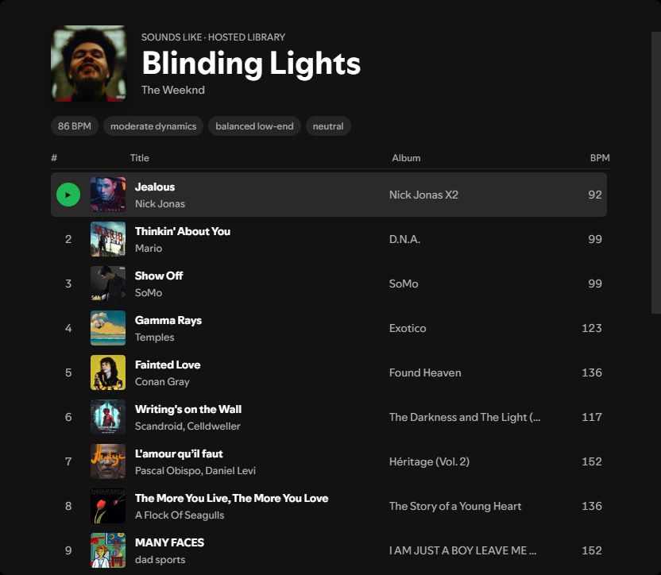

# Soundalike

Find tracks that sound like the song you are playing, directly
inside Spotify. Soundalike compares precomputed audio embeddings instead of
using genres, popularity, or listening-history recommendations.

## Use it

1. Install **Soundalike** from Marketplace.
2. Right-click any track in Spotify.
3. Select **Find soundalikes**.
4. Double-click a result or use its left-side play button. Right-click it for
   Spotify's normal track actions.

That is all normal use requires. There is no Soundalike account, Python
installation, terminal command, or local server to configure. The extension
automatically uses the hosted 272,853-track recommendation library.

### Marketplace updates

Marketplace now installs a small, commit-pinned bootstrap. On Spotify start it
checks a signed stable release feed, verifies the signature, immutable Git
commit URL, SHA-256 hash, and browser SRI before loading the runtime. It keeps
the last verified runtime locally and falls back to that runtime (then its
baked-in runtime) if an update cannot be trusted or fetched. Future signed
runtime releases do **not** require a Marketplace manifest change.

**Existing Marketplace users must reinstall once**: uninstall Soundalike in
Marketplace, install it again, and restart Spotify. Older immutable runtime
copies cannot update themselves. After that final reinstall, runtime updates
are automatic. Manual installs remain manual; use the current file and run
`spicetify apply` when updating.

## Spotify-native results

- Results open on a normal Spotify page, so the Back and Forward buttons work
  and the list stays visible while music plays.
- Results use a playlist-style layout with album artwork, verified artist
  names, clickable album names, and measured BPM.
- For a seed with a known Spotify lyrics language, only candidates with that
  exact known language are shown (English with English, French with French,
  and so on). The gate examines only the model's original top 20: it never
  promotes a weak lower-ranked song merely because that song has language
  metadata. Each candidate stays hidden until its own check finishes; verified
  exact-language rows appear progressively and are never later removed for a
  language mismatch.
- Different-language candidates and candidates with confirmed unavailable
  lyrics metadata are hidden rather than used as fallbacks, so strict
  filtering can return fewer than 20 results. "No lyrics metadata" does not
  mean Spotify detected a foreign language; it means language could not be
  established safely.
- Temporary Spotify language failures are retried and are not cached as
  permanent unknowns. Among exact-language candidates in the top 20, artists
  Spotify directly relates to the seed artist are shown first while preserving
  the model order within each group. Same-artist matches are no longer blocked,
  remix/version variants are softly penalized so originals stay ahead, and
  global notability can only reorder the top 1,000 audio-qualified tail
  candidates at 25% strength.
- If Spotify has no language for the seed, Soundalike preserves the normal
  ranking. Lyrics metadata alone cannot safely distinguish an instrumental
  from a metadata failure.
- The play button on a verified result plays that exact Spotify track
  immediately without closing or leaving the page. Double-clicking anywhere
  on the row does the same; a single click does not interrupt playback.
- Right-clicking a result opens Spotify's native menu with **Find soundalikes**
  again, plus playlists, queueing, song radio, artist and album navigation,
  credits, and sharing.
- If Spotify cannot confidently match a recommendation, Soundalike safely
  searches Spotify's full Songs results before falling back to a Spotify search
  page. It never plays a low-confidence match.
- Successful recommendations and resolved Spotify metadata are cached locally
  for seven days, so reopening the same track avoids repeating the expensive
  recommendation and catalog lookups. Unresolved Spotify searches and failed
  language checks are not cached, so a temporary miss can recover.
- Once language filtering and final ordering settle, a compact inline prompt
  may ask **How close were these matches?** Choose **Good**, **Mixed**, or
  **Off**. Mixed and Off reveal up to two optional reason chips and an optional
  280-character note; the note explicitly warns against personal information.
  Nothing is sent until **Send feedback** is pressed, and failures remain
  retryable. The prompt appears after each completed result set unless you opt
  out. **Not now** hides only the current prompt; after the second dismissal,
  the extension asks whether it should keep showing the survey. **Yes** keeps
  showing it after future searches, while **No** stores an opt-out locally.

## Privacy

Soundalike sends the selected track's title and artist to
`https://soundalike-api.yassin.app` to retrieve recommendations. If that
service is unavailable, it sends the same title and artist to
`https://soundalike.yassin.app` as a fallback. It never sends your Spotify
password, access token, library, listening history, or artwork. Language
labels and related-artist context come directly from Spotify inside the
already-authenticated desktop client and are not sent to Soundalike. No
separate Spotify login is required.

Optional feedback is sent to the public CORS endpoint at
`https://soundalike.yassin.app/api/spicetify-feedback`. Its record contains only
the seed title/artist, the rows actually displayed and their final order,
method/index/API/language/selection policy labels, Good/Mixed/Off, selected
closed reasons, the optional note, and random anonymous install/session
nonces used for retry deduplication. It does **not** include Spotify account
identity, credentials, access tokens, library, listening history, request
headers, IP addresses, or hidden candidates. The endpoint returns only a
receipt digest; the extension never receives a private storage URL.

The maintainer may receive a private Discord notification containing the
Good/Mixed/Off selection, seed title and artist, selected reasons, number of
displayed results, and a short receipt. Optional notes, anonymous nonces, and
the displayed result list are not sent to Discord.

## Good to know

- Soundalike normally uses an always-on recommendation service. It quietly
  prewarms the Vercel fallback after Spotify starts; if the primary service is
  unavailable, the first fallback request after idle can take up to about 30
  seconds. Repeated tracks use the local cache, and hosted responses can be
  reused by the CDN.
- The hosted library currently covers 272,853 tracks.
- Production ranking continues to use the independently validated
  `dual_sonic64_guardrail` model. The `v=4` value in an extension request is
  the strict Spotify-lyrics policy contract, not a V4 recommendation model.
  It invalidates permissive cached results. If the always-on service has not
  received that contract yet, the extension goes directly to the current
  Vercel ranker instead of accepting an older compatibility ranking.
- The completed V5 receipt favored the full-track acoustic control by 56/96
  pairwise choices, versus 54/96 for the preference head and 46/96 for fixed
  V4. That research scorer depends on Jamendo full-track section embeddings
  unavailable for arbitrary Spotify songs, so it is not falsely presented as
  the production ranker. V5's exact-language behavior is the deployable policy
  promoted here.
- Spotify availability and Soundalike library coverage are different. The
  extension can now resolve recommendations through Spotify's full Songs
  search, but a Spotify seed that is absent from the 272,853-track embedding
  index still cannot be analyzed by the hosted model.
- If **Find soundalikes** does not appear immediately after installation,
  fully quit and reopen Spotify.
- If a Spotify update breaks Spicetify features, update Spicetify and run
  `spicetify backup apply`.

Want private local queries, on-the-fly analysis for tracks outside the hosted
library, or a manual installation? See the
[advanced setup guide](SETUP.md).

Not using Spicetify? Try the [hosted web app](https://soundalike.yassin.app).
