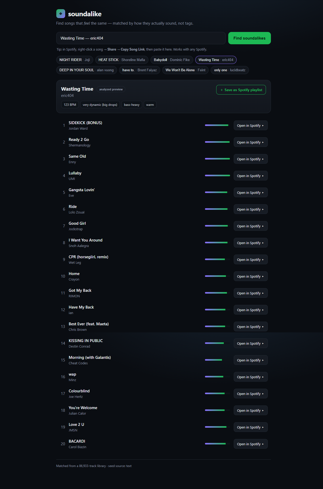

# soundalike in Spotify — right-click → *Find soundalikes*

Add a **“Find soundalikes”** item to the right-click menu of any track in the
Spotify desktop app. Click it and a panel shows songs that genuinely *sound*
like the one you clicked — powered by the local neural audio model, not tags.



There are two ways to use soundalike. Pick based on your Spotify install:

| | Web app (works with **any** Spotify) | Spicetify (in-app right-click) |
|---|---|---|
| Setup | none beyond `soundalike serve` | patch the Spotify client |
| Works with Microsoft-Store Spotify | ✅ | ❌ (needs the standalone app) |
| Trigger | paste a song / **Copy Song Link** | right-click a track |

---

## Option A — the web app (recommended, zero client patching)

```bash
pip install -e ".[ml]"      # first time only
soundalike serve            # opens http://127.0.0.1:8787
```

Then either type `Title — Artist`, or — the frictionless way — in Spotify
**right-click a song → Share → Copy Song Link** and paste it. You get instant
soundalikes with an “Open in Spotify” button on each. This works with the
Microsoft-Store build of Spotify too.

---

## Option B — Spicetify (true in-app right-click)

Spicetify patches the Spotify **desktop** client to add custom menu items. It
**requires the standalone Spotify** from <https://www.spotify.com/download> —
the **Microsoft-Store version cannot be patched** (this is a Spicetify
limitation, not ours). If you have the Store version, either use Option A or
reinstall Spotify from spotify.com first.

Before installing Spicetify, open the standalone Spotify app once, sign in, and
then close it. This creates the `Spotify` and `prefs` paths that Spicetify needs.

### 1. Install Spicetify

PowerShell (Windows):

```powershell
iwr -useb https://raw.githubusercontent.com/spicetify/cli/main/install.ps1 | iex

# Confirm this shell can find Spicetify and its standalone Spotify paths.
spicetify --version
spicetify config spotify_path
spicetify config prefs_path
```

If `spicetify` is not recognized after installation, open a new PowerShell
window. The official installer normally places the executable at
`$env:LOCALAPPDATA\spicetify\spicetify.exe`. If the new window still cannot
find it, add that directory to the current session and retry:

```powershell
$env:Path = "$env:LOCALAPPDATA\spicetify;$env:Path"
spicetify --version
```

Terminal (macOS):

```bash
curl -fsSL https://raw.githubusercontent.com/spicetify/cli/main/install.sh | sh

# Only needed if Spicetify does not detect Spotify automatically:
spicetify config spotify_path "/Applications/Spotify.app/Contents/Resources"

spicetify --version
spicetify config spotify_path
spicetify config prefs_path
```

The installer supports both Apple silicon and Intel Macs. Restart Terminal if
`spicetify` is not immediately available. Linux users can follow the
[platform-specific setup](https://spicetify.app/docs/getting-started#linux).

### 2. Install this extension

PowerShell (Windows):

```powershell
# Run from the soundalike repository root.
$extensions = Join-Path $env:APPDATA "spicetify\Extensions"
New-Item -ItemType Directory -Path $extensions -Force | Out-Null
Copy-Item integrations\spicetify\soundalike.js -Destination $extensions -Force

spicetify config extensions soundalike.js
spicetify apply
```

Do not use `$(spicetify config-dir)` as a path. That command opens the config
directory in Explorer but does not print its location, so PowerShell receives
an empty destination. The documented Windows extension directory is
`%APPDATA%\spicetify\Extensions`.

The warning `Config "extensions" unchanged` is harmless: it means
`soundalike.js` was already enabled. `spicetify apply` must still finish with
`success Refreshed extensions`.

Terminal (macOS):

```bash
# Run from the soundalike repository root.
extensions="$HOME/.config/spicetify/Extensions"
mkdir -p "$extensions"
cp integrations/spicetify/soundalike.js "$extensions/"

spicetify config extensions soundalike.js
spicetify apply
```

### 3. Run the local engine and use it

PowerShell (Windows):

```powershell
# Run from the soundalike repository root, with your virtual environment active.
python -m pip install -e ".[ml]"  # first time only
soundalike serve --no-browser

# In a second PowerShell window, verify the server is ready:
Invoke-RestMethod http://127.0.0.1:8787/health
```

Terminal (macOS):

```bash
# Run from the soundalike repository root, with your virtual environment active.
python -m pip install -e ".[ml]"  # first time only
soundalike serve --no-browser

# In a second Terminal window:
curl --fail http://127.0.0.1:8787/health
```

Now right-click any song in Spotify → **Find soundalikes**. A panel opens with
vibe-matched tracks; click one to jump to it in Spotify.

The extension only talks to `http://127.0.0.1:8787` on your own machine — no
data leaves your computer, and nothing runs unless you started `soundalike serve`.

### Troubleshooting and updates

- **No “Find soundalikes” menu item:** confirm the file exists at
  `%APPDATA%\spicetify\Extensions\soundalike.js` on Windows or
  `~/.config/spicetify/Extensions/soundalike.js` on macOS, then run
  `spicetify config extensions soundalike.js`, `spicetify apply`, and restart
  Spotify.
- **“Server not reachable”:** keep `soundalike serve --no-browser` running and
  verify `/health` with the command above.
- **After a Spotify update:** run `spicetify backup apply`. If Spicetify itself
  reports an available update, run `spicetify update` first.
- **After updating soundalike:** copy `soundalike.js` again using step 2, then
  run `spicetify apply`.

---

## How it works

```
right-click track ─▶ Spotify track id ─▶ local server /api/recommend
                                              │
                     already in the library?  ├─ yes ─▶ cached embedding (instant)
                                              └─ no  ─▶ 30s Deezer preview ─▶ neural encoder
                                                                                    │
                       rank 272,853-track index by audio+vibe similarity ◀──────────┘
```

On first use, the manifest may download the checksum-pinned 299 MB production
index; the bundled ~87k index remains the offline fallback. The selected
272,853-track index and neural encoder are loaded **once** when the server
starts, so subsequent right-clicks avoid model cold-start work.
